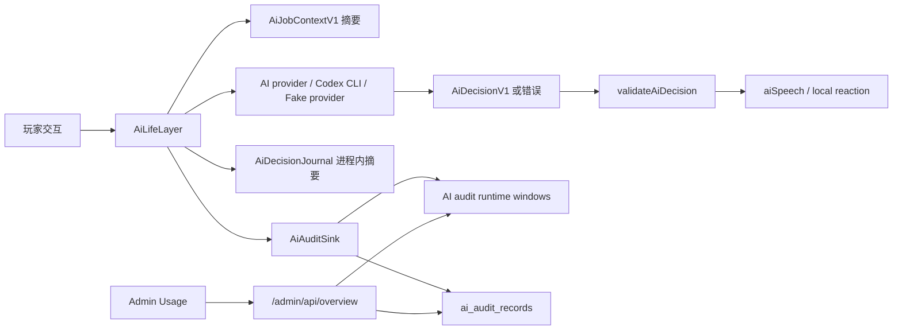

# AI Audit Center 设计与实现归档

最后核对日期：2026-06-22。

本文是 AI Audit Center 的设计文档，也归档当前 AI 生命层已经实现的后台可观测能力。需求来源见 `docs/prd/ai-audit-center.zh_CN.md`。

## 当前已有能力

| 能力 | 现状 | 主要文件 |
|---|---|---|
| 运行指标 | `AiLifeLayer.runtimeMetrics()` 记录 provider calls、success、error、fallback、accepted/rejected、local reactions、generated events、memory writes、flush/prune/latency。 | `server/ai/life_layer.ts`、`server/game.ts` |
| 最近决策摘要 | `AiDecisionJournal` 保留进程内最近记录，包含 jobId、trigger、entity、player、status、reason、lineIds、intents、sceneId、memoryWrites。 | `server/ai/decision_journal.ts` |
| 世界导演审计 | world director states 和 proposal lifecycle journal 可显示 created、refreshed、expired、evicted。 | `server/ai/world_director.ts` |
| 社交记忆审计 | NPC memory、rumor、memory persistence diagnostics 会进入 admin overview。 | `server/ai/social_memory.ts`、`server/ai/life_layer.ts` |
| 内容覆盖审计 | MobFamily、NPC profile、scene anchors、semantic objects、items、lineIds、authoring checklist。 | `server/ai/content_coverage.ts` |
| Profile 预览 | 作者 profile 预览和 validation，能看 persona、targets、fallback、knowledge、taboo、scene/item/time/weather/companion 深度。 | `server/ai/content_coverage.ts` |
| Memory 清理 | `/admin/api/ai/memory/clear` 清理 volatile overlay 和当前 realm 的 `ai_memory_records`。 | `server/admin.ts`、`server/game.ts` |
| 真实 DB 长跑 | 可选 `AI_MEMORY_PG_LONGRUN=1` 测试真实 Postgres memory round-trip。 | `tests/ai_memory_pg_longrun.test.ts` |

当前缺口：

- 最近决策只在内存里，重启后消失。
- 没有 AI 专属频率窗口。
- 没有 token 统计。
- 没有 provider job 的持久化摘要。
- Admin Usage 页没有最近 AI audit records 表。

## 设计目标

AI Audit Center 第一版建立一个轻量、低风险、可回退的审计层：

- 只读观察，不影响 `src/sim`。
- 写入失败不影响玩家体验。
- 按 realm 隔离。
- 保存可运营、可调试的摘要，不保存完整 prompt 原文。
- token 先做估算并明确标记，后续接入精确 usage。

## 数据流



## 审计记录

第一版记录 `AiAuditRecord`：

```ts
interface AiAuditRecord {
  auditId: string;
  realm: string;
  jobId: string;
  trigger: string;
  entityKind: 'npc' | 'mob' | 'object' | 'system';
  entityId: number | null;
  templateId: string;
  playerEntityId: number | null;
  sceneId: string;
  zoneId: string;
  providerSource: 'codex' | 'fake' | 'fallback' | 'local';
  status: 'accepted' | 'rejected' | 'provider_error' | 'local_reaction';
  latencyMs: number;
  inputTokens: number;
  outputTokens: number;
  totalTokens: number;
  tokenEstimate: boolean;
  outputMode: string;
  allowedIntentCount: number;
  allowedLineIdCount: number;
  memorySignalCount: number;
  directorProposalCount: number;
  sceneObjectCount: number;
  companionCount: number;
  lineIds: string[];
  intents: string[];
  memoryWriteRefs: string[];
  reason: string;
  error: string;
  createdAt: string;
}
```

`providerSource` 语义：

- `codex`：provider 成功返回，且 `aiSpeech.source` 来自 Codex/provider。
- `fake`：测试 provider 或默认 FakeAiProvider 成功返回。第一版如果无法可靠区分 provider 类型，可统一展示 `codex` 或 `provider`，但内部字段必须保留扩展空间。
- `fallback`：provider 报错后本地 fallback decision 生效。
- `local`：不调用 provider 的本地语义反应，例如 item discard、scene inspection、quest rumor、boss memory。

## Token 估算

第一版不假装账单级精度。估算规则：

- `inputTokens = ceil(JSON.stringify(context).length / 4)`。
- `outputTokens = ceil(JSON.stringify(decision).length / 4)`。
- provider error 没有 decision 时，`outputTokens = 0`。
- local reaction 没有 provider context 时，输入 token 取 `0`。
- `tokenEstimate = true`。

如果未来 Codex CLI 或 provider 返回 usage：

- 增加 `exactInputTokens`、`exactOutputTokens` 或把 `tokenEstimate` 置为 false。
- 保留估算字段用于没有 usage 的 fallback。

## 频率窗口

AI audit runtime windows 独立于现有 `provider_usage.ts`：

- 1m。
- 5m。
- 1h。
- 24h。

统计项：

- provider jobs。
- accepted。
- rejected。
- provider errors。
- fallback。
- local reactions。
- input tokens。
- output tokens。
- total tokens。

实现上可以复用 ring bucket 思路，保存在进程内，后台刷新即可看到实时窗口。持久化表负责最近记录和重启后的短期追溯。

## Postgres schema

新增 `server/ai_audit_db.ts`：

- `server/ai_audit.ts`：定义 `AiAuditRecord`、运行时窗口统计、token 估算、provider/local 审计记录构造。
- `AI_AUDIT_SCHEMA`：创建 `ai_audit_records`。
- `PgAiAuditDb.saveRecord(record)`：插入审计记录。
- `PgAiAuditDb.recentRecords(limit)`：按 realm 读取最近记录。
- `PgAiAuditDb.summary(limit/window)` 可后续补，第一版 summary 由运行时窗口提供。

表设计：

- `id BIGSERIAL PRIMARY KEY`
- `realm TEXT NOT NULL`
- `audit_id TEXT NOT NULL`
- `job_id TEXT NOT NULL`
- `trigger TEXT NOT NULL`
- `entity_kind TEXT NOT NULL`
- `entity_id INT`
- `template_id TEXT NOT NULL DEFAULT ''`
- `player_entity_id INT`
- `scene_id TEXT NOT NULL DEFAULT ''`
- `zone_id TEXT NOT NULL DEFAULT ''`
- `provider_source TEXT NOT NULL DEFAULT ''`
- `status TEXT NOT NULL`
- `latency_ms REAL NOT NULL DEFAULT 0`
- `input_tokens INT NOT NULL DEFAULT 0`
- `output_tokens INT NOT NULL DEFAULT 0`
- `total_tokens INT NOT NULL DEFAULT 0`
- `token_estimate BOOLEAN NOT NULL DEFAULT TRUE`
- `output_mode TEXT NOT NULL DEFAULT ''`
- count 字段若干
- `line_ids TEXT[] NOT NULL DEFAULT '{}'`
- `intents TEXT[] NOT NULL DEFAULT '{}'`
- `memory_write_refs TEXT[] NOT NULL DEFAULT '{}'`
- `reason TEXT NOT NULL DEFAULT ''`
- `error TEXT NOT NULL DEFAULT ''`
- `payload JSONB NOT NULL DEFAULT '{}'::jsonb`
- `created_at TIMESTAMPTZ NOT NULL DEFAULT now()`

索引：

- `(realm, created_at DESC)`
- `(realm, status, created_at DESC)`
- `(realm, trigger, created_at DESC)`
- `(realm, player_entity_id, created_at DESC)`
- unique `(realm, audit_id)`

## Admin API

`/admin/api/overview` 新增：

```ts
aiAudit: {
  summary: {
    generatedAt: string;
    windows: Array<{
      key: 'm1' | 'm5' | 'h1' | 'h24';
      labelKey: string;
      providerJobs: number;
      accepted: number;
      rejected: number;
      providerErrors: number;
      fallbacks: number;
      localReactions: number;
      inputTokens: number;
      outputTokens: number;
      totalTokens: number;
      estimatedTokens: boolean;
    }>;
    totals: {
      providerJobs: number;
      localReactions: number;
      inputTokens: number;
      outputTokens: number;
      totalTokens: number;
      estimatedTokens: boolean;
    };
  };
  recent: AiAuditRecord[];
}
```

## Admin UI

Usage 页在现有 AI life layer 面板中新增两个 section：

1. AI usage and tokens
   - 每个窗口展示 provider jobs、accepted、rejected、errors、fallback、local、tokens。
   - 明确显示 estimated。
2. Recent AI audit records
   - 最近 20 条。
   - 显示 status、trigger、entity、scene/zone、source、latency、tokens、lineIds、intents、memory writes、reason/error。

所有服务端返回值都要在 `tables.ts` escape。

## 写入策略

- provider 成功、provider error、validator accepted/rejected 都记录。
- provider error 后 fallback decision 也记录为同一 job 的 `provider_error` 或独立 fallback 记录。第一版使用同一 job 的 status `provider_error`，并在 reason/error 里说明 fallback。
- local reaction 记录为 `local_reaction`，token 为 0。
- 写入 Postgres 使用 fire-and-forget，但错误进入内存 diagnostics，不阻断玩家事件。

## 与核心玩法边界

AI Audit Center 不触碰：

- `src/sim`。
- `IWorld`。
- `ClientWorld`。
- 战斗、任务、掉落、经济、背包、XP、等级、宠物状态。

只读路径：

- `AiLifeLayer` 构造审计摘要。
- `server/admin.ts` 读取审计 summary 和 recent records。
- `src/admin` 渲染后台 HTML。

## 测试设计

| 测试 | 覆盖 |
|---|---|
| `tests/ai_audit_db.test.ts` | schema、save/load、realm scoped、limit clamp、normalization、summary shape。 |
| `tests/ai_life_layer_audit.test.ts` | provider success、provider error、rejected decision、local reaction、token 估算、审计写失败不影响玩家事件。 |
| `tests/admin.test.ts` | `/admin/api/overview` 返回 `aiAudit`，admin token 保护不变。 |
| `tests/admin_ai_metrics_ui.test.ts` | usage/token/audit 表格展示和 XSS escape。 |

## 运行命令

```bash
npx vitest run tests/ai_audit_db.test.ts tests/ai_life_layer_audit.test.ts tests/admin.test.ts tests/admin_ai_metrics_ui.test.ts
npx tsc --noEmit
npm run build:server
git diff --check
```

## 后续版本

- 单条 audit detail endpoint。
- 按 jobId/player/scene/status/trigger 过滤。
- 精确 usage 接入。
- 模型成本估算和预算告警。
- 长期归档和保留策略，例如 7 天热表、30 天聚合。
