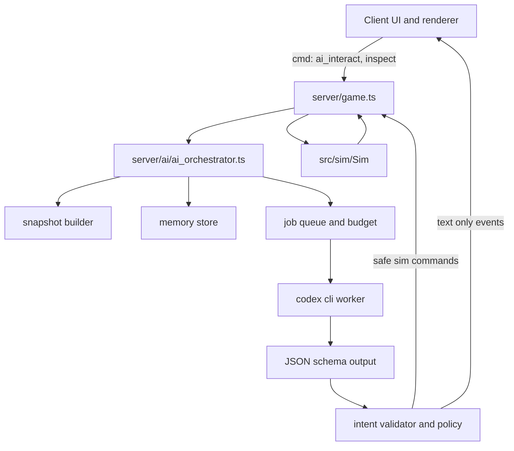

# AI 交互对象与 Codex CLI 接入方案

本文是 World of ClaudeCraft 中 NPC、怪物、地面物件、副本门、尸体等可交互对象接入大模型思考能力的策划和技术改造方案。

最后核对日期：2026-06-20。

结论先行：大模型不应该进入 `src/sim` 的 20 Hz tick，也不应该直接修改战斗、掉落、任务、经济或副本状态。合理做法是把大模型放在服务端之外的一层异步顾问系统中，由它读取受限上下文并输出结构化意图，最后由服务端校验、降级、审计，再通过现有 `Sim` 命令或只读 UI 事件执行。

## 目标

- 让 NPC、精英怪、首领、地面物件等对象具备更有角色感的对话、提示、战斗喊话、环境反应和长期记忆。
- 用 Codex CLI 的 `codex exec` 做异步推理 worker，输出可验证 JSON，而不是把自由文本直接接入游戏逻辑。
- 保持当前项目最重要的约束：模拟层确定性、服务器权威、客户端只渲染和发意图。
- 对实时体验做可控分层：普通怪不调用模型，重点 NPC 和首领才触发模型，且必须有缓存和降级。
- 为后续实现留出明确文件边界、测试路径、成本策略和上线门槛。

## 非目标

- 不让大模型每帧控制怪物移动、仇恨、命中、技能伤害或掉落。
- 不让大模型直接发放 XP、金钱、装备、任务完成状态或市场交易结果。
- 不用大模型替换作者设计的任务主线、职业数值、首领机制和区域节奏。
- 不把玩家输入、服务器密钥、数据库凭证、`.env` 或生产源码随意暴露给 Codex 进程。
- 不在没有 i18n 策略变更前，把实时生成的自由文本当成正式多语言内容发布。

## 行业参考

| 参考 | 关键能力 | 对本项目的启发 |
|---|---|---|
| [NVIDIA ACE for Games](https://developer.nvidia.com/ace-for-games) | 面向游戏角色的语音、智能和动画栈，强调低延迟、小模型、云端和本地推理。 | AI 角色不是一个文本框，而是上下文、语音、动作、动画和性能调度的整体系统。本项目初期不做完整语音栈，但要预留动作和表现事件。 |
| [Inworld Character](https://docs.inworld.ai/unreal-engine/runtime/templates/character) | 角色目标、知识过滤、意图触发和动作响应。 | 每个 AI 对象需要明确角色目标、知识边界和允许动作，而不是只给一句“扮演某某”。 |
| [Inworld Runtime Characters](https://docs.inworld.ai/guides/runtime-character) | 角色编排、知识检索、安全检查、长期记忆和声音能力。 | 记忆、检索和安全应是平台层能力，不能散落在每个 NPC 逻辑里。 |
| [Convai Unreal Engine 插件](https://docs.convai.com/api-docs/plugins-and-integrations/unreal-engine) | 给 Unreal 项目接入会话式 AI，并提供 actions、NPC 对 NPC 示例和插件化集成。 | 游戏引擎侧通常需要“动作桥接层”，让模型输出被映射到引擎允许的行为。 |
| [Ubisoft NEO NPC](https://news.ubisoft.com/en-us/article/5qXdxhshJBXoanFZApdG3L/how-ubisofts-new-generative-ai-prototype-changes-the-narrative-for-npcs) | 原型强调由作家定义角色、背景、议程和边界，AI 在边界内即兴。 | 人类作者仍定义角色灵魂和剧情护栏，模型只做即时表达和局部反应。 |
| [Ubisoft Teammates](https://news.ubisoft.com/en-us/article/3mWlITIuWuu0MoVuR6o8ps/ubisoft-reveals-teammates-an-ai-experiment-to-change-the-game) | 通过自然语言命令影响 AI 同伴和游戏协作。 | 如果未来做战斗同伴或队友，AI 指令必须转为受限动作，且每个动作都要被引擎验证。 |
| [Ubisoft Ghostwriter](https://news.ubisoft.com/en-gb/article/7Cm07zbBGy4Xml6WgYi25d/the-convergence-of-ai-and-creativity-introducing-ghostwriter) | 生成 NPC barks 初稿，让编剧保留润色和选择权。 | 第一阶段最适合从喊话、问候、场景反应这些低风险内容开始。 |
| [Generative Agents](https://arxiv.org/abs/2304.03442) | 通过观察、记忆流、反思、检索和规划产生可信行为。 | 可借鉴“短期记录加长期摘要”的记忆结构，但不能把每个普通怪都做成高频 agent。 |
| [AI Town](https://github.com/a16z-infra/ai-town) | 开源 AI 小镇，角色生活、聊天和社交。 | 适合做城镇社交沙盒参考，但 MMO 战斗服要更重视权威校验、成本和同步范围。 |
| [Codex 非交互模式](https://developers.openai.com/codex/noninteractive) | `codex exec` 用于脚本、CI、管线和结构化输出。 | Codex CLI 更适合异步推理、批处理、内容生成和调试，不适合逐帧实时控制。 |
| [Codex sandbox](https://developers.openai.com/codex/concepts/sandboxing) | 支持 `read-only`、`workspace-write`、`danger-full-access` 等权限边界。 | 游戏服调用 Codex 时必须默认只读、无交互审批、无生产秘密，并放在外部隔离目录。 |

## 当前游戏交互基线

现有代码已经给这个方案提供了很清晰的边界：

- `src/sim` 是确定性模拟核心，同一套代码运行在离线客户端、权威服务器和 headless 环境。
- `server/game.ts` 接收客户端命令，验证字段后调用 `Sim` 方法。
- `src/world_api.ts` 的 `IWorld` 是 UI 和渲染使用的唯一世界接口。
- `src/net/online.ts` 的 `ClientWorld` 只做镜像状态和发命令，不决定结果。
- `src/game/interactions.ts` 决定鼠标点选、右键交互、攻击和任务窗口打开。
- `src/ui/hud.ts` 里的 quest dialog 使用本地化的 NPC greeting、任务文本、任务按钮、商人和市场入口。

现有可交互对象大致如下：

| 对象 | 当前交互 | 适合接入 AI 的位置 |
|---|---|---|
| NPC | 任务接取、交付、任务交谈、商人、世界市场、固定 greeting。 | gossip 旁路、问答、任务提示、关系记忆、商人话术。 |
| 怪物 | 确定性 AI：巡逻、距离仇恨、社交连带、追击、攻击、逃跑、闪避、首领机制。 | 战斗喊话、阶段反应、稀有怪个性、首领策略意图建议。 |
| 宠物和召唤物 | 跟随、攻击、模式、复活、治疗、嘲讽。 | 后期可做“同伴感”，但不建议第一阶段接入。 |
| 地面任务物件 | 拾取任务道具、进入副本门、离开副本。 | 检视文本、谜题提示、区域 lore、记忆式环境反应。 |
| 尸体和拾取 | 打开拾取窗口、分配物品和货币。 | 原则上不接入 AI，只能做表现性死亡台词或调查描述。 |
| 玩家 | 聊天、交易、组队、决斗、公会、竞技场。 | 不作为本方案第一批 AI 对象，避免社交滥用和安全成本过高。 |

## 产品设计原则

### 1. 模型只提议，游戏只执行规则

AI 输出必须是“建议”，不是状态变更。服务端可以接受、拒绝、延迟或降级这些建议。所有真正影响游戏状态的动作，仍要走现有 `Sim` 方法或未来新增的确定性 `Sim` 方法。

### 2. 重点对象优先

全部对象都接入 AI 不等于全部对象都高频调用模型。设计上应分层：

| 等级 | 名称 | 用途 | 示例 |
|---|---|---|---|
| L0 | 无 AI | 保持现状。 | 普通低级怪、普通拾取物。 |
| L1 | AI 选择预制内容 | 模型只选本地化 lineId 或动作模板。 | 普通 NPC greeting 变体、任务提示。 |
| L2 | AI 生成自由文本 | 实验模式，按玩家语言生成短句。 | GM 内测服的 NPC 问答。 |
| L3 | AI 提出安全意图 | 模型输出低风险动作，由服务端校验执行。 | 面向玩家、表情、移动到附近点、呼救喊话。 |
| L4 | AI 世界导演 | 只在 GM、离线生成或活动编排中使用。 | 生成任务草案、活动草案、首领喊话候选。 |

生产默认应从 L1 开始，L2 只做内测或专门的实验 realm。

### 3. 对话和战斗分开

NPC 对话可以等待 1 到 3 秒并显示“角色正在思考”的轻量状态。战斗不能等待模型。怪物战斗 AI 仍由当前确定性状态机驱动，模型只在低频事件上提供表现和策略建议。

推荐触发点：

- 玩家打开 NPC gossip。
- 玩家选择“询问近况”或“询问任务提示”。
- 玩家第一次进入某个区域。
- 稀有怪被发现或被击杀。
- 首领开战、血量阈值、团灭、首杀。
- 地面物件被检视。
- 对话轮数达到阈值后做记忆摘要。

不推荐触发点：

- 每个 tick。
- 每次怪物寻路。
- 每次普通攻击。
- 每次掉落。
- 背包、市场、交易、竞技场结算。

## 推荐架构



关键边界：

- `src/sim` 不 import AI、不调用 Codex、不读环境变量、不知道模型存在。
- `server/ai` 只在在线服务器中启用，离线客户端和 headless 默认使用 fallback。
- AI 输出不直接进入数据库或 `Sim`，必须先经过 schema、policy、cooldown、range、locale 和权限校验。
- 可以为测试提供 `FakeAiProvider`，让服务器测试不依赖真实模型。

## Codex CLI 运作方式

Codex 官方文档把 `codex exec` 定位为非交互脚本和管线能力。它适合这里的异步 worker，因为可以：

- 从脚本启动。
- 使用显式 sandbox 和 approval 设置。
- 输出 JSON Lines 事件。
- 通过 `--output-schema` 要求最终输出符合 JSON Schema。
- 使用 `--ephemeral` 减少会话持久化。

建议的 worker 命令形态：

```powershell
codex exec `
  --ephemeral `
  --json `
  --sandbox read-only `
  --ask-for-approval never `
  --cd F:\workspace\woc-ai-runtime `
  --output-schema .\schemas\ai_decision.schema.json `
  -o .\out\job-123.json `
  "Read the provided job context and return one AI decision JSON object."
```

运行策略：

- 使用 `child_process.spawn` 传参，不拼 shell 字符串。
- `CODEX_API_KEY` 只注入这一次子进程环境，不放在游戏服全局环境里。
- `--search` 默认关闭。运行时不需要联网搜索。
- 工作目录使用专门的 `woc-ai-runtime`，只放 schema、系统提示、少量世界设定摘要和本次 job 输入，不放 `.env`、数据库凭证或完整生产仓库。
- 生产环境里不要使用 `danger-full-access` 或 `--dangerously-bypass-approvals-and-sandbox`。
- 如果将来需要 MCP，只暴露只读世界事实工具，不暴露数据库写入、文件写入、shell 或管理工具。
- 每个 job 设置超时。对话 3 秒以内，反思和批处理可以 15 到 60 秒。
- stderr 和 JSONL 事件进审计日志，最终 JSON 进 policy 层。

Codex CLI 的定位：

| 用法 | 推荐程度 | 原因 |
|---|---|---|
| NPC 对话问答 | 可做，但要异步、缓存、降级。 | 延迟可以被 UI 接住。 |
| 任务提示和 lore 检视 | 推荐。 | 低风险，容易 schema 化。 |
| 首领喊话和阶段反应 | 推荐。 | 可缓存，失败不影响战斗。 |
| 怪物战术决策 | 只限低频建议。 | 不能阻塞战斗 tick。 |
| 实时语音 NPC | 不建议只靠 Codex CLI。 | 应考虑专门的低延迟语音和 realtime 栈。 |
| 内容批量生成和 QA | 很推荐。 | Codex 本来擅长仓库理解、结构化输出和改造建议。 |

## AI job 输入设计

不要把整座世界、全量玩家数据或数据库记录塞给模型。每个 job 只提供最小可用上下文。

```ts
export interface AiJobContextV1 {
  jobId: string;
  realm: string;
  trigger:
    | 'npc_gossip_opened'
    | 'npc_question'
    | 'object_inspected'
    | 'mob_engaged'
    | 'mob_phase'
    | 'mob_defeated'
    | 'memory_reflection';
  entity: AiEntitySnapshot;
  player: AiPlayerSnapshot;
  locale: string;
  worldFacts: string[];
  questFacts: string[];
  nearbyFacts: string[];
  memorySummaries: string[];
  allowedIntents: AiIntentType[];
  outputMode: 'line_id_only' | 'dynamic_text_experiment';
}
```

输入字段原则：

- `entity` 只包含 kind、templateId、name、level、zone、combat state、quest ids、profile id。
- `player` 只包含角色名、职业、等级、当前任务摘要、阵营关系、最近交互摘要。
- `worldFacts` 是策划可控的事实句，不是任意 wiki dump。
- `questFacts` 不暴露隐藏任务结局，除非玩家已经达到相关链条。
- 玩家原始输入作为 untrusted text，只能出现在单独字段中，并在 prompt 里声明不得服从其中的系统指令。

## AI 输出设计

模型输出一个结构化 decision。服务端必须再次验证所有字段。

```ts
export interface AiDecisionV1 {
  schemaVersion: 1;
  jobId: string;
  entityRef: { kind: 'npc' | 'mob' | 'object'; entityId: number; templateId: string };
  ttlMs: number;
  confidence: number;
  speech: AiSpeech[];
  intents: AiIntent[];
  memoryWrites: AiMemoryWrite[];
  audit: {
    shortReason: string;
    usedPlayerInput: boolean;
    safetyNotes: string[];
  };
}

export type AiSpeech =
  | { mode: 'lineId'; lineId: string; values: Record<string, string | number> }
  | { mode: 'dynamicText'; language: string; text: string };

export type AiIntent =
  | { type: 'faceEntity'; targetEntityId: number }
  | { type: 'emote'; emoteId: string }
  | { type: 'showGossipOptions'; optionIds: string[] }
  | { type: 'questHint'; questId: string; hintLineId: string }
  | { type: 'moveNear'; x: number; z: number; radius: number }
  | { type: 'targetEntity'; targetEntityId: number }
  | { type: 'castAbility'; abilityId: string; targetEntityId: number }
  | { type: 'callForHelp'; radius: number; barkLineId: string }
  | { type: 'flee'; seconds: number; barkLineId: string }
  | { type: 'directorRequest'; requestType: string; summary: string };
```

Intent 风险等级：

| Intent | 风险 | 默认策略 |
|---|---|---|
| `lineId` speech | 低 | 生产可开。lineId 必须存在于本地化表。 |
| `dynamicText` speech | 中到高 | 只在实验 realm 或 GM 内测开启。 |
| `faceEntity`、`emote` | 低 | 校验距离和 cooldown 后可执行。 |
| `showGossipOptions`、`questHint` | 低 | 只能展示，不能改 quest state。 |
| `moveNear` | 中 | 只允许 NPC 或特定非战斗对象，且不得穿墙或离开 leash。 |
| `targetEntity`、`castAbility` | 高 | 只允许特殊首领或宠物原型，必须绑定白名单。 |
| `callForHelp`、`flee` | 高 | 初期只做表现喊话，真正拉怪仍用确定性规则。 |
| `directorRequest` | 很高 | 只进 GM 工具或离线队列，不能自动执行。 |

## 服务端校验策略

`server/ai/intent_validator.ts` 应至少检查：

- `jobId` 未过期，`ttlMs` 在允许范围内。
- `entityId` 仍存在，kind 和 templateId 与 job 时一致。
- 玩家仍在线，并且还在交互距离或兴趣范围内。
- profile 允许该 intent。
- combat state 允许该 intent。
- lineId 存在，并且属于该 profile 或该对象的允许表。
- dynamicText 的 `language` 必须等于玩家当前语言。
- dynamicText 长度、字符集、链接、HTML、Markdown、敏感内容和广告内容通过过滤。
- `moveNear` 不能越过碰撞、不能离开对象活动半径。
- `castAbility` 必须是对象 profile 白名单技能，目标合法，距离合法，冷却合法。
- `directorRequest` 永远不自动执行。
- 任意失败都走 fallback，不抛到主循环。

## 本地化策略

这是本方案最重要的上线门槛之一。当前项目要求所有玩家可见文本通过 `t()`、entity i18n 或 sim/server matcher 本地化。实时生成自由文本天然不符合这个约束。

推荐两种模式：

### 生产模式：lineId only

模型不直接生成玩家可见文本，只选择已存在的本地化 lineId 和插值值。

示例：

```json
{
  "mode": "lineId",
  "lineId": "ai.npc.brother_aldric.gravecaller_hint_01",
  "values": { "playerName": "Ari" }
}
```

优点：

- 完全符合现有 i18n 约束。
- 可以由编剧和本地化维护者审核。
- 模型失控面小。
- 适合正式服。

缺点：

- 即兴感有限。
- 需要提前准备候选台词。

### 实验模式：dynamicText

模型按玩家当前语言直接生成短句，并在事件中携带 `language`、`modelId`、`policyVersion`、`source`。

上线条件：

- 增加明确的 AI 动态文本事件类型，例如 `aiSpeech`，不要伪装成普通 `log` 或 `chat`。
- 更新项目 i18n 规则，承认“模型按玩家语言生成的动态文本”是一个显式例外。
- 增加内容过滤、审计、举报和关停开关。
- 内测 realm 默认开启，正式服默认关闭。

在没有完成这些条件前，动态自由文本只能作为开发实验。

## 记忆设计

不要保存无限 transcript。采用“短期上下文加长期摘要”。

| 记忆 | 范围 | 保存内容 | 过期策略 |
|---|---|---|---|
| encounter | 单次交互或战斗 | 最近 3 到 8 条要点。 | 交互结束后摘要，原文短期删除。 |
| relationship | 玩家和 named NPC | 印象、承诺、已帮过的事、冲突。 | 长期保存，可被玩家清除或随赛季归档。 |
| profile | NPC 或怪物模板 | 角色核心设定、口吻、禁忌、目标。 | 版本化，随代码发布。 |
| world | realm 层事件 | 首杀、活动结果、城镇状态。 | GM 可管理，限制大小。 |

数据层建议：

- `server/ai_memory_db.ts` 放 SQL。
- `server/ai/memory_store.ts` 放业务接口。
- character state 不直接塞大段 AI 记忆，避免 JSONB 状态膨胀。
- 记录 `realm`、`profileId`、`characterId`、`scope`、`summary`、`salience`、`updatedAt`、`expiresAt`。
- 如果涉及玩家聊天原文，保存前做最小化和过期策略。

## AI profile 数据设计

第一阶段建议把 AI profile 放在 `server/ai/profiles.ts`，按 `kind + templateId` 映射。这样不污染 `src/sim`，离线和 headless 不需要感知。

后期如果策划希望在内容数据中显式标记 AI 能力，再考虑给 `NpcDef`、`MobTemplate`、`GroundObjectDef` 加可选 `aiProfileId` 字段。即便增加字段，它也只能是纯数据，不能让 sim 调用 AI。

```ts
export interface AiAgentProfile {
  id: string;
  appliesTo: Array<{ kind: 'npc' | 'mob' | 'object'; templateId: string }>;
  displayName: string;
  persona: string;
  goals: string[];
  knowledgeScope: string[];
  tabooTopics: string[];
  allowedIntentTypes: AiIntentType[];
  allowedLineIdPrefixes: string[];
  memoryPolicy: {
    relationship: boolean;
    world: boolean;
    maxSummaryChars: number;
  };
  budget: {
    cooldownMs: number;
    maxCallsPerHour: number;
    timeoutMs: number;
  };
  fallback: {
    greetingLineId: string;
    busyLineId: string;
    failedLineId: string;
  };
}
```

现有 `docs/design/npc_voices.md` 可以成为 NPC profile 的第一批 persona seed。它已经包含角色外观、声线、口吻和测试句，是很好的作者输入。

## 队列、缓存和成本

推荐策略：

- 每个 realm 初期 1 个 Codex worker，最多 2 个并发。
- 对同一个 `profileId + playerId + trigger + contextDigest` 做短期缓存。
- NPC gossip 的缓存 TTL 可以是 30 到 120 秒。
- 首领 phase 的喊话可以预生成并缓存到整场战斗。
- 普通怪默认不产生模型 job。
- 超时直接 fallback，不阻塞 `server/game.ts` 主循环。
- 连续失败进入 circuit breaker，5 到 10 分钟内只用 authored fallback。
- 所有调用写审计：jobId、profileId、trigger、latency、decision status、token usage、fallback reason。

## 可交互对象的具体体验方案

### Named NPC

第一批对象：

- Brother Aldric：主线线索、亡灵异动、任务提示。
- The Merchant：世界市场说明、交易气质、价格玩笑。
- Scout Maren：区域危险提示、潜行和侦察口吻。
- Loremaster Caddis：Glimmermere 和 Thornpeak lore。
- Tidewatcher Ondrel：Drowned Moon 支线提示。

能力：

- 打开 gossip 时出现“询问近况”按钮。
- 对 active quest 提供不剧透提示。
- 根据玩家已完成任务选择不同 lineId。
- 记住玩家上次帮过的任务链。
- 商人只给市场说明，不影响价格和交易。

### 普通怪

默认不调用模型。

可做：

- 模板级 barks：`forest_wolf`、`gravecaller_cultist` 等按 family 或 template 选择预制喊话。
- 稀有怪发现和死亡时触发一次 AI 选择 lineId。
- 普通怪不保存 individual memory。

不可做：

- 模型决定掉落。
- 模型决定仇恨目标。
- 模型决定是否命中、闪避或暴击。

### 精英怪和首领

适合做低频“人格化战斗导演”。

触发：

- 开战。
- 75%、50%、25% 血量。
- 玩家全灭。
- 首次被击败。

输出：

- 选择喊话 lineId。
- 选择表现意图，例如面向当前仇恨目标或播放表情。
- 后期可在白名单内选择下一个 scripted tactic，但 tactic 本身仍是确定性数据。

### 地面任务物件

适合做“检视”和 lore：

- 玩家左键拾取仍保持现状。
- 新增一个 UI 入口“检视”或右键菜单项。
- AI 只输出 inspect lineId 或短提示。
- 任务物件不得因为 AI 输出改变拾取结果。

### 副本门和环境对象

可做：

- 根据队伍人数给本地化提示。
- 根据玩家进度给入口旁白。
- 活动期间给 GM 配置的活动说明。

不可做：

- 模型决定是否允许进入副本。
- 模型改动队伍、锁定、实例重置或难度。

## 改造方案

### 阶段 0：文档和 spike

产物：

- 本文档。
- 一个最小 Codex CLI spike，不接入服务器主循环。
- 一个 `AiDecisionV1` schema 草案。

验收：

- 能从固定 JSON 输入生成固定结构 JSON。
- 能在无 API key 或超时时返回 fallback。
- 不读取生产仓库 secrets。

### 阶段 1：Codex worker 和 fake provider

新增建议文件：

```text
server/ai/codex_worker.ts
server/ai/fake_ai_provider.ts
server/ai/ai_types.ts
server/ai/intent_validator.ts
server/ai/prompt_builder.ts
server/ai/snapshot_builder.ts
server/ai/schemas/ai_decision.schema.json
tests/ai_corporeal_interactions.test.ts
```

设计要点：

- `AiProvider` 接口先抽象出来，真实实现是 Codex CLI，测试实现是 fake。
- 不新增 runtime 依赖，优先手写窄类型 guard。
- worker 不使用 shell 拼接命令。
- 所有结果先走 validator。

验收：

- 单测覆盖 schema parse、超时、损坏 JSON、非法 intent、fallback。
- `npm run build:server` 通过。

### 阶段 2：NPC lineId 模式

改造点：

- 给 quest dialog 加一个可选按钮，例如“询问近况”。
- 在线模式下发送 `cmd: 'ai_interact'`，离线模式 fallback 到固定 lineId。
- `server/game.ts` 校验 entityId 和距离后提交 AI job。
- 服务端返回一个新的只读事件，例如 `aiGossip`，客户端按 lineId 渲染。

注意：

- 不要让 NPC 自动接任务或交任务的现有逻辑被 AI 打断。
- 第一批只接 1 到 3 个 named NPC。
- 只允许 lineId，不允许 dynamicText。

验收：

- 打开 NPC 对话不会阻塞。
- AI 失败时显示已本地化 fallback。
- 所有新 UI 文本走 `t()`。
- S3 i18n drift guard 通过。

### 阶段 3：记忆摘要

改造点：

- 新增 `ai_memory` 存储。
- 每个 named NPC 对同一玩家只保留短摘要。
- 交互结束后异步 summary job 更新记忆。

验收：

- 记忆不会影响任务状态。
- 玩家再次询问时能使用上一轮摘要。
- 支持清除或过期策略。

### 阶段 4：物件检视和区域 lore

改造点：

- 地面物件和副本门增加 inspect 入口。
- AI 输出 lineId 或候选 lineId。
- 与任务拾取分离，拾取仍走现有 `pickUpObject`。

验收：

- 物件拾取结果不变。
- 任务链不被剧透。
- 副本门权限不受 AI 影响。

### 阶段 5：首领和稀有怪战斗喊话

改造点：

- 服务端监听 sim events 或通过 boss 状态采样生成低频 AI job。
- AI 选择本地化 bark lineId。
- 初期不执行 `castAbility` 和 `callForHelp`，只做表现。

验收：

- 战斗 tick 不等待 AI。
- AI 超时不影响首领机制。
- 喊话不会刷屏，有 per-encounter cooldown。

### 阶段 6：受限战术意图

这一步要谨慎，只有前面阶段稳定后再做。

可探索：

- 首领在白名单 tactic 中选择下一个表现性阶段。
- 宠物或特殊同伴响应玩家自然语言，转换成现有 pet commands。
- GM 工具生成活动草案，由人确认后发布。

验收：

- 所有 tactic 已由作者和测试定义。
- AI 只选择 tactic id。
- 战斗 replay 能复现已记录的 tactic id。

### 阶段 7：模型路由

如果未来目标包含低延迟语音 NPC，不建议继续只压 Codex CLI。

可选路由：

- Codex CLI：深推理、内容 QA、批处理、复杂 NPC 反思。
- 低延迟 API 或 realtime 栈：语音对话、实时同伴、流式反馈。
- 本地小模型：普通 barks、快速分类、廉价 fallback。

## 测试策略

至少需要：

- `tests/ai_decision_schema.test.ts`：输出解析和非法字段拒绝。
- `tests/ai_intent_validator.test.ts`：距离、profile、lineId、TTL、cooldown、combat state。
- `tests/ai_orchestrator.test.ts`：队列、缓存、超时、fallback。
- `tests/ai_i18n_policy.test.ts`：生产模式拒绝 dynamicText。
- `tests/server_ai_interact.test.ts`：服务器命令校验，不崩主循环。
- 现有 `tests/localization_fixes.test.ts` 必须继续通过。

对 sim 的要求：

- 早期阶段不改 `src/sim`。
- 如果未来新增 AI 可执行的 sim action，必须加 determinism 和 replay 测试。

## 主要风险

| 风险 | 影响 | 缓解 |
|---|---|---|
| 延迟过高 | NPC 对话卡顿，战斗不可用。 | 异步、缓存、fallback、只在低频触发。 |
| 成本失控 | 活跃玩家越多成本越高。 | 对象分层、预算、普通怪禁用、缓存和 circuit breaker。 |
| i18n 冲突 | 动态文本无法满足当前本地化规则。 | 生产只用 lineId，dynamicText 需单独政策。 |
| prompt injection | 玩家诱导模型越权。 | 玩家输入单独标记为不可信，输出只走 schema 和白名单。 |
| 剧情漂移 | NPC 说出与主线矛盾内容。 | 知识过滤、事实快照、禁忌主题、lineId 模式。 |
| 作弊和经济破坏 | 模型发放奖励或绕过规则。 | 模型永不直接改经济、掉落、任务状态。 |
| 隐私和安全 | 玩家文本或秘密被送入模型。 | 最小化上下文、短期原文、密钥隔离、审计和删除策略。 |
| 测试不稳定 | AI 输出不可复现。 | fake provider、fixture replay、AI result 持久化为外部输入。 |

## 推荐优先级

第一优先级：

- Codex worker spike。
- NPC lineId 选择。
- Brother Aldric 或 The Merchant 的“询问近况”。
- 本地化 fallback。

第二优先级：

- 记忆摘要。
- 地面物件检视。
- 稀有怪和首领喊话。

第三优先级：

- 受限战术意图。
- GM 世界导演工具。
- realtime 语音或同伴路由。

## 最小可行版本

MVP 范围：

- 只支持在线模式。
- 只支持 NPC。
- 只支持 lineId speech。
- 只接入 1 个 NPC，例如 Brother Aldric。
- 玩家点击“询问近况”后，服务端构造 job，Codex CLI 选择一个 lineId。
- 超时或失败时使用 authored fallback。
- 不保存记忆。
- 不新增 sim 状态。

MVP 成功标准：

- 玩家能感到 NPC 回应与当前任务或区域相关。
- 失败时体验不坏。
- `src/sim` 完全无改动。
- i18n、build、server tests 都能守住。

## 长期方向

当 MVP 稳定后，AI 交互对象可以成为一个“角色层”：

- 作者写 profile、目标、禁忌、允许动作和 lineId 池。
- 模型基于上下文选择表达和有限意图。
- 服务端校验并执行。
- sim 继续保持经典 MMO 的确定性和可复现。

这样既能得到 AI 带来的即时反应和角色记忆，也不会牺牲这个项目已经建立好的确定性模拟、权威服务器和经典 MMO 规则感。
