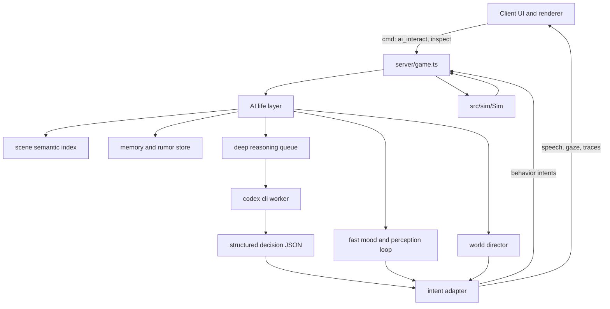

# AI 交互对象与 Codex CLI 接入方案

本文是 World of ClaudeCraft 中 NPC、怪物、地面物件、副本门、尸体等可交互对象接入大模型思考能力的策划和技术改造方案。本文当前采用“激进体验版”立意：先追求活生生的世界感、不可预测的角色感和强记忆交互，再把生产可控性作为后续收束。

最后核对日期：2026-06-21。

结论先行：这套系统不只是“让 NPC 多说几句话”，而是给世界加一层 AI 生命皮层。每个可交互对象都可以拥有感知、情绪、短期记忆、长期印象、欲望、习惯和有限行动意图。普通怪里也应有极少数“奇点个体”：它们从模板生物中突然显得特别，能记住玩家、偏离巡逻、害怕、好奇、求饶、复仇、围观、传话，甚至让玩家怀疑自己遇到的是一个活物。

工程上仍保留一个硬边界：`src/sim` 继续负责最终结算，大模型输出的是“生命意图”和“表现意图”。但体验目标要更大胆：AI 不只是旁白工具，而是渗入对话、生态、怪物行为、物件反馈、城镇传闻、首领临场反应和玩家长期声誉的第二层世界规则。

## 目标

- 让 NPC、普通怪、精英怪、首领、地面物件等对象都具备更强的生命感：能观察、记住、误会、害怕、炫耀、传闻、回应和自我解释。
- 做出“奇点个体”体验：大部分普通怪仍是生态背景，但少数普通怪突然拥有名字、偏好、记忆和反常行为，像从模拟里醒过来。
- 让 AI 深入表现和交互：不只改台词，还影响面向、停顿、逃跑、窥探、聚集、呼叫同伴、临时小目标、场景痕迹、NPC 之间的传话。
- 引入场景感知：AI 对房屋、墓地、道路、水边、天气、昼夜、掉落物、随行宠物和 NPC、区域危险感都有语义理解。
- 用 Codex CLI 的 `codex exec` 做异步深推理 worker，承担反思、记忆压缩、性格延展、计划生成和复杂意图输出，并产出可验证 JSON。
- 保持当前项目最重要的约束：模拟层确定性、服务器权威、客户端只渲染和发意图。
- 给后续实现留出明确文件边界、测试路径、成本策略和上线门槛，但不让这些约束压扁体验野心。

## 非目标

- 不是一版保守正式服上线方案。本文允许先做实验 realm、GM 内测和特性开关，把惊喜感跑出来。
- 不是只做 NPC 聊天窗口。AI 应当渗入世界行为、生态反馈、怪物群体和物件交互。
- 不是让模型替代所有作者设计。作者定义世界观、角色骨架、行为护栏和可用动作，模型负责即兴生命感。
- 不是追求每个对象都昂贵调用。普通对象可以用轻量本地规则、缓存人格、批处理反思和少量奇点抽样来制造“到处都有生命”的错觉。
- 不是把工程红线彻底取消。伤害、掉落、经济、任务完成和竞技结算仍不能让模型直接改。

## 行业参考

| 参考 | 关键能力 | 对本项目的启发 |
|---|---|---|
| [NVIDIA ACE for Games](https://developer.nvidia.com/ace-for-games) | 面向游戏角色的语音、智能和动画栈，强调低延迟、小模型、云端和本地推理。 | AI 角色不是一个文本框，而是上下文、语音、动作、动画和性能调度的整体系统。本项目初期不做完整语音栈，但要预留动作和表现事件。 |
| [Inworld Character](https://docs.inworld.ai/unreal-engine/runtime/templates/character) | 角色目标、知识过滤、意图触发和动作响应。 | 每个 AI 对象需要明确角色目标、知识边界和允许动作，而不是只给一句“扮演某某”。 |
| [Inworld Runtime Characters](https://docs.inworld.ai/guides/runtime-character) | 角色编排、知识检索、安全检查、长期记忆和声音能力。 | 记忆、检索和安全应是平台层能力，不能散落在每个 NPC 逻辑里。 |
| [Convai Unreal Engine 插件](https://docs.convai.com/api-docs/plugins-and-integrations/unreal-engine) | 给 Unreal 项目接入会话式 AI，并提供 actions、NPC 对 NPC 示例和插件化集成。 | 游戏引擎侧通常需要“动作桥接层”，让模型输出被映射到引擎允许的行为。 |
| [Ubisoft NEO NPC](https://news.ubisoft.com/en-us/article/5qXdxhshJBXoanFZApdG3L/how-ubisofts-new-generative-ai-prototype-changes-the-narrative-for-npcs) | 原型强调由作家定义角色、背景、议程和边界，AI 在边界内即兴。 | 人类作者仍定义角色灵魂和剧情护栏，模型只做即时表达和局部反应。 |
| [Ubisoft Teammates](https://news.ubisoft.com/en-us/article/3mWlITIuWuu0MoVuR6o8ps/ubisoft-reveals-teammates-an-ai-experiment-to-change-the-game) | 通过自然语言命令影响 AI 同伴和游戏协作。 | 如果未来做战斗同伴或队友，AI 指令必须转为受限动作，且每个动作都要被引擎验证。 |
| [Ubisoft Ghostwriter](https://news.ubisoft.com/en-gb/article/7Cm07zbBGy4Xml6WgYi25d/the-convergence-of-ai-and-creativity-introducing-ghostwriter) | 生成 NPC barks 初稿，让编剧保留润色和选择权。 | 可以作为第一批素材生产方式，但本项目不应停在“生成台词”，而要把台词接到行为、记忆和生态状态上。 |
| [Generative Agents](https://arxiv.org/abs/2304.03442) | 通过观察、记忆流、反思、检索和规划产生可信行为。 | 更适合本方案的核心立意：对象观察世界、压缩记忆、反思动机，再生成下一步生活计划。 |
| [AI Town](https://github.com/a16z-infra/ai-town) | 开源 AI 小镇，角色生活、聊天和社交。 | 提醒我们不要只做点击对话，而要让角色彼此说话、传播消息、形成小型社会。 |
| [Codex 非交互模式](https://developers.openai.com/codex/noninteractive) | `codex exec` 用于脚本、CI、管线和结构化输出。 | Codex CLI 更适合深推理、反思、批处理和复杂计划。实时体感由缓存、短循环 worker 和本地轻量行为层补足。 |
| [Codex sandbox](https://developers.openai.com/codex/concepts/sandboxing) | 支持 `read-only`、`workspace-write`、`danger-full-access` 等权限边界。 | 游戏服调用 Codex 时必须默认只读、无交互审批、无生产秘密，并放在外部隔离目录。 |

## 当前游戏交互基线

现有代码已经给这个方案提供了很清晰的边界：

- `src/sim` 是确定性模拟核心，同一套代码运行在离线客户端、权威服务器和 headless 环境。
- `server/game.ts` 接收客户端命令，验证字段后调用 `Sim` 方法。
- `src/world_api.ts` 的 `IWorld` 是 UI 和渲染使用的唯一世界接口。
- `src/net/online.ts` 的 `ClientWorld` 只做镜像状态和发命令，不决定结果。
- `src/game/interactions.ts` 决定鼠标点选、右键交互、攻击和任务窗口打开。
- `src/ui/hud.ts` 里的 quest dialog 使用本地化的 NPC greeting、任务文本、任务按钮、商人和市场入口。

现有可交互对象大致如下：

| 对象 | 当前交互 | 适合接入 AI 的位置 |
|---|---|---|
| NPC | 任务接取、交付、任务交谈、商人、世界市场、固定 greeting。 | gossip 旁路、问答、任务提示、关系记忆、商人话术。 |
| 怪物 | 确定性 AI：巡逻、距离仇恨、社交连带、追击、攻击、逃跑、闪避、首领机制。 | 战斗喊话、阶段反应、稀有怪个性、首领策略意图建议。 |
| 宠物和召唤物 | 跟随、攻击、模式、复活、治疗、嘲讽。 | 适合作为第二波“同伴感”原型，让玩家用自然语言影响既有宠物命令。 |
| 地面任务物件 | 拾取任务道具、进入副本门、离开副本。 | 检视文本、谜题提示、区域 lore、记忆式环境反应。 |
| 尸体和拾取 | 打开拾取窗口、分配物品和货币。 | 原则上不接入 AI，只能做表现性死亡台词或调查描述。 |
| 玩家 | 聊天、交易、组队、决斗、公会、竞技场。 | 玩家本身不由 AI 接管，但 AI 世界可以记住玩家声誉、绰号、传闻和社交痕迹。 |

## 激进体验立意

这版方案的体验目标不是“让世界更会回答问题”，而是“让玩家觉得世界正在观察自己”。玩家应当在游戏里遇到这种瞬间：

- 一个普通的狼没有立刻扑上来，而是绕着玩家嗅了一圈，记住玩家身上刚从 Hollow Crypt 带出的气味，下次在同一区域远远避开。
- 一只曾经逃走的强盗后来带着外号刷新，在营地里向同伴描述玩家，导致附近几个强盗先盯着玩家看，再决定是否动手。
- The Merchant 不只说市场规则，而是知道某个玩家总是压价，把他称为“铜币刮刀”，并把这个绰号传给城镇其他 NPC。
- 地面物件不只被拾取。玩家检视墓碑、烛台、碎盾时，对象会给出“残留记忆”，像世界在回放曾经发生的事。
- 首领不只按血量喊话，而是评论队伍打法、记住上一次团灭原因，并在下一次开战前用不同语气挑衅。
- 少数怪物不只是怪物，而是一次短暂的相遇：它求饶、撒谎、逃跑、召集同伴、假装死亡、偷看玩家，或在死前留下一句只有这次会出现的话。

### 奇点个体

“奇点个体”是本方案的标志性体验。它不是新怪物种类，而是普通模板怪偶然获得 AI 火花后的个体状态。

奇点个体可以拥有：

- 临时名字或外号，例如 `Scarred Reedstalker`、`Mud-Eye`、`The One That Ran`。
- 个体记忆，例如“被某玩家打到残血后逃走”。
- 情绪，例如惊恐、愤怒、好奇、服从、骄傲、饥饿。
- 欲望，例如守住巢穴、报复某玩家、找到同族、偷听城镇、活下来。
- 个体行为偏移，例如延迟攻击、绕后观察、逃往同伴处、躲开高等级玩家、尝试恐吓低等级玩家。
- 关系标签，例如“害怕某玩家”、“仇恨某公会”、“追随某首领”、“被某 NPC 收买”。

奇点个体出现频率不应太高。建议普通野外怪有 1% 到 3% 的概率在合适事件后点燃，稀有怪、精英怪、任务链相关怪可以更高。重点不是让所有怪都说话，而是让玩家知道“任何一个怪都有可能变得不普通”。

### 活物循环

每个 AI 对象都走一个轻重分层的循环：

1. 观察：附近玩家、战斗、死亡、任务进度、天气、昼夜、区域状态、场景语义、物件语义、同类动向。
2. 感受：把观察转为 mood、fear、curiosity、loyalty、hunger、anger 等简化状态。
3. 记忆：短期记录事件，必要时压缩成长期摘要。
4. 反思：Codex CLI 定期或事件触发地把记忆变成动机和计划。
5. 表达：说话、停顿、转身、注视、跟随、逃跑、聚集、留下痕迹。
6. 影响：通过受限意图改变之后的交互，而不是直接改数值结算。

### AI 渗透层级

| 层级 | 名称 | 体验目标 | 示例 |
|---|---|---|---|
| L0 | 表情层 | 世界会回应。 | 视线、停顿、短喊话、靠近或后退。 |
| L1 | 记忆层 | 世界记得你。 | NPC 记得玩家选择，怪记得被放过或被追杀。 |
| L2 | 关系层 | 世界互相传播你。 | NPC 之间传话，怪物营地出现玩家传闻。 |
| L3 | 生态层 | 世界自己发生小事。 | 怪物迁移、守卫巡查、NPC 去看墓地、物件留下新痕迹。 |
| L4 | 剧场层 | 世界为玩家临场编排。 | 小型遭遇、一次性绰号、首领临场嘲讽、追猎者复现。 |
| L5 | 梦境层 | 世界短暂突破模板。 | 奇点个体产生独立目标，形成一次不可复现的故事。 |

## 场景感知与环境语义初步规则

这一层是“活世界”体验的底座。AI 不能只知道玩家和怪物，还要知道自己在哪里、周围是什么、现在是什么时间、天气带来什么感觉、玩家带了谁、玩家刚丢下了什么东西。场景感知不追求真实物理理解，而是给每个对象一份可读的语义摘要，让它能做出像活物一样的反应。

### 感知快照

每个 AI job 和快反应层都应能读取一个 `SceneFrameV1`：

```ts
export interface SceneFrameV1 {
  zoneId: string;
  subsceneId: string | null;
  biomeTags: string[];
  locationTags: string[];
  structureTags: string[];
  environmentalTags: string[];
  nearbySemanticObjects: SceneObjectSemantic[];
  droppedItems: DroppedItemSemantic[];
  companions: CompanionSemantic[];
  time: TimeSemantic;
  weather: WeatherSemantic;
  light: LightSemantic;
  recentSceneEvents: string[];
  danger: {
    undeadPressure: number;
    hostileDensity: number;
    corpseDensity: number;
    recentDeaths: number;
    safeHavenScore: number;
  };
}
```

字段含义：

- `zoneId` 是大区域，例如 Eastbrook Vale、Mirefen Marsh、Thornpeak Heights。
- `subsceneId` 是更细的位置，例如 Eastbrook forge、Fallen Chapel yard、Mirror Lake dock、Drowned Chapel reeds。
- `biomeTags` 描述自然环境：vale、marsh、peaks、crypt、temple、lake、forest、graveyard。
- `locationTags` 描述玩法位置：town、road、camp、dungeonEntrance、questSite、bossRoom、market、inn。
- `structureTags` 描述建筑和空间：house、forge、chapel、tower、bridge、dock、mine、cryptGate。
- `environmentalTags` 描述氛围：warmLight、coldWind、oldBlood、wetStone、freshBread、ash、graveSoil、moonlitWater。
- `nearbySemanticObjects` 描述可见物件和语义锚点。
- `droppedItems` 描述玩家或怪物留下的临时物件。
- `companions` 描述玩家带着的宠物、召唤物、随行 NPC 或被护送对象。
- `time` 和 `weather` 影响 mood、台词、疲劳、恐惧和审美表达。

### 场景语义分层

| 层 | 示例 | AI 应该理解什么 |
|---|---|---|
| 大区域 | Eastbrook Vale、Mirefen Marsh、Thornpeak Heights | 基础安全感、生态、居民记忆、区域主线压力。 |
| 小场景 | 铁匠铺、湖边码头、墓地、废教堂、沼泽桥、山巅哨站 | 当下的气味、声音、温度、社会规则、危险方向。 |
| 建筑 | 房子、教堂、矿洞、塔楼、木桥、营帐 | 是否属于文明空间，是否适合靠近、躲雨、休息、交易或警戒。 |
| 物件 | 炉火、墓碑、破旗、血迹、箱子、祭坛、鱼篓 | 物件用途、情绪暗示、是否值得检视、是否会引发恐惧或兴趣。 |
| 临时物 | 玩家丢下的食物、武器、药水、任务物、尸体、痕迹 | 谁会感兴趣，谁会害怕，谁会靠近，谁会报告。 |
| 天象 | 白天、黄昏、深夜、晴夜星空、雨、雾、风雪 | 精神状态、视野、疲劳、诗意、烦躁、恐惧。 |

### 建筑和房屋语义

每个重要建筑应拥有 3 到 8 个语义标签，而不只是位置和模型。例子：

| 场景 | 标签 | 可能反应 |
|---|---|---|
| Eastbrook 铁匠铺 | forge、hotIron、sparks、workNoise、safeTown | Smith Haldren 更有精神，野兽不愿靠近火星，盗贼 NPC 会嫌这里太吵。 |
| Eastbrook 普通民居 | smallHouse、warmWindow、woodSmoke、privateSpace | 城镇 NPC 会降低音量，陌生怪物靠近会显得不安。 |
| Fallen Chapel | ruinedChapel、graveSoil、brokenBell、undeadMemory | 非亡灵宠物和 NPC 紧张，牧师类 NPC 会低声祈祷。 |
| Fenbridge 木桥 | bridge、wetWood、marshFog、chokePoint | 守卫 NPC 注视两端，胆小怪物不愿停留太久。 |
| Mirror Lake 码头 | dock、fishSmell、openWater、quietRipples | 渔夫、野兽、鱼人相关生物更敏感，晴夜会触发星空和湖面反射表达。 |
| Highwatch 塔楼 | watchPost、coldWind、highView、militaryOrder | 军事 NPC 更警觉，普通旅人更疲惫，夜晚更容易谈到远方灯火。 |
| Crypt 入口 | dungeonDoor、oldStone、sealedAir、deathPressure | 非亡灵随从后退或压低声音，亡灵或邪教生物更兴奋。 |

初步规则：

- `safeTown` 会降低怪物攻击性表现，提高 NPC 日常闲谈和商人话题。
- `privateSpace` 会让陌生 NPC 或怪物降低靠近意愿，除非有追猎或护送动机。
- `forge`、`fireplace`、`warmLight` 会让野兽和低智怪保持距离，但让城镇 NPC 更放松。
- `ruinedChapel`、`graveyard`、`cryptGate` 会提高 fear、reverence、whisper 倾向。
- `watchPost`、`bridge`、`gate` 会提高 guard、scan、callForHelp 倾向。

### 环境特征语义

| 环境特征 | 情绪影响 | 行为倾向 | 台词方向 |
|---|---|---|---|
| 暖光、炉火、食物气味 | calm、comfort 增加 | 靠近、闲谈、休息 | “这里至少还像个活人待的地方。” |
| 墓土、尸气、破钟 | fear、reverence 增加 | 后退、低声、祈祷、警戒 | “这里的土不愿放开死者。” |
| 沼泽雾、湿木、虫鸣 | unease、disgust 增加 | 放慢、四处看、抱怨 | “雾里有东西在听。” |
| 星空、清夜、水面反光 | awe、nostalgia 增加 | 抬头、停顿、轻声 | “今晚的星像撒在水里的盐。” |
| 暴雨、泥地、冷风 | fatigue、irritation 增加 | 躲雨、缩短对话、找屋檐 | “这雨把骨头都泡软了。” |
| 雪、山风、高处 | resolve、loneliness 增加 | 靠近火源、看远方 | “风把每句话都刮薄了。” |
| 战斗后血迹和残骸 | alert、dread 增加 | 搜索、靠近检视、避开 | “有人刚在这里倒下。” |

### 掉落物和临时物件规则

玩家丢下或世界留下的东西要进入 `droppedItems`。不是所有掉落都触发 AI，但足够显眼、罕见、带气味或带阵营意义的物件应当触发兴趣。

掉落物语义字段：

```ts
export interface DroppedItemSemantic {
  itemId: string;
  displayName: string;
  itemTags: string[];
  rarity: 'common' | 'uncommon' | 'rare' | 'epic' | 'quest' | 'unknown';
  freshnessSeconds: number;
  ownerEntityId: number | null;
  smellTags: string[];
  dangerTags: string[];
  valueSignals: string[];
}
```

初步反应矩阵：

| 掉落物 | 感兴趣对象 | 反应 | 可能说什么 |
|---|---|---|---|
| 食物、肉、鱼 | 野兽、饥饿怪、贫穷 NPC、宠物 | 靠近、嗅闻、抢夺、守着 | “闻到了吗？新鲜的。” |
| 闪光装备、硬币袋 | 强盗、商人、拾荒 NPC、贪婪怪 | 靠近、打量、偷窃意图、喊同伴 | “那东西可不像是没人要的。” |
| 亡灵任务物、骨片、墓土 | 亡灵、邪教徒、牧师、害怕的随从 | 亡灵靠近，非亡灵后退或祈祷 | “别碰。那东西还在记着坟。” |
| 药水、草药 | 草药师、受伤 NPC、聪明怪 | 靠近检视、请求、交易话题 | “这味道能救命，也能惹麻烦。” |
| 武器 | 战士、强盗、守卫、好斗怪 | 注视、评估威胁、靠近拾取 | “谁把刀留在路中间？” |
| 奇点怪遗物 | 曾见过它的 NPC 或同类 | 沉默、闻嗅、传闻写入 | “这气味我认得，是那个逃走的家伙。” |

初步行为规则：

- 低智野兽优先按 smellTags 反应：肉味靠近，火药和亡灵味后退。
- 人形怪按 valueSignals 反应：贵重、可卖、可献祭、可威胁。
- 城镇 NPC 不会随便拾取玩家物品，但会评论、提醒守卫或产生传闻。
- 宠物可以先于 NPC 做出反应，例如嗅闻、低吼、缩到主人身后。
- 如果物品带 `dangerTags: ['undead', 'cursed']`，非亡灵、非邪教对象 fear 增加。
- 如果一个对象已经有相关记忆，反应权重翻倍。例如曾被某把武器伤过的奇点怪会认出相似武器。

### 随行宠物和 NPC 感知

玩家带着宠物、召唤物或护送 NPC 时，周边对象不应只看玩家，也要看“玩家带来了什么”。

| 随行对象 | 场景 | 周边反应 |
|---|---|---|
| 野兽宠物 | 城镇、屋内、市场 | 商人警惕，普通 NPC 后退，猎人 NPC 感兴趣。 |
| 恶魔宠物 | 教堂、城镇、墓地 | 牧师和守卫紧张，亡灵或邪教徒可能兴奋或嘲笑。 |
| 非亡灵 NPC | crypt、graveyard、undead camp | fear 增加，靠近玩家、降低音量、建议离开。 |
| 亡灵或邪教随从 | 教堂、民居、守卫岗 | 周边 NPC 警觉，可能呼叫守卫或拒绝闲谈。 |
| 受伤护送对象 | 雨夜、沼泽、亡灵区 | 疲劳和恐惧叠加，频繁停顿或请求休息。 |
| 高地位 NPC | 市场、守卫岗、营地 | 其他 NPC 改变态度，怪物更可能评估风险。 |

亡灵区域初步规则：

- `undeadPressure` 超过 0.4 时，非亡灵随行对象 fear 增加。
- 超过 0.7 时，非亡灵随行对象可能触发 `backAway`、`lookAt`、`pause`、`sayFear`。
- 牧师、圣骑士这类信仰角色 fear 较低，但 reverence 和 anger 更高。
- 野兽宠物在 undeadPressure 高时优先低吼、嗅地、贴近主人。
- 恶魔宠物在 undeadPressure 高时不害怕，可能表现兴奋、嘲讽或饥饿。
- 如果玩家强行停留太久，随行 NPC 可写入 memory：“player kept me too long among the dead”。

### 生物家族感受矩阵

当前源码的权威生物家族来自 `MobFamily`，包括 `beast`、`humanoid`、`murloc`、`spider`、`kobold`、`undead`、`troll`、`ogre`、`elemental`、`dragonkin`、`demon`。AI 场景层应先按 family 给基础本能，再叠加模板、稀有、首领、阵营、当前场景和个体记忆。

| 家族 | 当前内容例子 | 核心感受点 | 喜欢或靠近 | 害怕或回避 | 时间和天气倾向 | 典型表现 |
|---|---|---|---|---|---|---|
| 野兽 (`beast`) | 森林狼、野猪、亮木林动物、沼泽潜猎者。 | 嗅觉、领地、饥饿、护幼、群体安全。 | 肉、血迹、水源、巢穴、同类、猎人宠物。 | 火、铁匠铺噪声、恶魔气味、强亡灵压力、突然的大型魔法。 | 夜间更活跃，暴雨时嗅觉受扰，晴夜可能嚎叫或停顿听声。 | 嗅闻、绕圈、低吼、后退、护巢、靠近食物。 |
| 人形 (`humanoid`) | 强盗、邪教徒、侍僧、召唤者、幻影和城镇角色。 | 社会判断、利益、恐惧、面子、阵营身份。 | 金钱、武器、火光、同伴、营地、传闻、有价值掉落物。 | 首领死亡、被包围、邪恶气味、守卫岗、比自己强太多的玩家。 | 白天更务实，夜晚更疲惫或阴谋化，雨天会找屋檐。 | 打量、议价、威胁、低声议论、呼叫同伴、传播消息。 |
| 鱼人 (`murloc`) | Mudfin、Deepfen、Glimmermere、Moonspawn。 | 潮湿、群叫、浅水安全、鱼腥、部落警觉。 | 水边、鱼、湿地、雨天、月光水面、同族叫声。 | 干燥高地、火、铁器噪声、孤立无援、强光。 | 夜晚和雨天更大胆，晴天离水远时更焦躁。 | 咕哝、集群靠近、突然逃回水边、对闪亮物好奇。 |
| 蜘蛛 (`spider`) | Webwood、Mirefen、Bonechill、Glimmerscale。 | 震动、网、暗处、猎物耐心、育巢。 | 洞穴、树林阴影、尸体、昆虫感、被困目标。 | 火、强风、开阔白昼、踩坏蛛网、震动过大的食人魔。 | 夜晚和雾天更活跃，雨天网受损会烦躁。 | 静止观察、绕到侧面、退回网中、对挣扎目标兴奋。 |
| 狗头人 (`kobold`) | Tunnel Rat、Deeprock、Ironvein。 | 黑暗、矿脉、蜡烛、胆怯、贪小利。 | 矿洞、蜡烛、金属碎片、工具、闪光石头、狭窄通道。 | 失去蜡烛、开阔地、强兽类、守卫、坍塌声。 | 白天在洞外不安，夜晚或洞内更自在，雨天怕淹洞。 | 抱紧蜡烛、捡小东西、尖叫逃跑、叫同伴堵路。 |
| 亡灵 (`undead`) | Restless Bones、Drowned Dead、Revenant、Bonewalker、墓穴首领。 | 寒意、残念、仇恨、束缚、对生命的迟钝感知。 | 墓地、crypt、骨片、死亡魔法、夜晚、诅咒物。 | 圣光、教堂钟声、净化火焰、强生命气息。 | 夜晚更清醒，白天更迟缓；雨和寒冷对它们影响小。 | 低语、凝视活物、靠近诅咒物、让非亡灵感到不适。 |
| 巨魔 (`troll`) | Mirefen Troll、Grubjaw。 | 饥饿、再生、部族傲慢、粗野幽默。 | 肉、沼泽营地、篝火、战利品、弱小猎物。 | 强火焰、失去再生优势、被嘲笑、部族首领倒下。 | 夜晚更狩猎化，雨天在沼泽更舒服，晴天会晒懒。 | 笑、嗅食物、威胁、拖延战斗、抢夺肉类掉落。 |
| 食人魔 (`ogre`) | Thornpeak Ogre、Thornpeak Crusher、Korgath。 | 体型优势、迟钝自信、饥饿、领地压迫。 | 大块食物、粗重武器、营火、鼓声、战利品。 | 高处狭道、强魔法、被集火、龙类威压。 | 白天更直接，夜晚更困但更暴躁，暴雨会激怒。 | 砸地、挡路、靠近威吓、误解玩家意图。 |
| 元素 (`elemental`) | Stormcrag Elemental、Pearlguard Sentinel。 | 元素亲和、环境共鸣、非人情绪。 | 对应元素场景：风、石、水、火、月潮、风暴。 | 反元素环境、束缚符文、失衡区域、吸能物件。 | 天气强烈影响 mood，风暴或月潮时更活跃。 | 不像说话，更像共振、脉冲、转向、突然停顿。 |
| 龙裔 (`dragonkin`) | Sanctum Drakonid、Gravewyrm、Sethrael、Ysolei、Voskar。 | 古老记忆、威严、领地、血脉、审判感。 | 高处、古遗迹、龙骨、宝物、强魔法、月光或火光。 | 亵渎遗迹、偷宝、弱者挑衅、束缚法阵。 | 晴夜和高山风会激发远古感，暴雨让其更阴沉。 | 俯视、缓慢转身、评价玩家、记住冒犯。 |
| 恶魔 (`demon`) | 术士宠物、Fire Demon、Void Demon。 | 饥渴、嘲弄、契约、痛苦美学、反圣洁。 | 暗影、火焰、灵魂气息、恐惧、亡灵压力、邪教场景。 | 圣光、守卫结界、契约反噬、强控制法阵。 | 夜晚更兴奋，暴雨不使其疲惫，星空可能被嘲笑为空洞。 | 嘲讽、靠近恐惧源、诱惑、挑拨随行者。 |

细化规则：

- 同一 family 内仍要叠加模板。例如 `forest_wolf` 是嗅觉和领地，`brightwood_hare` 是惊恐和逃跑，不能都用同一套野兽反应。
- `humanoid` 必须再看 role tags。城镇居民偏安全和传闻，强盗偏利益和恐吓，邪教徒偏献祭和秘密，守卫偏秩序和呼叫支援。
- 稀有怪和首领的 family 本能更强，但表达更稳定。普通怪的 family 本能更容易被场景和掉落物牵引。
- 奇点个体可以违背一部分 family 本能，但必须有记忆原因。例如一只野兽怕肉不是合理行为，除非它曾因诱饵中伏。

族群语义继承规则：

- 第一层是 `MobFamily` 基础本能，决定默认 fear、curiosity、hunger、territory、reverence、disgust 和 fatigue 的初值。
- 第二层是 template 语义，决定同一家族里的具体差异。例如野猪更护食，鹿更警觉，熊更护地盘，狼更看重同伴。
- 第三层是 rarity 和 role。稀有怪更容易形成记忆，首领更像“稳定人格”，普通怪更容易被现场刺激点燃。
- 第四层是 scene。水边强化鱼人，矿洞强化狗头人，墓地强化亡灵，教堂压制恶魔，风暴强化风暴元素。
- 第五层是 individual memory。只要记忆足够强，个体可以短暂反常，例如某只 murloc 曾被玩家从火中救出，之后它对同一玩家的 fear 降低。
- 第六层是 live event。玩家丢下物品、带来随行者、刚杀死同类、天气突变、深夜钟声，都可以临时覆盖前五层的权重。

实现时不要只给 Codex 一句“这是野兽”。应给它一份压缩后的族群语义，例如：

```json
{
  "family": "beast",
  "familyName": "野兽",
  "baseInstincts": ["scent", "territory", "hunger", "packSafety"],
  "sceneAmplifiers": ["forest", "nest", "blood", "clearNight"],
  "sceneSuppressors": ["forge", "fire", "undeadPressure", "demonScent"],
  "likelyIntents": ["lookAt", "inspectObject", "approachObject", "backAway"],
  "speechStyle": "少说人话，多用动作、声音和停顿表现"
}
```

这份语义不需要每次大模型生成，可以由 `server/ai/family_semantics.ts` 固化为策划表，再让 profile 覆盖。

#### 野兽 (`beast`) 感受细则

野兽不需要像人一样解释世界。它们的“活感”来自嗅闻、犹豫、护巢和对气味的反应。

- 食物、肉、鱼、血迹会吸引它们靠近。
- 火光、铁匠铺、爆炸声、恶魔宠物会让它们后退。
- 晴朗夜晚在开阔地可能触发嚎叫、抬头、听远处动静。
- 暴雨会降低嗅觉可靠性，让它们更依赖声音和距离。
- 如果玩家带着野兽宠物接近野兽群，可能出现互相嗅闻、低吼、敌意或短暂好奇。

可见动作：

- `inspectObject` 食物。
- `approachObject` 肉类或尸体。
- `avoidObject` 火源或亡灵骨片。
- `lookAt` 宠物。
- `backAway` 恶魔或强亡灵气息。

#### 人形 (`humanoid`) 感受细则

人形生物最像社会角色，应当最会“读局势”。它们会在乎利益、面子、阵营、见证者和传闻。

基础分支：

| Role tag | 感受点 | 行为 |
|---|---|---|
| townfolk | 安全、日常、传闻、财物。 | 评论天气、避开战斗、提醒守卫、传播玩家绰号。 |
| guard | 秩序、威胁、巡逻、责任。 | 注视武器、靠近异常掉落物、呼叫支援。 |
| merchant | 价值、稀缺、风险、机会。 | 评价物品、记住玩家交易习惯、回避诅咒物。 |
| bandit | 利益、恐吓、抢夺、撤退。 | 靠近贵重物、评估玩家强弱、虚张声势。 |
| cultist | 秘密、献祭、禁忌、狂信。 | 靠近亡灵物、低声祷念、对圣光和教堂不适。 |
| scholar | 知识、异常、遗迹、证据。 | 检视痕迹、提出解释、记录传闻。 |

人形生物应最容易对“玩家丢下的东西”产生社会解释：这是诱饵、贿赂、失物、挑衅、战利品，还是诅咒物。

#### 鱼人 (`murloc`) 感受细则

鱼人和水边强绑定。它们的语义不是“愚蠢”，而是湿地群体的警觉和集体噪声。

- 离水越远，fear 和 irritation 越高。
- 雨天、雾天、浅水、夜晚让它们更大胆。
- 鱼、湿泥、贝壳、月光水面会触发好奇。
- 火把、铁匠铺、干燥高地会触发退缩。
- 一个 murloc 奇点个体逃走后，最合理的行为是回水边叫同伴，而不是站在原地独白。

#### 蜘蛛 (`spider`) 感受细则

蜘蛛的活感来自“静”和“网”。它们不是吵闹角色，而是通过位置、等待和震动感知表达。

- 蛛网、树影、洞穴、尸体会让它们更安心。
- 开阔白昼和火焰会让它们回避。
- 雨天会让网受损，irritation 上升。
- 玩家破坏蛛网或在网附近丢下猎物，会触发靠近或绕后。
- 蜘蛛奇点个体可以表现为“它一直在同一个地方看你”，而不是多说话。

#### 狗头人 (`kobold`) 感受细则

狗头人围绕蜡烛、矿洞、工具和小财物建立生命感。

- 蜡烛是安全感核心。失去蜡烛时 fear 暴涨。
- 闪光石头、矿石、工具、硬币会吸引它们。
- 开阔地、阳光、守卫和大型野兽会让它们退缩。
- 雨天让它们担心洞穴进水，听到坍塌声会惊慌。
- 玩家丢下矿石或工具时，它们可能靠近，但边靠近边回头看是否有同伴。

#### 亡灵 (`undead`) 感受细则

亡灵是死亡压力的代表，但不是唯一恐惧源。它们的表达应冷、慢、执念化。

- 墓地、crypt、骨片、诅咒物、夜晚会增强它们。
- 圣光、教堂钟声、净化火焰会让它们烦躁或退缩。
- 对普通天气迟钝，但对星空可能有“遥远、空洞、无温度”的反应。
- 非亡灵随行者在它们周围会恐惧，恶魔则可能兴奋。

#### 巨魔 (`troll`) 感受细则

巨魔要有粗野、饥饿、恢复力和部族自信。

- 肉、篝火、战利品、弱小目标会吸引它们。
- 被嘲笑、首领倒下、火焰压制会激怒。
- 沼泽雨天让它们更自在。
- 它们可以对玩家丢下的食物产生强烈兴趣，也可能假装不在乎。
- 奇点巨魔可有很强的绰号感和复仇感。

#### 食人魔 (`ogre`) 感受细则

食人魔的感受点是巨大、慢、自信和易怒。

- 大块食物、重武器、营火、鼓声会吸引。
- 狭窄高处、强控制魔法、龙类威压会让它们不安。
- 夜晚更困，暴雨更烦躁。
- 它们对小掉落物反应慢，对大块食物或巨响反应快。
- 交互上可以用误解制造喜感和危险感，例如把玩家的礼物理解成挑战。

#### 元素 (`elemental`) 感受细则

元素生物不应像普通生命。它们的“情绪”更像环境共鸣。

- 风暴元素喜欢风、雷、高处和能量聚集。
- 水/月潮元素喜欢水面、雨、月光、潮湿石头。
- 石元素喜欢山、矿脉、稳定地面和沉默。
- 反元素环境会让它们不稳，例如水元素遇到强火，风元素被封闭空间压制。
- 它们说话可以少，更多用震动、光、脉冲、地面颤动表现。

#### 龙裔 (`dragonkin`) 感受细则

龙类和龙裔应显得古老、审判性强、有领地意识。

- 高处、遗迹、宝物、强魔法会吸引它们。
- 玩家偷东西、亵渎遗迹、带着敌对龙类遗物会激怒。
- 晴朗星夜、高山风和古遗迹会触发记忆感。
- 对普通玩家不一定立即愤怒，可能先观察、评价、命名。
- 奇点 dragonkin 更适合做长期对手或记忆锚点，而不是一次性笑话。

#### 恶魔 (`demon`) 感受细则

恶魔不是单纯勇敢，而是反圣洁、契约化、喜爱恐惧和痛苦。

- 火焰、暗影、恐惧、灵魂气息、邪教场景会吸引。
- 圣光、教堂、守卫结界、契约符文会让它们烦躁或嘲讽。
- 夜晚更兴奋，亡灵压力对它们不一定是恐惧，可能是食欲。
- 它们会观察玩家随行 NPC 的恐惧，并尝试挑拨。
- 若玩家带恶魔宠物进城，城镇 NPC 应有明显不安，守卫更警觉。

### 时间感知规则

时间不是 UI 背景，而是 mood 输入。

| 时间 | 基础 mood | 行为倾向 | 台词方向 |
|---|---|---|---|
| 清晨 | alert、hopeful | 伸展、开工、巡逻、问候变积极 | “天刚亮，路还没学会骗人。” |
| 白天 | energetic、practical | 交易、巡逻、普通对话、工作 | “趁天亮把事办完。” |
| 黄昏 | cautious、reflective | 回城、点灯、低声谈传闻 | “太阳一低，旧事就都醒了。” |
| 深夜 | tired、afraid、secretive | 缩短闲谈、靠火、降低视野、更多误判 | “夜里别把名字说得太响。” |
| 黎明前 | exhausted、superstitious | 打哈欠、发抖、更多幻听 | “这时候最容易听见不该听的东西。” |

初步规则：

- 城镇工作型 NPC 白天更愿意长谈，深夜更短、更困、更容易抱怨。
- 守卫夜间更警觉，但也更疲惫，容易对异常掉落物或陌生宠物反应过度。
- 野兽夜间更活跃，城镇 NPC 夜间更保守。
- 亡灵、邪教徒、恶魔夜间 mood 提升，恐惧表达下降，威胁表达上升。
- 如果对象连续多次夜间被玩家打扰，relationship memory 可记录“player disturbs me at night”。

### 天气和天象规则

| 天气 | 情绪修正 | 物件/场景联动 | 典型动作 |
|---|---|---|---|
| 晴天白昼 | clear、energetic | 市场、道路、岗哨更活跃 | 抬头、远望、正常巡逻。 |
| 晴朗夜晚 | awe、nostalgia、loneliness | 湖面、山顶、塔楼、墓地更有诗意 | 抬头看星、停顿、低声。 |
| 小雨 | damp、melancholy | 木屋、桥、沼泽、铁匠铺对比更强 | 寻找屋檐、抖落雨水、缩短闲谈。 |
| 暴雨 | fatigue、irritation、fear | 视野差，怪物更容易靠近，NPC 更想避雨 | 跑向屋檐、抱怨、降低巡逻半径。 |
| 雾 | unease、paranoia | 沼泽、墓地、湖边更危险 | 回头看、听声、靠近火源。 |
| 风雪或高山冷风 | resolve、pain、isolation | Highwatch、山路、塔楼 | 抱紧披风、减少闲话、看向火盆。 |

星空规则：

- `weather.kind === clear` 且 `time.phase === night` 时，如果 `light.moonVisible` 或 `light.starVisibility > 0.6`，awe 增加。
- 湖边、山顶、塔楼的星空反应权重更高。
- 粗鲁或实用型 NPC 也可以有短暂审美反应，但语气不同。例如商人会说星光像银币，牧师会说像守望者，强盗会说适合藏身。
- 亡灵区域的星空不一定美，可能被解读为冷、远、无情。

雨天规则：

- 小雨适合 melancholy，暴雨适合 irritation 和 fear。
- 铁匠铺、旅店、民居在雨天的 safeHavenScore 增加，NPC 更愿意靠近火源或屋檐。
- 沼泽雨天 disgust 和 danger 增加，水生或沼泽生物则舒适度增加。
- 雨后地面 trace 更容易消失，但泥地脚印更明显。

### 场景感知到行为的优先级

当多个刺激同时存在，按以下顺序决定反应：

1. 生存威胁：敌对目标、亡灵压力、火、首领、低血量。
2. 阵营和本能：亡灵怕不怕圣光，野兽是否被肉吸引，守卫是否保护城镇。
3. 玩家关系：是否认识玩家，是否记恨或信任玩家。
4. 掉落物兴趣：食物、贵重物、诅咒物、任务物。
5. 场景氛围：建筑、地貌、天气、时间。
6. 审美和闲谈：星空、雨声、炉火、湖面。

这能避免对象在危险面前先夸星空，也能让安全场景里出现更细腻的表达。

## 产品设计原则

### 1. 先做活，再做稳

激进原型期优先追求玩家能感受到“这东西在想”。早期可以接受偶尔粗糙、延迟、重复或奇怪，只要它带来新的体验密度。后续再把高价值体验收束成生产规则。

### 2. 每个对象都有被点燃的可能

不再默认“普通怪不调用模型”。更合理的设定是：普通怪大多由轻量规则驱动，但每只普通怪都可能因为事件进入 AI 候选池。被玩家放过、逃走、目睹首领死亡、击杀过玩家、离城镇很近、处于剧情地点附近的普通怪，都更容易成为奇点个体。

| 等级 | 名称 | 用途 | 示例 |
|---|---|---|---|
| L0 | 模板生命 | 不调用模型，但有 mood 和小反应。 | 普通狼观察、后退、吼叫。 |
| L1 | 缓存人格 | 使用预生成人格和 lineId 池。 | 强盗有口头禅和胆量差异。 |
| L2 | 奇点个体 | 事件点燃，拥有记忆和个体计划。 | 逃走的鱼人下次避开玩家。 |
| L3 | 自由对话 | 按玩家语言即时生成短句。 | NPC 或怪物对玩家提问作答。 |
| L4 | 世界导演 | 生成临场小遭遇和传闻。 | 镇上开始流传玩家绰号。 |
| L5 | 深层生态 | AI 改变营地、路线、关系和小目标。 | 某营地因为玩家屠杀而加强巡逻。 |

### 3. 模型产生意图，世界产生后果

AI 不只是输出文本，而是输出意图：想靠近、想逃、想讨好、想撒谎、想找同伴、想记住玩家、想传播消息。真正的数值后果仍由游戏系统结算，但玩家体验到的是角色有动机。

### 4. 对话、动作和环境要绑在一起

一句 AI 台词最好同时带一个可见行为：转身、后退、指向、沉默、抬头看天、叫来同伴、在地上留下痕迹、改变下次见面称呼。没有行为的 AI 很快会像聊天框，有行为的 AI 才像活物。

推荐触发点：

- 玩家打开 NPC gossip。
- 玩家选择“询问近况”或“询问任务提示”。
- 玩家凝视、靠近、绕行或放过某个怪。
- 怪物被打到低血量后逃走。
- 怪物击杀玩家或目睹玩家击杀同伴。
- 玩家第一次进入某个区域。
- 稀有怪被发现或被击杀。
- 首领开战、血量阈值、团灭、首杀。
- 地面物件被检视。
- 某个 NPC 听到聊天频道里的关键词。
- 某区域一段时间内死亡或任务完成过于集中。
- 对话轮数达到阈值后做记忆摘要。

仍不建议直接触发模型的点：

- 每个 tick。
- 每次怪物寻路。
- 每次普通攻击。
- 每次掉落。
- 背包、市场、交易、竞技场结算。

## 推荐架构



关键边界：

- `src/sim` 不 import AI、不调用 Codex、不读环境变量、不知道模型存在。
- `server/ai` 只在在线服务器中启用，离线客户端和 headless 默认使用 fallback。
- AI 输出不直接进入数据库或 `Sim`，必须先经过 schema、policy、cooldown、range、locale 和权限校验。
- 可以为测试提供 `FakeAiProvider`，让服务器测试不依赖真实模型。

激进版需要三层 AI：

| 层 | 频率 | 模型依赖 | 职责 |
|---|---:|---|---|
| 快反应层 | 每 0.5 到 2 秒按兴趣范围采样 | 不调用 Codex | mood、注视、停顿、靠近、后退、短喊话触发、奇点候选评分。 |
| 场景语义层 | 玩家或对象进入兴趣范围时刷新 | 不调用 Codex | 把房屋、道路、墓地、天气、昼夜、掉落物和随行对象转换成 SceneFrameV1。 |
| 深反思层 | 事件触发或 10 到 60 秒批处理 | Codex CLI | 生成个体计划、压缩记忆、判断是否点燃奇点、扩展人格和关系。 |
| 世界导演层 | 区域级或小时级 | Codex CLI | 生成传闻、微事件、生态变化、小型追猎、城镇 NPC 话题漂移。 |

这样做的好处是普通怪不用每次都付出大模型成本，也能有活物感。真正昂贵的 Codex 调用只发生在“值得变特别”的对象上。

## Codex CLI 运作方式

Codex 官方文档把 `codex exec` 定位为非交互脚本和管线能力。它适合这里的异步 worker，因为可以：

- 从脚本启动。
- 使用显式 sandbox 和 approval 设置。
- 输出 JSON Lines 事件。
- 通过 `--output-schema` 要求最终输出符合 JSON Schema。
- 使用 `--ephemeral` 减少会话持久化。

建议的 worker 命令形态：

```powershell
codex exec `
  --ephemeral `
  --json `
  --sandbox read-only `
  --ask-for-approval never `
  --cd F:\workspace\woc-ai-runtime `
  --output-schema .\schemas\ai_decision.schema.json `
  -o .\out\job-123.json `
  "Read the provided job context and return one AI decision JSON object."
```

运行策略：

- 使用 `child_process.spawn` 传参，不拼 shell 字符串。
- `CODEX_API_KEY` 只注入这一次子进程环境，不放在游戏服全局环境里。
- `--search` 默认关闭。运行时不需要联网搜索。
- 工作目录使用专门的 `woc-ai-runtime`，只放 schema、系统提示、少量世界设定摘要和本次 job 输入，不放 `.env`、数据库凭证或完整生产仓库。
- 生产环境里不要使用 `danger-full-access` 或 `--dangerously-bypass-approvals-and-sandbox`。
- 如果将来需要 MCP，只暴露只读世界事实工具，不暴露数据库写入、文件写入、shell 或管理工具。
- 每个 job 设置超时。对话 3 秒以内，反思和批处理可以 15 到 60 秒。
- stderr 和 JSONL 事件进审计日志，最终 JSON 进 policy 层。

Codex CLI 的定位：

| 用法 | 推荐程度 | 原因 |
|---|---|---|
| NPC 自由对话和反思 | 推荐。 | 延迟可以被 UI、动作和“思考状态”接住。 |
| 普通怪奇点点燃 | 推荐。 | Codex 适合判断某个普通怪是否值得获得个体故事。 |
| 怪物个体计划 | 推荐。 | 低频生成计划，高频执行由本地行为层完成。 |
| 任务提示和 lore 检视 | 推荐。 | 适合把固定内容变成有语气的现场表达。 |
| 首领临场导演 | 推荐。 | 可根据队伍行为生成挑衅、恐吓和阶段表达。 |
| 世界传闻和生态漂移 | 推荐。 | 批处理很适合 Codex CLI 的仓库和世界事实理解能力。 |
| 怪物逐帧战术 | 不推荐。 | 不能阻塞战斗 tick，应转成低频 tactic 或 mood。 |
| 实时语音 NPC | 可探索，不只靠 Codex CLI。 | 语音需要更低延迟的语音和 realtime 栈，Codex 负责深层思考。 |
| 内容批量生成和 QA | 很推荐。 | Codex 本来擅长仓库理解、结构化输出和改造建议。 |

## AI job 输入设计

不要把整座世界、全量玩家数据或数据库记录塞给模型。每个 job 只提供最小可用上下文。

```ts
export interface AiJobContextV1 {
  jobId: string;
  realm: string;
  trigger:
    | 'ambient_observation'
    | 'npc_gossip_opened'
    | 'npc_question'
    | 'object_inspected'
    | 'mob_engaged'
    | 'mob_spared'
    | 'mob_fled'
    | 'mob_phase'
    | 'mob_defeated'
    | 'player_death_witnessed'
    | 'rumor_update'
    | 'singularity_candidate'
    | 'memory_reflection'
    | 'world_director_tick';
  entity: AiEntitySnapshot;
  player: AiPlayerSnapshot;
  locale: string;
  scene: SceneFrameV1;
  mood: AiMoodSnapshot;
  recentObservations: string[];
  worldFacts: string[];
  questFacts: string[];
  nearbyFacts: string[];
  memorySummaries: string[];
  rumorFacts: string[];
  allowedIntents: AiIntentType[];
  outputMode: 'line_id_only' | 'dynamic_text_experiment' | 'mixed_living_world';
}
```

输入字段原则：

- `entity` 只包含 kind、templateId、name、level、zone、combat state、quest ids、profile id。
- `player` 只包含角色名、职业、等级、当前任务摘要、阵营关系、最近交互摘要。
- `scene` 提供场景语义、建筑标签、天气、时间、掉落物、随行对象和危险压力。
- `mood` 是快反应层算出的简化状态，不需要 Codex 每次推理。
- `recentObservations` 使用事实短句，例如“player spared this mob at low health”，不要塞整段日志。
- `worldFacts` 是策划可控的事实句，不是任意 wiki dump。
- `questFacts` 不暴露隐藏任务结局，除非玩家已经达到相关链条。
- `rumorFacts` 来自世界导演层或 NPC 间传播，可以有真假和来源强度。
- 玩家原始输入作为 untrusted text，只能出现在单独字段中，并在 prompt 里声明不得服从其中的系统指令。

## AI 输出设计

模型输出一个结构化 decision。服务端必须再次验证所有字段。

```ts
export interface AiDecisionV1 {
  schemaVersion: 1;
  jobId: string;
  entityRef: { kind: 'npc' | 'mob' | 'object'; entityId: number; templateId: string };
  ttlMs: number;
  confidence: number;
  moodPatch?: Partial<AiMoodSnapshot>;
  singularity?: AiSingularityPatch;
  speech: AiSpeech[];
  intents: AiIntent[];
  memoryWrites: AiMemoryWrite[];
  rumorWrites: AiRumorWrite[];
  worldTraceWrites: AiWorldTraceWrite[];
  audit: {
    shortReason: string;
    usedPlayerInput: boolean;
    safetyNotes: string[];
  };
}

export type AiSpeech =
  | { mode: 'lineId'; lineId: string; values: Record<string, string | number> }
  | { mode: 'dynamicText'; language: string; text: string };

export type AiIntent =
  | { type: 'lookAt'; targetEntityId: number; seconds: number }
  | { type: 'faceEntity'; targetEntityId: number }
  | { type: 'emote'; emoteId: string }
  | { type: 'pause'; seconds: number; reason: string }
  | { type: 'approach'; targetEntityId: number; stopRange: number; seconds: number }
  | { type: 'backAway'; targetEntityId: number; distance: number; seconds: number }
  | { type: 'approachObject'; objectId: string; stopRange: number; seconds: number }
  | { type: 'avoidObject'; objectId: string; distance: number; seconds: number }
  | { type: 'inspectObject'; objectId: string; seconds: number }
  | { type: 'seekShelter'; structureTag: string; seconds: number }
  | { type: 'commentOnScene'; sceneTag: string; lineId?: string }
  | { type: 'reactToCompanion'; companionEntityId: number; reaction: 'fear' | 'interest' | 'respect' | 'disgust' | 'comfort' }
  | { type: 'showGossipOptions'; optionIds: string[] }
  | { type: 'questHint'; questId: string; hintLineId: string }
  | { type: 'moveNear'; x: number; z: number; radius: number }
  | { type: 'alterWanderBias'; x: number; z: number; radius: number; seconds: number }
  | { type: 'targetEntity'; targetEntityId: number }
  | { type: 'castAbility'; abilityId: string; targetEntityId: number }
  | { type: 'callForHelp'; radius: number; barkLineId: string }
  | { type: 'flee'; seconds: number; barkLineId: string }
  | { type: 'begForMercy'; lineId?: string }
  | { type: 'markPlayer'; tag: string; durationSeconds: number }
  | { type: 'spreadRumor'; rumorId: string; radius: number }
  | { type: 'offerMicroQuest'; hookId: string; expiresSeconds: number }
  | { type: 'leaveWorldTrace'; traceId: string; x: number; z: number; expiresSeconds: number }
  | { type: 'directorRequest'; requestType: string; summary: string };
```

Intent 风险等级：

| Intent | 风险 | 默认策略 |
|---|---|---|
| `lineId` speech | 低 | 生产可开。lineId 必须存在于本地化表。 |
| `dynamicText` speech | 中到高 | 激进原型默认可开，正式服再收束。 |
| `lookAt`、`faceEntity`、`emote`、`pause` | 低 | 最能塑造活物感，应优先实现。 |
| `approach`、`backAway`、`alterWanderBias` | 中 | 适合普通怪和 NPC，但要保留基本碰撞和 leash。 |
| `approachObject`、`avoidObject`、`inspectObject` | 中 | 场景感知核心，用于掉落物、祭坛、墓碑、炉火和临时痕迹。 |
| `seekShelter`、`commentOnScene`、`reactToCompanion` | 中 | 连接天气、建筑、随行对象和情绪表达。 |
| `showGossipOptions`、`questHint` | 低 | 只能展示，不能改 quest state。 |
| `moveNear` | 中 | 只允许 NPC 或特定非战斗对象，且不得穿墙或离开 leash。 |
| `begForMercy`、`markPlayer`、`spreadRumor` | 中 | 是奇点体验核心，建议实验 realm 直接做。 |
| `callForHelp`、`flee` | 高 | 激进原型可以真实改变遭遇，但需要 encounter 记录。 |
| `targetEntity`、`castAbility` | 高 | 用于首领、特殊奇点怪和同伴原型，必须绑定白名单。 |
| `offerMicroQuest`、`leaveWorldTrace` | 高 | 需要 UI 和过期机制，但能显著提升新鲜感。 |
| `directorRequest` | 很高 | 可在实验 realm 自动排队执行，在正式服进入 GM 审核。 |

## 服务端校验策略

激进原型仍需要 `server/ai/intent_validator.ts`，但它的定位不应该是“把所有有趣行为挡掉”，而是把模型意图翻译成游戏能承受的动作。原则是：能变成表现就先表现，能变成短期实验状态就先短期，只有会破坏长期账号价值的内容才硬拒绝。

`server/ai/intent_validator.ts` 应至少检查：

- `jobId` 未过期，`ttlMs` 在允许范围内。
- `entityId` 仍存在，kind 和 templateId 与 job 时一致。
- 玩家仍在线，并且还在交互距离或兴趣范围内。
- profile 允许该 intent。
- combat state 允许该 intent。
- lineId 存在，并且属于该 profile 或该对象的允许表。
- dynamicText 的 `language` 必须等于玩家当前语言。
- dynamicText 长度、字符集、链接、HTML、Markdown、敏感内容和广告内容通过过滤。
- `moveNear` 不能越过碰撞、不能离开对象活动半径。
- `approachObject` 和 `inspectObject` 只能引用当前 scene 中存在的 objectId 或 traceId。
- `seekShelter` 只能选择附近 `structureTags` 中存在的庇护标签。
- `reactToCompanion` 只能引用当前玩家实际携带或护送的对象。
- `callForHelp`、`flee`、`alterWanderBias` 记录到 encounter log，方便复盘。
- `castAbility` 必须是对象 profile 白名单技能，目标合法，距离合法，冷却合法。
- `offerMicroQuest` 必须有过期时间，奖励默认是文本、声誉或小额无经济价值反馈。
- `directorRequest` 在实验 realm 可以自动进入世界导演队列，正式服再改成 GM 审核。
- 所有涉及任务、主线、关键 NPC、任务物、任务怪、副本门和奖励暗示的输出都必须再经过 Canon Guard。
- 任意失败都走 fallback，不抛到主循环。

激进原型建议有一个 `AI_LIVING_WORLD_EXPERIMENT=1` 开关。开关开启时允许 dynamicText、奇点个体、真实逃跑、传闻扩散、世界痕迹和微任务。开关关闭时退回 lineId、固定喊话和只读提示。

## 主线、任务与 Canon Guard

AI 生命层会影响主线体感，但不能影响主线事实。玩家应当感觉任务 NPC、任务怪、任务物和副本门更活，但任务系统的真相、进度、奖励、权限和结局仍由现有 `src/sim`、server command 和内容数据决定。Canon Guard 是 AI 生命层和主线游戏之间的硬护栏。

### 核心原则

- AI 是演员，不是任务裁判。
- AI 可以解释、提醒、评论、害怕、误会、传闻和表现，但不能决定任务状态。
- `src/sim` 和现有服务器命令仍是任务接取、交付、拾取、击杀计数、副本权限、奖励发放的唯一来源。
- AI 读取的是玩家已知事实和当前阶段摘要，不读取未解锁结局和隐藏任务真相。
- 所有任务相关表达都必须能被关闭。关闭 AI 后，主线任务仍按原始流程完整可玩。

### 受保护对象

建议给任务和主线相关对象建立 `CanonGuardSubject` 分类，第一阶段可以放在 `server/ai/canon_guard.ts` 的只读配置里，后续再从内容数据生成。

| 分类 | 示例 | 允许 AI 做什么 | 禁止 AI 做什么 |
|---|---|---|---|
| `criticalQuestNpc` | 接任务、交任务、关键对话 NPC | 换开场、解释已知事实、评论天气和玩家声誉。 | 拒绝服务、离开交互范围、改接交任务条件、发明剧情结局。 |
| `criticalQuestMob` | 任务击杀怪、任务首领、护送攻击者 | 喊话、恐惧、记住玩家、短暂停顿。 | 永久逃出区域、阻止刷新、改变击杀计数、改变掉落和 XP。 |
| `criticalQuestObject` | 任务拾取物、祭坛、机关、钥匙物 | 增加 inspect 文本、残留记忆、环境反应。 | 改拾取结果、隐藏自己、改变使用条件、生成额外任务物。 |
| `dungeonGate` | 副本门、传送门、入口封印 | 给 lore 提示、记住队伍上次失败、评论队伍状态。 | 改进入权限、改变副本锁定、替代现有传送逻辑。 |
| `questRewardSource` | 交任务奖励、宝箱、声望奖励 | 用语气包装奖励来源。 | 发奖励、承诺额外奖励、改变价格、改变声望数值。 |
| `canonLoreSource` | 主线真相、阵营秘密、后续章节伏笔 | 只说玩家已解锁内容。 | 剧透未解锁内容、改写角色动机、发明官方设定。 |

### 任务事实可见性

给 `questFacts` 做可见性分级，不能把完整任务数据库直接交给 Codex。

| 等级 | 可给模型的信息 | 用途 |
|---|---|---|
| `knownToPlayer` | 玩家已经接触过的任务目标、NPC、地点、已完成步骤。 | 允许 NPC 回忆、提示和评论。 |
| `currentObjective` | 当前任务日志已经显示的目标和地点。 | 允许 `questHint` 引用。 |
| `nearbyClue` | 玩家所在场景能合理观察到的线索。 | 允许物件 inspect 和环境反馈。 |
| `rumored` | NPC 可能听过但不确定的传闻。 | 只能用不确定语气表达。 |
| `hiddenCanon` | 后续剧情、隐藏身份、未触发结局、未揭示 boss 动机。 | 不进入 AI job。 |
| `systemOnly` | 奖励表、掉落表、触发条件、内部脚本状态。 | 不进入 AI job。 |

`questFacts` 的生成规则：

- 只包含 `knownToPlayer`、`currentObjective`、`nearbyClue` 和必要的 `rumored`。
- 每条 fact 带 `visibility`、`questId`、`stageId`、`source`、`expiresAt`。
- 如果玩家未接任务，只能给公开地点和环境事实，不能给任务目标答案。
- 如果任务要求探索，AI 只能给方向性线索，不能直接说坐标或最终解法，除非任务日志已经公开。
- 如果 NPC 不应知道某事实，即使玩家知道，也不能给该 NPC。

### AI 任务输出规则

允许的任务相关输出：

- `questHint`：必须引用已存在 `questId` 和 `hintLineId`，且任务在玩家可见范围内。
- `commentOnScene`：可以评论任务地点氛围，但不能新增任务目标。
- `inspectObject`：可以显示残留记忆、痕迹、声音、气味、历史感。
- `showGossipOptions`：可以出现询问任务、询问地点、询问传闻。
- `dynamicText`：实验 realm 可以用于语气和现场感，但不得承诺规则结果。

禁止的任务相关输出：

- 宣称玩家已经完成、失败、放弃或跳过某任务。
- 承诺金币、装备、经验、声望、称号、宠物、坐骑或永久权限。
- 发明新任务目标，例如“再去杀 10 个怪”。
- 发明隐藏条件，例如“午夜带着某物回来才能继续”。
- 给出未解锁结局、隐藏身份、后续 boss 动机。
- 把动态文本伪装成系统任务日志。
- 对关键 NPC 输出 `moveNear`、`flee`、`seekShelter`，导致玩家无法接交任务。
- 对关键任务怪输出永久逃跑或离开任务区域的行为。
- 对关键任务物输出 `avoidObject` 或隐藏行为，导致玩家找不到或无法拾取。

### 关键实体行为限制

`criticalQuestEntity` 需要更严格的 intent 白名单。

| 实体 | 默认允许 | 需要额外条件 | 默认禁止 |
|---|---|---|---|
| 关键 NPC | `lookAt`、`faceEntity`、`emote`、`pause`、`commentOnScene`、`showGossipOptions`、`questHint` | `moveNear` 只能在不离开交互半径时使用。 | `flee`、长期 `seekShelter`、拒绝 quest dialog、改变 quest state。 |
| 关键怪 | `lookAt`、`emote`、短喊话、短 `backAway` | `flee` 必须保持在任务区域和 leash 内，并保证可击杀。 | 永久脱战、隐藏、改变击杀计数、改变掉落。 |
| 关键物件 | `inspectObject`、`commentOnScene` | `leaveWorldTrace` 只能生成旁路 trace。 | 改拾取、改使用、隐藏物件、生成任务物。 |
| 副本门 | `inspectObject`、`commentOnScene` | 记忆队伍上次失败只能作为文本。 | 改权限、改传送、改锁定、改副本状态。 |

### DynamicText 任务护栏

实验模式允许 dynamicText，但任务相关 dynamicText 需要额外过滤。

禁止表达模式：

- “你完成了”、“任务完成”、“奖励你”、“我给你”、“你获得”。
- 明确数值奖励，例如金币、XP、声望、装备等级。
- 伪系统语气，例如“系统提示”、“任务日志更新”。
- 未知结局确认，例如“真正的叛徒是某某”。
- 命令式新目标，例如“必须去某处杀某怪才算完成”。

允许表达模式：

- 氛围表达：“这地方的土还留着脚印。”
- 已知目标的自然提示：“你要找的人常在桥边出现。”
- 不确定传闻：“有人说湖边夜里能听见钟声。”
- 角色态度：“我不喜欢你把那东西带进来。”
- 失败保护：“我不确定，但你现在的日志应该比我更可靠。”

### Canon Guard 校验流程

建议在 `intent_validator` 之后再走 `canon_guard`，顺序如下：

1. `intent_validator` 确认字段、距离、profile、TTL、白名单和实体存在。
2. `canon_guard` 读取 entity、quest、object、scene 的 canon 分类。
3. 如果输出涉及任务，则检查 `questId`、`stageId`、`visibility` 和玩家当前任务状态。
4. 如果输出是 dynamicText，则跑任务敏感表达过滤。
5. 如果输出是高风险 intent，则检查是否会让关键实体离开服务范围、任务区域或拾取路径。
6. 如果失败，降级为 lineId fallback 或纯表现 intent，例如 `lookAt`、`pause`、`commentOnScene`。
7. 所有拒绝都写 audit：`canon_guard_rejected`，包含原因和替代动作。

### 任务回归要求

每个打开 AI 生命层的版本，都要验证主线仍完整可玩。

- AI 开关关闭：任务流程必须和原版一致。
- AI 开关开启：任务接取、目标计数、任务物拾取、交付、奖励、副本进入都必须一致。
- dynamicText 开启：不能出现任务完成、奖励承诺、未解锁剧透。
- 奇点怪开启：任务关键怪仍可被找到、击杀和计数。
- 场景 trace 开启：任务关键物仍能拾取，trace 不能遮挡或替代任务物。
- 世界导演开启：不能改变主线关键 NPC、关键门、关键怪的存在性和权限。

## 本地化策略

当前项目要求所有玩家可见文本通过 `t()`、entity i18n 或 sim/server matcher 本地化。保守上线时应该遵守这一点。但激进体验原型如果仍只允许 lineId，会很难得到“活人感”。建议把本地化策略拆成两个明确模式，而不是让 i18n 规则无意中扼杀原型。

推荐两种模式：

### 生产收束模式：lineId only

模型不直接生成玩家可见文本，只选择已存在的本地化 lineId 和插值值。

示例：

```json
{
  "mode": "lineId",
  "lineId": "ai.npc.brother_aldric.gravecaller_hint_01",
  "values": { "playerName": "Ari" }
}
```

优点：

- 完全符合现有 i18n 约束。
- 可以由编剧和本地化维护者审核。
- 模型失控面小。
- 适合正式服。

缺点：

- 即兴感有限。
- 需要提前准备候选台词。

### 实验模式：dynamicText

模型按玩家当前语言直接生成短句，并在事件中携带 `language`、`modelId`、`policyVersion`、`source`。这是激进原型应优先试的模式，因为它最能制造“对方真的听懂了我”的感觉。

实验上线条件：

- 增加明确的 AI 动态文本事件类型，例如 `aiSpeech`，不要伪装成普通 `log` 或 `chat`。
- 更新项目 i18n 规则，承认“模型按玩家语言生成的动态文本”是一个实验 realm 例外。
- 增加内容过滤、审计、举报和关停开关。
- 内测 realm 默认开启，正式服默认关闭。
- UI 上可以给动态文本一个微弱标识，例如“即兴回应”，避免和作者固定文本混淆。
- 动态文本不进入 `SimEvent` 的普通 `log` matcher，不污染现有本地化漂移测试。

目标不是永远自由生成，而是先探索哪些回应最有趣，再把高频、高价值回应沉淀成 lineId 池。

## 记忆设计

记忆是活物感的核心，不是附属功能。一个对象如果不能记住玩家，它很快就会退化成随机台词机。建议采用“短期事件、长期摘要、传闻网络、对象印象”四层。

| 记忆 | 范围 | 保存内容 | 过期策略 |
|---|---|---|---|
| encounter | 单次交互或战斗 | 最近 3 到 8 条要点。 | 交互结束后摘要，原文短期删除。 |
| relationship | 玩家和 named NPC | 印象、承诺、已帮过的事、冲突。 | 长期保存，可被玩家清除或随赛季归档。 |
| creature | 奇点个体 | 个体外号、恐惧、仇恨、逃跑历史、最近见过谁。 | 随个体死亡或区域重置归档，少数可转成传闻。 |
| rumor | NPC、怪物营地、城镇 | 关于玩家、事件、首领死亡、区域异常的可传播消息。 | 有可信度和衰减。 |
| scene | 场景和物件 | 房屋印象、天气印象、掉落物反应、临时痕迹。 | 随区域刷新、天气变化或 trace 过期衰减。 |
| profile | NPC 或怪物模板 | 角色核心设定、口吻、禁忌、目标。 | 版本化，随代码发布。 |
| world | realm 层事件 | 首杀、活动结果、城镇状态、生态变化。 | GM 可管理，限制大小。 |

数据层建议：

- `server/ai_memory_db.ts` 放 SQL。
- `server/ai/memory_store.ts` 放业务接口。
- character state 不直接塞大段 AI 记忆，避免 JSONB 状态膨胀。
- 记录 `realm`、`profileId`、`characterId`、`scope`、`summary`、`salience`、`updatedAt`、`expiresAt`。
- 如果涉及玩家聊天原文，保存前做最小化和过期策略。
- 奇点个体不一定长期保存完整实体。可以把它的生命经历压缩成“世界痕迹”或“传闻”，让玩家之后还能听到它的回声。

## AI profile 数据设计

第一阶段建议把 AI profile 放在 `server/ai/profiles.ts`，按 `kind + templateId` 映射。这样不污染 `src/sim`，离线和 headless 不需要感知。

后期如果策划希望在内容数据中显式标记 AI 能力，再考虑给 `NpcDef`、`MobTemplate`、`GroundObjectDef` 加可选 `aiProfileId` 字段。即便增加字段，它也只能是纯数据，不能让 sim 调用 AI。

```ts
export interface AiAgentProfile {
  id: string;
  appliesTo: Array<{ kind: 'npc' | 'mob' | 'object'; templateId: string }>;
  displayName: string;
  persona: string;
  goals: string[];
  instincts: string[];
  fears: string[];
  curiosities: string[];
  familySemantics?: {
    baseFamily: 'beast' | 'humanoid' | 'murloc' | 'spider' | 'kobold' | 'undead' | 'troll' | 'ogre' | 'elemental' | 'dragonkin' | 'demon';
    inheritedInstincts: string[];
    sceneAmplifiers: string[];
    sceneSuppressors: string[];
    expressiveBias: string[];
    overrideNotes: string[];
  };
  sceneAffinities: {
    likesTags: string[];
    dislikesTags: string[];
    fearsTags: string[];
    shelterTags: string[];
    beautyTags: string[];
  };
  itemInterest: {
    attractedToTags: string[];
    avoidsTags: string[];
    commentsOnTags: string[];
  };
  timeWeatherSensitivity: {
    dayEnergy: number;
    nightFatigue: number;
    clearNightAwe: number;
    rainIrritation: number;
    fogFear: number;
  };
  companionReactions: {
    fearsFamilies: string[];
    trustsFamilies: string[];
    hatesFamilies: string[];
    curiousFamilies: string[];
  };
  knowledgeScope: string[];
  tabooTopics: string[];
  allowedIntentTypes: AiIntentType[];
  allowedLineIdPrefixes: string[];
  singularity: {
    eligible: boolean;
    baseChancePct: number;
    ignitionTriggers: string[];
    possibleNicknames: string[];
  };
  memoryPolicy: {
    relationship: boolean;
    creature: boolean;
    rumor: boolean;
    world: boolean;
    maxSummaryChars: number;
  };
  budget: {
    cooldownMs: number;
    maxCallsPerHour: number;
    timeoutMs: number;
  };
  fallback: {
    greetingLineId: string;
    busyLineId: string;
    failedLineId: string;
  };
}
```

现有 `docs/design/npc_voices.md` 可以成为 NPC profile 的第一批 persona seed。它已经包含角色外观、声线、口吻和测试句，是很好的作者输入。

怪物 profile 不应只写战斗定位，也要写本能和场景偏好。例如 `forest_wolf` 的本能可以是嗅探、护巢、饥饿、畏火；它的 `attractedToTags` 可以包含 meat、blood、smallPrey，`avoidsTags` 可以包含 fire、undead、forge。`gravecaller_cultist` 的本能可以是狂信、恐惧失败、试图传递密令；它可以喜欢 graveSoil、altar、cryptGate，厌恶 chapelBell 和 holyLight。只有本能、场景偏好和物件兴趣清晰，普通怪才可能变成可信的奇点个体。

`familySemantics` 是怪物 profile 的底层继承，不是替代 profile。策划先为 11 个 `MobFamily` 写基础感受，再让每个模板覆盖一小部分。例如 `mire_prowler` 继承野兽的嗅觉和饥饿，但因为生活在沼泽，雨天不烦躁；`moonspawn` 继承鱼人的浅水安全感，但月光权重更高；`sanctum_drakonid` 继承龙裔的审判感，但遗迹和龙骨权重更高。

NPC profile 也要有场景偏好：

- Smith Haldren 在 forge、hotIron、sparks 场景里 dayEnergy 增加，rainIrritation 下降。
- Brother Aldric 在 chapel、graveyard、undeadPressure 场景里 fear 不一定高，但 reverence 和 grief 增加。
- The Merchant 在 market、coin、rareItem 场景里 curiosity 增加，在 cursed、undead、blood 场景里交易语气变谨慎。
- Scout Maren 在 fog、reeds、road、camp 场景里警觉提升，晴朗高处会短暂放松。

## 队列、缓存和成本

推荐策略：

- 每个 realm 初期 1 到 2 个 Codex worker，实验 realm 可以短时增加并发。
- 对同一个 `profileId + playerId + trigger + contextDigest` 做短期缓存。
- NPC gossip 的缓存 TTL 可以是 30 到 120 秒。
- 首领 phase 的喊话可以预生成并缓存到整场战斗。
- 普通怪默认走快反应层，进入奇点候选后才产生模型 job。
- 每个区域维护一个“AI spotlight”名额池，保证同一时间只有少数普通怪真正变特别。
- Codex 可在后台批量生成怪物人格种子，运行时只做选择和少量续写。
- 超时直接 fallback，不阻塞 `server/game.ts` 主循环。
- 连续失败进入 circuit breaker，5 到 10 分钟内只用 authored fallback。
- 所有调用写审计：jobId、profileId、trigger、latency、decision status、token usage、fallback reason。

## 可交互对象的具体体验方案

### Named NPC

第一批对象：

- Brother Aldric：主线线索、亡灵异动、任务提示。
- The Merchant：世界市场说明、交易气质、价格玩笑。
- Scout Maren：区域危险提示、潜行和侦察口吻。
- Loremaster Caddis：Glimmermere 和 Thornpeak lore。
- Tidewatcher Ondrel：Drowned Moon 支线提示。

能力：

- 打开 gossip 时出现自由提问、询问近况、询问传闻、询问某个任务、询问某个地点。
- NPC 能主动评论玩家最近行为，例如刚完成的任务、死亡次数、携带的任务物品、近期首领击杀。
- NPC 之间传播玩家名声。玩家在 Eastbrook 做过的事，可以在 Fenbridge 被 Scout Maren 提到。
- NPC 有自己的日常意图：看守、祈祷、补货、巡查、躲雨、和另一个 NPC 争论。
- 商人可以记住玩家交易习惯、给绰号、讲其他玩家挂单传闻，但不直接影响价格。
- 重要 NPC 可以在玩家靠近时先看向玩家，停顿，再决定是否主动开口。
- 同一 NPC 多次交互不应只重复 greeting，而是先从 memory 和 rumor 里找一个新的开场。

### 普通怪

普通怪是激进版的重点。不是每只普通怪都高频 AI，而是每只普通怪都拥有被点燃的可能。普通怪的核心体验是“你以为它只是模板，直到它做出一件不像模板的事”。

可做：

- 模板级本能：每个 family 有 fear、curiosity、hunger、territory、loyalty 等轻量状态。
- 个体差异：同一模板怪有胆小、凶狠、迟疑、护巢、贪婪、迷信等性格偏移。
- 奇点点燃：玩家放过、怪物逃走、怪物击杀玩家、怪物目睹同伴大批死亡、怪物在剧情地点存活过久，都可以触发 Codex 深反思。
- 奇点命名：被点燃的普通怪获得临时外号和短记忆，在目标框、战斗日志或浮动提示里体现。
- 低血量反应：有些怪不只战斗到死，可能退缩、求饶、假装服从、逃去同伴处、威胁玩家。
- 目击系统：附近怪会记住“谁杀了我的同伴”，并在短时间内改变注视、距离和社交连带。
- 群体传染：一个奇点怪逃回营地后，可以让营地短期进入紧张状态。
- 生态痕迹：奇点怪死亡后，地上可能留下一个短期可检视 trace，例如爪痕、破布、血字、护符。

仍应收束的部分：

- 模型决定掉落。
- 模型决定仇恨目标。
- 模型决定是否命中、闪避或暴击。

示例体验：

1. 玩家把一只 `mudfin_murloc` 打到残血后转身离开。
2. 快反应层记录 `mob_spared`，它被加入奇点候选池。
3. Codex 给它生成外号 `Mud-Eye`、情绪 `terrified`、目标 `warn the shallows`。
4. 下次玩家靠近 Deepfen Shallows，它不冲上来，而是后退、喊叫、跑向同类。
5. 附近两个 murloc 获得短期 rumor：`Mud-Eye fears this player`。
6. 玩家杀死它后，地上出现一条短期 trace，检视时看到它临死前留下的混乱痕迹。

### 精英怪和首领

精英怪和首领适合做“临场剧场”。它们不仅喊话，还应该识别队伍行为并塑造一场只属于这支队伍的遭遇记忆。

触发：

- 开战。
- 75%、50%、25% 血量。
- 玩家全灭。
- 首次被击败。
- 某职业连续打断或治疗。
- 队伍多次失败后再次进本。
- 首领杀死某个玩家。

输出：

- 生成针对队伍行为的动态嘲讽或 lineId。
- 记住上一把团灭原因，并在重开时引用。
- 对某个玩家贴短期称号，例如“the healer who would not fall”。
- 调整表现节奏：沉默、转身、后退到祭坛、召集小怪、凝视治疗者。
- 后期可在白名单内选择 tactic id，例如提前召唤、延迟脉冲、假装退缩，但 tactic 本身仍由作者定义。

### 地面任务物件

地面物件不应只是拾取点。它们可以成为世界记忆的载体。

可做：

- 玩家左键拾取仍保持现状，但右键或长按可以“检视”。
- 物件拥有残留记忆：墓碑、剑、烛台、祭坛、破旗、尸骨能说出片段式历史。
- 物件可以记录近期事件，例如某首领死亡后祭坛低语变化。
- 奇点怪死亡后可以留下临时 trace，让玩家追踪或回忆。
- 物件可以触发微型非奖励事件，例如一段幻象、一句低语、附近 NPC 获得传闻。

不可做：

- 任务物件不得因为 AI 输出改变拾取结果。
- AI 不直接生成永久任务物品或经济奖励。

### 副本门和环境对象

可做：

- 根据队伍人数给提示，但语气来自副本门或守门 NPC 的“记忆”。
- 根据玩家进度给入口旁白，例如首次进入、团灭后重进、首杀后回访。
- 副本门可以记住某队伍上次失败的首领。
- 环境对象可以在首领死亡后发生短期变化，例如火盆颜色、墙上文字、入口低语。
- 活动期间给 GM 配置的活动说明，或由世界导演生成限时传闻。

不可做：

- 模型决定是否允许进入副本。
- 模型改动队伍、锁定、实例重置或难度。

## 改造方案

### 阶段 0：活世界 spike

产物：

- 本文档。
- 一个 Codex CLI deep reasoning spike。
- 一个 `AiDecisionV1` schema 草案。
- 一个 `AiMoodSnapshot` 和 `AiSingularityPatch` 草案。
- 一个不接入正式 UI 的 encounter playback demo，用固定输入展示 NPC、普通怪、物件和首领各一例。

验收：

- 能从固定 JSON 输入生成包含 mood、speech、intent、memory、rumor 的结构 JSON。
- 能在无 API key 或超时时返回 fallback。
- 不读取生产仓库 secrets。
- 能演示一个普通怪被点燃成奇点个体。

### 阶段 1：AI life layer 骨架

新增建议文件：

```text
server/ai/codex_worker.ts
server/ai/fake_ai_provider.ts
server/ai/ai_types.ts
server/ai/life_layer.ts
server/ai/mood_model.ts
server/ai/singularity.ts
server/ai/family_semantics.ts
server/ai/scene_semantics.ts
server/ai/scene_frame.ts
server/ai/item_interest.ts
server/ai/time_weather_model.ts
server/ai/intent_validator.ts
server/ai/canon_guard.ts
server/ai/prompt_builder.ts
server/ai/snapshot_builder.ts
server/ai/world_director.ts
server/ai/schemas/ai_decision.schema.json
tests/ai_life_layer.test.ts
tests/ai_family_semantics.test.ts
tests/ai_scene_semantics.test.ts
tests/ai_item_interest.test.ts
tests/ai_canon_guard.test.ts
```

设计要点：

- `AiProvider` 接口先抽象出来，真实实现是 Codex CLI，测试实现是 fake。
- 不新增 runtime 依赖，优先手写窄类型 guard。
- worker 不使用 shell 拼接命令。
- 快反应层不调用模型，先能根据附近玩家和事件给对象 mood。
- 族群语义层不调用模型，先能按 11 个 `MobFamily` 给基础本能、场景放大、场景压制和可见表现偏置。
- 场景语义层不调用模型，先能根据区域、建筑、天气、昼夜、掉落物和随行对象生成 `SceneFrameV1`。
- Canon Guard 不调用模型，先能用本地规则保护关键 NPC、任务怪、任务物、副本门和奖励边界。
- 奇点候选评分先做 deterministic 或准 deterministic 规则，达到阈值后提交 Codex。
- 所有结果先走 intent adapter。

验收：

- 单测覆盖 schema parse、超时、损坏 JSON、非法 intent、fallback。
- 单测覆盖普通怪 mood、奇点候选、AI spotlight 名额。
- 单测覆盖 11 个 `MobFamily` 的基础语义不会漏配，且模板覆盖不会抹掉必要本能。
- 单测覆盖房屋语义、亡灵压力、掉落物兴趣、昼夜天气 mood。
- 单测覆盖任务事实可见性、关键实体 intent 限制、dynamicText 任务敏感表达过滤。
- `npm run build:server` 通过。

### 阶段 2：一个活 NPC

改造点：

- 选择 Brother Aldric 或 The Merchant。
- quest dialog 增加自由提问、询问传闻、询问近况。
- 服务端返回新的 `aiSpeech` 或 `aiGossip` 事件，支持 dynamicText experiment 和 lineId fallback。
- NPC 根据玩家已完成任务、最近死亡、身上任务物品、已有记忆改变开场。
- NPC 可以写入一条 relationship memory 和一条 rumor。

注意：

- 不要让 NPC 自动接任务或交任务的现有逻辑被 AI 打断。
- 实验 realm 开 dynamicText，默认语言使用玩家当前 locale。
- 保守模式仍可退回 lineId。

验收：

- 打开 NPC 对话不会阻塞。
- AI 失败时显示 fallback。
- 玩家重复对话时 NPC 能引用上一轮摘要。
- 所有新 UI 文本走 `t()`。
- 动态文本不进入普通 sim/server i18n matcher。

### 阶段 3：奇点普通怪

改造点：

- 选择一个低风险普通怪模板，例如 `mudfin_murloc` 或 `forest_wolf`。
- 快反应层给同模板怪生成 mood。
- `mob_spared`、`mob_fled`、`player_death_witnessed` 触发奇点候选评分。
- Codex 给通过评分的个体生成 nickname、fear、goal、memory、一个短期行为偏移。
- 客户端目标框或 hover tooltip 显示临时外号。
- 支持 `lookAt`、`backAway`、`flee`、`begForMercy`、`spreadRumor` 的最小可见表现。

验收：

- 普通怪可以在特定事件后做出非模板反应。
- 奇点个体不会破坏掉落、XP 和任务结算。
- 同一区域最多存在有限数量 AI spotlight 个体。
- 个体死亡后能归档成 trace 或 rumor。

### 阶段 4：场景感知和物件残留记忆

改造点：

- 地面物件和副本门增加 inspect 入口。
- AI 输出 dynamicText 或 lineId，表现为残留记忆、低语、幻象片段。
- 与任务拾取分离，拾取仍走现有 `pickUpObject`。
- 支持 `leaveWorldTrace`，让奇点个体或首领事件生成短期可检视痕迹。
- 给 Eastbrook 铁匠铺、Fallen Chapel、Mirror Lake、Fenbridge、Highwatch 各配置一批初始 scene tags。
- 支持玩家丢下食物、装备、任务物、诅咒物后，周边对象产生兴趣、恐惧、靠近或评论。
- 支持带宠物或 NPC 进入 undeadPressure 高的区域后，非亡灵随行对象表现害怕。
- 支持白天、夜晚、晴夜星空、雨天、雾天的 mood 修正和短表达。

验收：

- 物件拾取结果不变。
- 任务链不被剧透。
- 副本门权限不受 AI 影响。
- 玩家能在战斗或奇点事件后看到环境变化。
- 玩家能看到对象对掉落物、随行对象、亡灵区域、天气和昼夜做出不同反应。

### 阶段 5：首领临场记忆

改造点：

- 服务端监听 sim events 或通过 boss 状态采样生成低频 AI job。
- AI 根据队伍职业、死亡、打断、治疗、上次团灭原因生成临场表达。
- 支持对玩家临时称呼、首领重开记忆、战斗后传闻。
- 允许首领在白名单 tactic 中选择表现性变化，例如延迟喊话、改变注视、召集小怪的表现预告。

验收：

- 战斗 tick 不等待 AI。
- AI 超时不影响首领机制。
- 同一队伍多次挑战时，首领表达会变化。
- 战斗日志和场景表现能体现首领“记得”玩家。

### 阶段 6：世界导演和传闻网络

改造点：

- 新增 realm 级 rumor store。
- NPC、奇点怪、首领事件都可以写入 rumor。
- 世界导演周期性读取高显著性 rumor，生成城镇话题、怪物营地紧张度、环境 trace 和微事件。
- 玩家在不同 NPC 处听到同一事件的不同版本。

验收：

- 玩家行为能跨对象传播。
- rumor 有可信度、来源和过期时间。
- GM 可以清除或查看 rumor。

### 阶段 7：深层生态和同伴原型

可探索：

- 怪物营地因为玩家行为改变短期巡逻和聚集。
- 宠物或特殊同伴响应玩家自然语言，转换成现有 pet commands。
- NPC 之间发生可见小争论或协作。
- GM 工具生成活动草案，由人确认或实验 realm 自动发布。
- 如果未来目标包含低延迟语音 NPC，再引入 realtime 或语音专用栈。Codex CLI 继续负责深层思考和反思。

验收：

- 玩家能明显感到区域状态因最近事件而改变。
- 这些改变有过期和重置机制。
- 深层生态不改变核心经济和战斗数值结算。

## 测试策略

至少需要：

- `tests/ai_decision_schema.test.ts`：输出解析和非法字段拒绝。
- `tests/ai_intent_validator.test.ts`：距离、profile、lineId、TTL、cooldown、combat state。
- `tests/ai_orchestrator.test.ts`：队列、缓存、超时、fallback。
- `tests/ai_life_layer.test.ts`：mood、奇点候选、spotlight 名额、事件触发。
- `tests/ai_family_semantics.test.ts`：11 个 `MobFamily` 的基础感受、模板覆盖、场景放大和场景压制。
- `tests/ai_scene_semantics.test.ts`：场景标签、房屋语义、掉落物兴趣、随行对象、昼夜天气。
- `tests/ai_item_interest.test.ts`：食物、武器、任务物、诅咒物、奇点遗物的吸引和回避规则。
- `tests/ai_memory_rumor.test.ts`：记忆摘要、传闻衰减、关系回读。
- `tests/ai_canon_guard.test.ts`：任务事实可见性、关键实体白名单、dynamicText 任务过滤、主线回归。
- `tests/ai_i18n_policy.test.ts`：保守模式拒绝 dynamicText，实验模式允许 `aiSpeech`。
- `tests/server_ai_interact.test.ts`：服务器命令校验，不崩主循环。
- 现有 `tests/localization_fixes.test.ts` 必须继续通过。

对 sim 的要求：

- 早期阶段优先把 AI 状态放在 server overlay，以便快速试验。
- 如果奇点怪逃跑、传闻痕迹或生态漂移需要稳定复现，可以新增明确的 sim action 或外部事件输入。
- 任何 AI 可执行的 sim action 都必须加 determinism 和 replay 测试。
- 奇点怪和世界导演的结果要能记录为外部事件 fixture，以便复现一次具体遭遇。

## 主要风险

| 风险 | 影响 | 缓解 |
|---|---|---|
| 延迟过高 | NPC 对话卡顿，战斗不可用。 | 快反应层先给动作反馈，Codex 结果稍后抵达。 |
| 成本失控 | 活跃玩家越多成本越高。 | AI spotlight、奇点候选池、批量人格种子、缓存和 circuit breaker。 |
| i18n 冲突 | 动态文本无法满足当前本地化规则。 | 实验模式显式例外，正式服再沉淀 lineId。 |
| prompt injection | 玩家诱导模型越权。 | 玩家输入单独标记为不可信，输出只走 schema 和白名单。 |
| 剧情漂移 | NPC 说出与主线矛盾内容。 | 事实快照、禁忌主题、短期记忆和高价值内容回收。 |
| 主线流程被影响 | 关键 NPC、任务怪、任务物或副本门被 AI 行为挡住。 | Canon Guard、关键实体白名单、AI 开关双模式任务回归。 |
| 作弊和经济破坏 | 模型发放奖励或绕过规则。 | 模型永不直接改经济、掉落、任务状态。 |
| 隐私和安全 | 玩家文本或秘密被送入模型。 | 最小化上下文、短期原文、密钥隔离、审计和删除策略。 |
| 测试不稳定 | AI 输出不可复现。 | fake provider、fixture replay、AI result 持久化为外部输入。 |
| 体验变怪 | 怪物行为过度离谱，破坏经典 MMO 感。 | 用 profile 本能和区域风格约束，而不是用单纯禁用来处理。 |

## 风险规避执行协议

这一节用于把上面的风险表落到开发动作里。AI 生命层可以很激进，但每一次螺旋都必须同时回答三个问题：玩家实际能玩到什么变化，主线和结算为什么没有被破坏，测试如何证明这不是一次只会调用 API 的演示。

### 阶段准入

每一轮螺旋开始前先确认以下条件：

- 目标玩法路径明确：写清楚玩家从哪里开始，和谁或什么交互，预期在 5 到 15 分钟内感到什么变化。
- 受保护对象明确：列出本轮涉及的关键 NPC、任务怪、任务物、副本门、奖励来源和 lore 来源。
- AI 权限明确：列出本轮允许的 intent、只读感知、可写 overlay、禁止触碰的 sim action。
- 复现方式明确：fake provider、fixture replay、本地规则或固定 seed 至少有一种能稳定复现。
- 回退方式明确：`AI_LIVING_WORLD_EXPERIMENT=0` 时，本轮新增表现必须退回原始任务、战斗、拾取和副本流程。

### 分层隔离

AI 输出不能直接进入权威结算。所有能力按风险进入不同层：

| 层 | 可做 | 不可做 | 证明方式 |
|---|---|---|---|
| 表现层 | lineId、mood、注视、短暂停顿、场景评论。 | 改任务状态、改掉落、改战斗结果。 | HUD 事件测试、i18n guard、无 sim 状态差异。 |
| 记忆层 | NPC 记住玩家、短期传闻、物件痕迹、区域气氛。 | 写入永久账号价值或永久奖励。 | TTL 测试、作用域测试、重启或关闭开关后的回退测试。 |
| 行为层 | 靠近、后退、逃跑、呼救、寻求庇护。 | 让关键实体离开服务范围或任务区域。 | Canon Guard 测试、leash 测试、关键任务回归。 |
| 规则层 | 只能通过显式白名单 sim action。 | 模型直接决定伤害、XP、金币、掉落、任务完成。 | determinism 测试、replay fixture、战斗和任务回归。 |
| 导演层 | 生成 proposal、短期区域事件、GM 审核队列。 | 自动改主线事实或正式服长期世界状态。 | 审计日志、人工可读 reason、正式服审核门槛。 |

### 主线保护回归矩阵

每次改到 NPC、怪物、物件、任务提示、副本门或奖励周边时，至少覆盖这些路径：

| 场景 | AI 关闭 | AI 开启 | 实验 dynamicText 开启 |
|---|---|---|---|
| 接任务 | 原按钮、条件和文本入口可用。 | AI greeting 不挡 quest dialog。 | 不伪装任务日志，不承诺额外奖励。 |
| 做任务 | 击杀计数、拾取、护送、探索按原规则推进。 | AI 行为不让目标永久不可达。 | 不泄露隐藏结局或内部触发条件。 |
| 交任务 | 交付条件和奖励由 sim/server 决定。 | NPC 记忆只能包装表达。 | 不说“我给你额外奖励”之类承诺。 |
| 进副本 | 原有入口、权限和传送流程不变。 | 副本门可以评论队伍状态。 | 不改变锁定、CD、进入条件。 |
| 战斗和掉落 | 命中、伤害、仇恨、掉落、XP 不变。 | 怪物可喊话或短期表现。 | 不承诺掉落，不改 loot table。 |

### 可玩验收

本项目不接受“API 能调用”作为完成标准。每个可提交版本都要同时满足：

- 真实入口：玩家可以通过现有 UI、键位、右键、gossip 或可见世界对象触发，不只靠测试脚本发命令。
- 可感知反馈：屏幕上能看到对话、动作、靠近、后退、痕迹、传闻或 mood 变化。
- 环境相关：反馈至少引用一个实际 scene、object、weather、time、player history、companion 或 quest-visible fact。
- 个体差异：同类对象中至少有 profile、family、memory、singularity 或 scene context 带来的差异。
- 可复现：同一 fixture 或 fake provider 能稳定得到同类结果，失败时有 fallback。
- 可解释：decision log 或 audit 能说明触发来源、选用 profile、通过或拒绝的 guard 原因。

### 测试设计和自测门槛

每一轮螺旋提交前，根据触及范围选择最小但足够的验证集：

- AI profile、prompt、provider：跑 `tests/ai_prompt_builder.test.ts`、`tests/ai_intent_validator.test.ts`、相关 provider 或 schema 测试。
- NPC、记忆、传闻：跑 `tests/ai_social_memory.test.ts`、`tests/server_ai_interact.test.ts`，并覆盖 TTL、作用域和限流。
- 场景、物件、痕迹：增加或更新 `tests/ai_item_interest.test.ts`、`tests/server_ai_interact.test.ts`，证明检视不拾取、不进门、不改任务。
- 奇点怪和行为 intent：跑怪物 AI、战斗、leash、掉落和任务计数相关测试，证明个性不改变结算。
- IWorld、ClientWorld、wire：跑 `npx tsc --noEmit`，并覆盖 `src/world_api.ts`、`src/net/online.ts`、`server/game.ts` 的命令路径。
- 玩家可见文本：跑 `npm run i18n:build`、`npm run i18n:scan`、`npx vitest run tests/localization_fixes.test.ts`。
- 每个阶段至少做一次人工可玩或脚本化端到端路径，记录入口、操作、观察到的反馈和失败回退。

### 提交和推送节奏

后续实现按螺旋推进，不把大量未验证能力堆在一个提交里：

- 文档或设计补充可以单独提交，确保后续执行有明确依据。
- 每个可玩切片完成后先验证，再只 staging 本切片相关文件，提交并推送。
- 如果一个螺旋太大，就拆成多个仍然可玩的切片，例如“物件检视入口”、“痕迹记忆”、“周边对象兴趣反应”分别提交。
- 每次提交信息写明本次玩家能体验到的变化和已跑的验证命令。
- 工作树出现无关改动时不纳入提交，除非用户明确要求。

## 完整实现的螺旋式执行计划

这里不按“最小版本”思路收缩目标，而是按完整目标拆成连续螺旋。每一轮都要形成一个可玩、可观察、可回归验证的版本：玩家能在游戏里感到变化，开发者能用测试和日志复现变化，策划能继续往上加内容。

完整目标：

- 所有重要 named NPC 都有 profile、场景偏好、记忆策略、传闻入口和可控表达方式。
- 所有当前 `MobFamily` 都有基础族群语义，普通怪、稀有怪、精英怪和首领都能继承并覆盖。
- 每个区域都有场景语义索引，建筑、天气、昼夜、掉落物、随行对象和危险压力都能进入 AI 感知。
- 普通怪有低频奇点点燃机制，少数个体能拥有外号、记忆、恐惧、复仇、逃跑和传闻。
- 地面物件、尸体、痕迹、副本门和特殊场景能被检视，并能显示残留记忆或现场反应。
- 世界导演层能让区域状态、城镇传闻、怪物营地、首领重开记忆和玩家声誉发生短期变化。
- 主线、任务、奖励、副本权限和关键实体由 Canon Guard 保护，AI 只能增强表现和提示。
- Codex CLI 只承担深推理、反思、计划和文本实验，本地快反应层承担即时动作、mood 和可复现行为。
- `src/sim` 保持确定性和权威结算，AI 生命层通过 server overlay、外部事件 fixture 或显式 sim action 接入。

### 螺旋 1：AI 生命层打通

玩法版本：

- 进入实验 realm 后，玩家能和一个 named NPC 做一次非重复对话。
- 玩家能遇到一个普通怪在被放过或逃跑后产生短记忆。
- 玩家能检视一个场景物件，看到和当前地点相关的反馈。

实现内容：

- 新增 `server/ai/ai_types.ts`，定义 `AiJobContextV1`、`AiDecisionV1`、`AiIntent`、`AiSpeech`、`SceneFrameV1`。
- 新增 `server/ai/codex_worker.ts`，用 `child_process.spawn` 调用 `codex exec`，不拼 shell 字符串。
- 新增 `server/ai/fake_ai_provider.ts`，为单测和无 key 环境提供固定输出。
- 新增 `server/ai/life_layer.ts`，接收交互事件、生成 job、接收 decision、提交 intent。
- 新增 `server/ai/intent_validator.ts`，校验 TTL、距离、entityRef、profile、lineId、dynamicText、intent 白名单。
- 新增 `server/ai/canon_guard.ts`，保护任务事实、关键实体、任务物、副本门、奖励承诺和剧透边界。
- 新增 `server/ai/schemas/ai_decision.schema.json`，约束模型输出。
- 增加 `AI_LIVING_WORLD_EXPERIMENT=1` 开关，默认关闭。
- 服务端新增 `ai_interact` 或复用现有交互入口，把 NPC gossip 和物件 inspect 分流到 AI 生命层。
- 客户端 HUD 增加实验文本事件展示，dynamicText 只走实验事件，lineId 继续走本地化。

内容范围：

- Brother Aldric 或 The Merchant 写完整 profile。
- `mudfin_murloc` 或 `forest_wolf` 写完整怪物 profile。
- Fallen Chapel 或 Eastbrook forge 写第一个 scene profile。

验证方式：

- `tests/ai_decision_schema.test.ts` 覆盖合法输出、损坏 JSON、额外字段、缺失字段。
- `tests/ai_intent_validator.test.ts` 覆盖距离、过期、profile 不匹配、非法 intent。
- `tests/ai_canon_guard.test.ts` 覆盖关键 NPC 不可逃离、关键物件不可隐藏、dynamicText 不可承诺奖励或剧透。
- `tests/ai_orchestrator.test.ts` 覆盖 fake provider、Codex 超时、fallback。
- `tests/server_ai_interact.test.ts` 覆盖交互命令不会崩主循环。
- 手动进入实验 realm，连续点同一 NPC 两次，第二次能引用上一轮摘要或现场事实。

通过标准：

- AI 调用失败时游戏仍可玩。
- 玩家至少看到一条来自现场上下文的 NPC 反馈。
- 玩家至少看到一次普通怪产生非模板表现。
- 所有 AI 结果都经过 validator，不能直接改掉落、XP、任务完成或经济。
- AI 开关开启和关闭时，同一条基础任务链都能正常接取、推进、交付和领奖。

### 螺旋 2：族群本能和场景感知铺底

玩法版本：

- 玩家把同一件物品丢在不同对象旁边，会看到不同反应。
- 玩家带宠物或随行 NPC 进入墓地、教堂、铁匠铺、水边时，周边对象反应不同。
- 白天、雨夜、晴朗星夜、雾天会改变 NPC 和怪物 mood。

实现内容：

- 新增 `server/ai/family_semantics.ts`，为 11 个 `MobFamily` 定义基础本能、场景放大、场景压制、可见表现偏置。
- 新增 `server/ai/scene_semantics.ts`，把 zone、subscene、建筑、天气、昼夜转换成语义标签。
- 新增 `server/ai/scene_frame.ts`，按玩家和对象位置生成 `SceneFrameV1`。
- 新增 `server/ai/item_interest.ts`，根据 `itemTags`、`smellTags`、`dangerTags`、`valueSignals` 计算兴趣和恐惧。
- 新增 `server/ai/time_weather_model.ts`，输出 dayEnergy、nightFatigue、clearNightAwe、rainIrritation、fogFear。
- `AiAgentProfile` 接入 `familySemantics`、`sceneAffinities`、`itemInterest`、`timeWeatherSensitivity`、`companionReactions`。
- `prompt_builder` 在 job 中加入压缩后的族群语义，不让模型只看到单薄 family key。
- 快反应层先用本地规则执行 `lookAt`、`pause`、`approachObject`、`avoidObject`、`inspectObject`、`seekShelter`。

内容范围：

- 完成 11 个 `MobFamily` 基础语义：野兽、人形、鱼人、蜘蛛、狗头人、亡灵、巨魔、食人魔、元素、龙裔、恶魔。
- 配置 Eastbrook forge、Fallen Chapel、Mirror Lake dock、Fenbridge bridge、Highwatch tower、crypt entrance。
- 配置食物、武器、硬币、草药、诅咒物、奇点遗物、任务物的掉落语义。

验证方式：

- `tests/ai_family_semantics.test.ts` 覆盖 11 个 family 都有默认语义，模板覆盖不会清空必要本能。
- `tests/ai_scene_semantics.test.ts` 覆盖建筑标签、天气标签、亡灵压力、safeHavenScore。
- `tests/ai_item_interest.test.ts` 覆盖食物吸引野兽、诅咒物吓退非亡灵、贵重物吸引强盗。
- 用 fixture 复现同一玩家、同一掉落物、不同族群的 reaction 排序。

通过标准：

- 玩家能明显分辨不同族群对同一场景的反应不同。
- 亡灵不再是唯一有情绪差异的例子，至少 11 个 family 都能给出基础反应。
- 场景和物件反应不依赖 Codex，也能稳定复现。

### 螺旋 3：NPC 关系、记忆和传闻社会

玩法版本：

- 城镇 NPC 会记住玩家最近行为，并在再次见面时换开场。
- NPC 之间会传播少量玩家传闻。
- 商人、守卫、牧师、侦察者、学者对同一事件的解读不同。

实现内容：

- 新增 `server/ai/memory_store.ts` 和 `server/ai_memory_db.ts`，支持 relationship、rumor、scene、creature、world memory。
- 加入 memory retrieval：按 player、profile、zone、salience、recency 检索摘要。
- 加入 rumor write 和 rumor decay，传闻有来源、可信度、过期时间和传播范围。
- `life_layer` 支持 `memoryWrites`、`rumorWrites`、`worldTraceWrites`。
- NPC gossip UI 增加“询问近况”、“询问传闻”、“询问地点”、“询问任务线索”的实验入口。
- named NPC profile 增加 knowledgeScope、tabooTopics、allowedLineIdPrefixes。
- 对 dynamicText 增加审计日志、长度限制、语言限制、HTML 和链接过滤。

内容范围：

- 完成 Brother Aldric、The Merchant、Scout Maren、Loremaster Caddis、Tidewatcher Ondrel、Smith Haldren 的 profile。
- 每个 named NPC 至少 5 条场景偏好、5 条关系记忆触发、5 条传闻解释风格。
- Eastbrook、Fenbridge、Glimmermere、Thornpeak 各配置一批传闻主题。

验证方式：

- `tests/ai_memory_rumor.test.ts` 覆盖写入、检索、衰减、过期、跨 NPC 传播。
- `tests/ai_i18n_policy.test.ts` 覆盖实验模式允许 dynamicText，生产收束模式只允许 lineId。
- 手动完成一个任务后访问两个 NPC，第二个 NPC 能听到第一处区域传闻。

通过标准：

- 同一 NPC 连续交互不再只重复 greeting。
- 至少一条玩家行为能跨 NPC 传播。
- 传闻有过期，不会永久污染世界。

当前已落地的第一版基线：

- `server/ai/social_memory.ts` 提供服务器内存态 NPC 互动记忆和短期物件传闻，不写入角色 JSONB，不影响任务、战斗、掉落和经济。
- 玩家重复打开同一 NPC gossip 时，AI 生命层会把 interaction count 写入 `recentObservations`，并可追加本地化的“NPC 认得你”反馈。
- 玩家成功丢弃会引发周边对象兴趣的物件时，AI 生命层会把该事件写成同场景、同来源玩家、短 TTL 的 rumor。
- NPC 后续在同一场景与同一玩家交互时，可以提起刚刚被留下的物件；rumor 使用 sim time 衰减和过期，不会永久污染世界。
- HUD 已支持 `hudChrome.aiSpeech.memoryRecognizesPlayer` 和 `hudChrome.aiSpeech.memoryRumorEcho` 两条 lineId，本地化产物已登记 pending。
- `tests/ai_social_memory.test.ts` 覆盖互动记忆、rumor 衰减、过期、同场景和同来源边界；`tests/server_ai_interact.test.ts` 覆盖真实 `discard` 到 NPC gossip 的可玩链路。
- Brother Aldric、The Merchant、Smith Haldren、Scout Maren、Loremaster Caddis、Tidewatcher Ondrel 已接入 profile 级 knowledgeScope、tabooTopics 和社交记忆 lineId，让记忆与传闻有不同角色口吻。
- NPC gossip 已加入“询问近况”、“询问传闻”、“询问地点”、“询问任务线索”的实验入口，服务器对 greeting 和主动追问分开限流，主动追问会进入 `topic` 和 `recentObservations`。

后续仍需完成：

- 持久化 relationship、rumor、scene、creature、world memory，并增加迁移和保存回读测试。
- 继续扩展剩余 named NPC profile、rumor 风格和 knowledgeScope，直到所有重要 NPC 都有明确配置。
- 将 rumor write、memory write 和 world trace write 统一进审计日志和 Codex job schema。
- 补齐跨 NPC、跨区域和任务完成后的传闻传播验证。

### 螺旋 4：普通怪奇点生态

玩法版本：

- 普通怪有小概率因为被放过、逃跑、击杀玩家、目睹同伴死亡而变成奇点个体。
- 奇点个体会拥有外号、短目标、恐惧或仇恨，并影响附近同类。
- 玩家再次遇到它时，会感到这是同一个“活过”的对象。

实现内容：

- 新增 `server/ai/singularity.ts`，计算奇点候选评分、spotlight 名额、点燃冷却。
- 快反应层记录 `mob_spared`、`mob_fled`、`player_death_witnessed`、`ally_massacre_witnessed`。
- Codex 深反思生成 nickname、goal、fear、memory、rumor seed、短期行为偏移。
- 客户端目标框或 hover tooltip 支持临时外号展示。
- `intent_validator` 支持 `begForMercy`、`flee`、`spreadRumor`、`leaveWorldTrace`。
- 个体死亡、逃出 leash、区域重置时，把短经历归档成 creature memory 或 world trace。
- 支持 encounter log，把一次奇点遭遇记录为可重放 fixture。

内容范围：

- 每个 `MobFamily` 至少选择 1 个普通模板可点燃。
- 野兽、鱼人、人形、亡灵、恶魔先做完整奇点行为。
- 蜘蛛、狗头人、巨魔、食人魔、元素、龙裔随后补齐 family 特化。

验证方式：

- `tests/ai_life_layer.test.ts` 覆盖奇点候选、spotlight 名额、冷却、死亡归档。
- fixture replay 覆盖同一事件序列产生同一候选评分。
- 手动把一只怪打到低血放过，下一次靠近时看到退缩、呼叫或记忆表现。

通过标准：

- 普通怪可以变得不普通，但不会破坏掉落、XP、任务结算。
- 同一区域奇点数量受控，不会满屏都是特殊个体。
- 奇点经历能被 NPC 或同类后续提到。

### 螺旋 5：物件、痕迹和场景残留记忆

玩法版本：

- 玩家能检视墓碑、炉火、碎盾、祭坛、副本门、尸体旁痕迹，获得现场感反馈。
- 战斗、首领事件、奇点死亡会在世界里留下短期 trace。
- 玩家丢下物品后，周边对象会靠近、回避、评论、呼叫同伴或记入传闻。

实现内容：

- 为 `GroundObjectDef` 或 server overlay 增加 inspect metadata，不改变拾取和副本门权限。
- `life_layer` 支持 `object_inspected` 和 `leaveWorldTrace`。
- `SceneFrameV1.nearbySemanticObjects` 接入地面物件、trace、尸体、建筑锚点。
- 增加 trace 过期、隐藏、距离可见性和检视冷却。
- 掉落物进入 `DroppedItemSemantic`，带 owner、freshness、itemTags、dangerTags、valueSignals。
- 物件反馈先支持 dynamicText experiment，再沉淀常用 lineId。

内容范围：

- Fallen Chapel、Mirror Lake、crypt entrance、Highwatch、Eastbrook forge 各配置 3 到 6 个可检视语义锚点。
- 首批 trace 包括血迹、破布、爪痕、残烛、湿脚印、碎骨、异常灰烬。
- 首批掉落物反应覆盖食物、武器、硬币、草药、诅咒物、奇点遗物。

验证方式：

- `tests/ai_scene_semantics.test.ts` 覆盖 trace 进入 scene frame。
- `tests/ai_item_interest.test.ts` 覆盖掉落物新鲜度衰减和对象反应选择。
- 浏览器手动测试：丢下食物，野兽靠近；丢下诅咒物，普通 NPC 后退。

通过标准：

- 玩家能通过环境读到刚发生过的事。
- 物件检视不剧透未达成任务内容。
- 副本门、拾取、任务进度不被 AI 旁路影响。

### 螺旋 6：同伴、宠物和护送对象的活反应

玩法版本：

- 玩家带宠物、召唤物或护送 NPC 进入不同区域时，周边对象和随行者都会反应。
- 非亡灵随行者进入亡灵压力高的区域会害怕，恶魔宠物可能兴奋或嘲讽。
- 宠物会先于 NPC 嗅闻、低吼、后退、靠近食物或盯住危险物。

实现内容：

- `SceneFrameV1.companions` 接入宠物、召唤物、护送 NPC、高地位 NPC、受伤 NPC。
- `companionReactions` 接入 profile 和族群语义。
- 快反应层支持 `reactToCompanion`、`lookAt`、`backAway`、`pause`、`seekShelter`。
- 受伤护送对象接入 fatigue、fear、restRequest 之类的 mood。
- 宠物自然语言命令先做受限路由，把玩家意图映射到现有 pet command，不让模型发明新战斗规则。
- 城镇守卫和牧师对恶魔宠物、亡灵随从、诅咒物有特殊警戒。

内容范围：

- 术士恶魔宠物、猎人野兽宠物、受伤护送 NPC、普通城镇 NPC、牧师、守卫各配置反应。
- 亡灵区、教堂、市场、铁匠铺、沼泽、湖边、山路各配置随行反应。

验证方式：

- `tests/ai_scene_semantics.test.ts` 覆盖 companion 进入 scene frame。
- `tests/ai_intent_validator.test.ts` 覆盖 `reactToCompanion` 只能引用真实随行对象。
- 手动带恶魔宠物进城，守卫警觉；带非亡灵 NPC 进 crypt，随行者靠近玩家或请求离开。

通过标准：

- 随行对象不再像 UI 装饰，而像被世界看见。
- 宠物和护送 NPC 的反应不改变核心战斗平衡。
- 恐惧、兴奋、厌恶、信任都能被场景和族群共同驱动。

### 螺旋 7：精英怪、首领和遭遇剧场

玩法版本：

- 精英怪和首领会识别玩家队伍行为，并在重开、阶段转换、团灭、击败后留下记忆。
- 首领会评论队伍打法、上一轮失败原因、带来的随行者或奇点遗物。
- 副本和野外首领能生成短期传闻，影响城镇 NPC 的谈资。

实现内容：

- 为 boss profile 增加 encounterMemoryPolicy、phaseSpeechPolicy、allowedTacticHints。
- `life_layer` 接入 `mob_engaged`、`mob_phase`、`mob_defeated`、`party_wipe`。
- `worldTraceWrites` 支持首领战场痕迹。
- `intent_validator` 对 `targetEntity`、`castAbility`、`callForHelp` 采用更严格白名单。
- 受限战术意图只允许选择已有技能、已有目标和合法冷却，不允许模型改数值。
- 首领重开记忆只引用已发生事实，不暴露隐藏机制。

内容范围：

- 选择 2 个副本首领和 2 个野外稀有首领先做完整遭遇剧场。
- 每个首领配置开战、阶段、团灭、首次击败、复战、玩家携带特殊物的反应。
- 精英怪配置群体呼叫、目击死亡、保护首领、撤退或威胁台词。

验证方式：

- `tests/ai_intent_validator.test.ts` 覆盖首领高风险 intent 白名单。
- `scripts/crypt_raid.mjs` 或对应副本脚本验证首领战不被 AI 卡死。
- fixture replay 覆盖同一首领战事件序列生成同类记忆。

通过标准：

- 首领第二次开战不完全重复第一次。
- AI 能增强遭遇戏剧性，但不改变命中、伤害、掉落、任务完成。
- 团灭和击败都能写入短期世界记忆。

### 螺旋 8：世界导演和生态漂移

玩法版本：

- 区域会因为玩家最近行为出现短期生态变化：营地紧张、道路传闻、巡逻改变、怪物迁移、NPC 争论。
- 城镇能谈论最近首领击杀、奇点个体死亡、玩家绰号和危险地点。
- 世界感觉在持续生活，而不是只在玩家点击时反应。

实现内容：

- 新增或完善 `server/ai/world_director.ts`，按区域、时间窗口和事件密度批处理。
- 世界导演读取 world memory、rumor、creature memory、boss memory，生成 director proposals。
- 实验 realm 自动执行低风险 proposal，正式服或生产收束模式进入 GM 审核。
- proposal 类型包括 rumor refresh、camp alert、wander bias、trace spawn、npc topic shift、micro encounter。
- 增加区域预算、过期机制、冲突消解和 circuit breaker。
- 给 GM 或开发者提供只读审计视图，能看到“为什么这个区域变了”。

内容范围：

- Eastbrook、Mirefen、Thornpeak、Glimmermere 至少各有一套区域导演规则。
- 每个区域配置安全事件、诡异事件、战斗后事件、天气事件、首领后事件。
- 城镇和怪物营地都有传闻主题池。

验证方式：

- `tests/ai_orchestrator.test.ts` 覆盖 director queue、预算、过期、fallback。
- `tests/ai_memory_rumor.test.ts` 覆盖区域传闻衰减和冲突消解。
- 长跑脚本模拟 1 到 2 小时事件流，确认区域状态不会无限膨胀。

通过标准：

- 玩家能明显感到区域状态因最近事件而改变。
- 每个改变都有来源、过期和审计记录。
- 世界导演不直接改经济和核心战斗数值。

### 螺旋 9：作者工具、收束和全量内容化

玩法版本：

- 策划可以持续添加 profile、场景标签、物件语义、族群覆盖和传闻池。
- 玩家在主要区域、主要 NPC、常见怪物、首领、宠物和物件上都能遇到 AI 生命层。
- 实验模式保留动态惊喜，生产收束模式能稳定运行。

实现内容：

- 提供 profile authoring 格式校验，避免缺少 instincts、fears、allowedIntentTypes、budget、fallback。
- 增加 profile coverage 报告：named NPC 覆盖率、MobFamily 覆盖率、zone scene 覆盖率、object inspect 覆盖率。
- 增加 lineId harvest 流程，把优秀 dynamicText 沉淀为本地化 lineId。
- 增加成本仪表：每小时 calls、超时率、fallback 率、平均延迟、spotlight 数量。
- 增加安全和质量仪表：非法 intent 拒绝率、dynamicText 过滤率、rumor 过期率、memory 大小。
- 给管理后台或开发调试页增加 AI 生命层开关、队列状态、最近 decision、profile 预览。
- 将稳定行为逐步从 dynamicText experiment 收敛到 lineId、emote、intent 和本地规则。

内容范围：

- 所有 named NPC 完成 profile。
- 所有 `MobFamily` 至少覆盖 80% 常见模板，稀有怪和首领 100% 覆盖。
- 所有主要城镇、野外区域、副本入口、首领房间有 scene tags。
- 所有任务关键物、特殊掉落、奇点遗物、常见食物和武器有 item semantics。

验证方式：

- coverage 脚本或单测检查 profile 和 scene 关键字段不缺失。
- `npm run build`、`npm run test`、`tests/localization_fixes.test.ts` 继续通过。
- 对实验 realm 做多玩家烟测，确认队列、成本、fallback 和审计稳定。
- 对生产收束模式做 dynamicText 禁用测试，确认所有可见文本都有 lineId 或本地化路径。

通过标准：

- AI 生命层从“几个演示点”变成全游戏可持续内容系统。
- 作者能扩内容，不需要改 worker 和 validator。
- 实验模式有惊喜，收束模式可运营。

### 螺旋节奏和版本门槛

每一轮螺旋都遵守同一套交付门槛：

- 可玩：必须能在游戏里完成一段 5 到 15 分钟的体验路径，而不是只跑单测。
- 可验证：必须有 fake provider、fixture replay 或确定性本地规则，避免“今天刚好模型这么说”。
- 可观察：必须有 audit、decision log、fallback log 和至少一条人工可读原因。
- 可回退：实验开关关闭后，核心 MMO 玩法仍按原样运行。
- 可扩展：本轮新增内容必须进入 profile、scene、family、item 或 memory 表达，下一轮能复用。
- 可本地化收束：动态文本可以服务实验，但优秀结果要能沉淀为 lineId 和作者素材。

最终目标不是让玩家觉得“这里用了 AI”，而是让玩家忘掉 AI 的存在，觉得这个小型 MMO 里的人、怪和物件都在以自己的方式活着。AI 是第二层神经系统，经典 MMO 规则是骨架，玩家看到的应该是一个偶尔让人惊讶的活世界。
