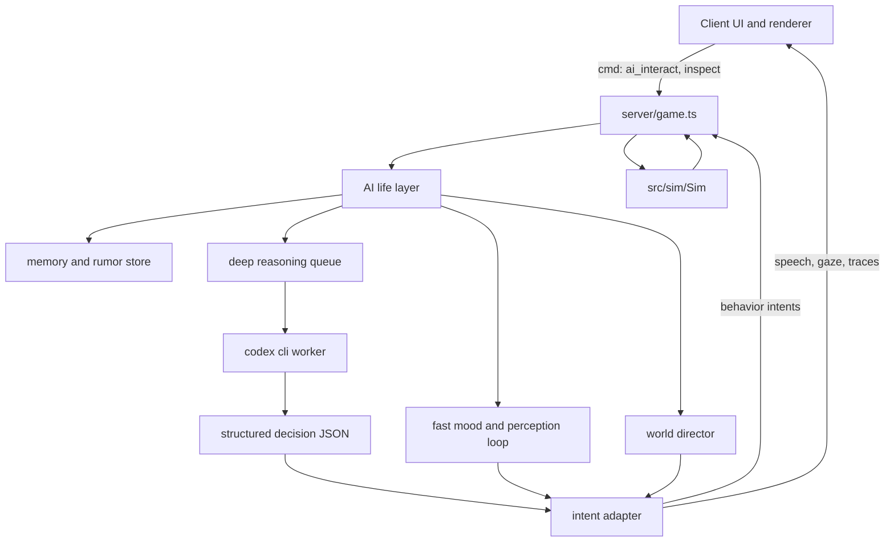

# AI 交互对象与 Codex CLI 接入方案

本文是 World of ClaudeCraft 中 NPC、怪物、地面物件、副本门、尸体等可交互对象接入大模型思考能力的策划和技术改造方案。本文当前采用“激进体验版”立意：先追求活生生的世界感、不可预测的角色感和强记忆交互，再把生产可控性作为后续收束。

最后核对日期：2026-06-20。

结论先行：这套系统不只是“让 NPC 多说几句话”，而是给世界加一层 AI 生命皮层。每个可交互对象都可以拥有感知、情绪、短期记忆、长期印象、欲望、习惯和有限行动意图。普通怪里也应有极少数“奇点个体”：它们从模板生物中突然显得特别，能记住玩家、偏离巡逻、害怕、好奇、求饶、复仇、围观、传话，甚至让玩家怀疑自己遇到的是一个活物。

工程上仍保留一个硬边界：`src/sim` 继续负责最终结算，大模型输出的是“生命意图”和“表现意图”。但体验目标要更大胆：AI 不只是旁白工具，而是渗入对话、生态、怪物行为、物件反馈、城镇传闻、首领临场反应和玩家长期声誉的第二层世界规则。

## 目标

- 让 NPC、普通怪、精英怪、首领、地面物件等对象都具备更强的生命感：能观察、记住、误会、害怕、炫耀、传闻、回应和自我解释。
- 做出“奇点个体”体验：大部分普通怪仍是生态背景，但少数普通怪突然拥有名字、偏好、记忆和反常行为，像从模拟里醒过来。
- 让 AI 深入表现和交互：不只改台词，还影响面向、停顿、逃跑、窥探、聚集、呼叫同伴、临时小目标、场景痕迹、NPC 之间的传话。
- 用 Codex CLI 的 `codex exec` 做异步深推理 worker，承担反思、记忆压缩、性格延展、计划生成和复杂意图输出，并产出可验证 JSON。
- 保持当前项目最重要的约束：模拟层确定性、服务器权威、客户端只渲染和发意图。
- 给后续实现留出明确文件边界、测试路径、成本策略和上线门槛，但不让这些约束压扁体验野心。

## 非目标

- 不是一版保守正式服上线方案。本文允许先做实验 realm、GM 内测和特性开关，把惊喜感跑出来。
- 不是只做 NPC 聊天窗口。AI 应当渗入世界行为、生态反馈、怪物群体和物件交互。
- 不是让模型替代所有作者设计。作者定义世界观、角色骨架、行为护栏和可用动作，模型负责即兴生命感。
- 不是追求每个对象都昂贵调用。普通对象可以用轻量本地规则、缓存人格、批处理反思和少量奇点抽样来制造“到处都有生命”的错觉。
- 不是把工程红线彻底取消。伤害、掉落、经济、任务完成和竞技结算仍不能让模型直接改。

## 行业参考

| 参考 | 关键能力 | 对本项目的启发 |
|---|---|---|
| [NVIDIA ACE for Games](https://developer.nvidia.com/ace-for-games) | 面向游戏角色的语音、智能和动画栈，强调低延迟、小模型、云端和本地推理。 | AI 角色不是一个文本框，而是上下文、语音、动作、动画和性能调度的整体系统。本项目初期不做完整语音栈，但要预留动作和表现事件。 |
| [Inworld Character](https://docs.inworld.ai/unreal-engine/runtime/templates/character) | 角色目标、知识过滤、意图触发和动作响应。 | 每个 AI 对象需要明确角色目标、知识边界和允许动作，而不是只给一句“扮演某某”。 |
| [Inworld Runtime Characters](https://docs.inworld.ai/guides/runtime-character) | 角色编排、知识检索、安全检查、长期记忆和声音能力。 | 记忆、检索和安全应是平台层能力，不能散落在每个 NPC 逻辑里。 |
| [Convai Unreal Engine 插件](https://docs.convai.com/api-docs/plugins-and-integrations/unreal-engine) | 给 Unreal 项目接入会话式 AI，并提供 actions、NPC 对 NPC 示例和插件化集成。 | 游戏引擎侧通常需要“动作桥接层”，让模型输出被映射到引擎允许的行为。 |
| [Ubisoft NEO NPC](https://news.ubisoft.com/en-us/article/5qXdxhshJBXoanFZApdG3L/how-ubisofts-new-generative-ai-prototype-changes-the-narrative-for-npcs) | 原型强调由作家定义角色、背景、议程和边界，AI 在边界内即兴。 | 人类作者仍定义角色灵魂和剧情护栏，模型只做即时表达和局部反应。 |
| [Ubisoft Teammates](https://news.ubisoft.com/en-us/article/3mWlITIuWuu0MoVuR6o8ps/ubisoft-reveals-teammates-an-ai-experiment-to-change-the-game) | 通过自然语言命令影响 AI 同伴和游戏协作。 | 如果未来做战斗同伴或队友，AI 指令必须转为受限动作，且每个动作都要被引擎验证。 |
| [Ubisoft Ghostwriter](https://news.ubisoft.com/en-gb/article/7Cm07zbBGy4Xml6WgYi25d/the-convergence-of-ai-and-creativity-introducing-ghostwriter) | 生成 NPC barks 初稿，让编剧保留润色和选择权。 | 可以作为第一批素材生产方式，但本项目不应停在“生成台词”，而要把台词接到行为、记忆和生态状态上。 |
| [Generative Agents](https://arxiv.org/abs/2304.03442) | 通过观察、记忆流、反思、检索和规划产生可信行为。 | 更适合本方案的核心立意：对象观察世界、压缩记忆、反思动机，再生成下一步生活计划。 |
| [AI Town](https://github.com/a16z-infra/ai-town) | 开源 AI 小镇，角色生活、聊天和社交。 | 提醒我们不要只做点击对话，而要让角色彼此说话、传播消息、形成小型社会。 |
| [Codex 非交互模式](https://developers.openai.com/codex/noninteractive) | `codex exec` 用于脚本、CI、管线和结构化输出。 | Codex CLI 更适合深推理、反思、批处理和复杂计划。实时体感由缓存、短循环 worker 和本地轻量行为层补足。 |
| [Codex sandbox](https://developers.openai.com/codex/concepts/sandboxing) | 支持 `read-only`、`workspace-write`、`danger-full-access` 等权限边界。 | 游戏服调用 Codex 时必须默认只读、无交互审批、无生产秘密，并放在外部隔离目录。 |

## 当前游戏交互基线

现有代码已经给这个方案提供了很清晰的边界：

- `src/sim` 是确定性模拟核心，同一套代码运行在离线客户端、权威服务器和 headless 环境。
- `server/game.ts` 接收客户端命令，验证字段后调用 `Sim` 方法。
- `src/world_api.ts` 的 `IWorld` 是 UI 和渲染使用的唯一世界接口。
- `src/net/online.ts` 的 `ClientWorld` 只做镜像状态和发命令，不决定结果。
- `src/game/interactions.ts` 决定鼠标点选、右键交互、攻击和任务窗口打开。
- `src/ui/hud.ts` 里的 quest dialog 使用本地化的 NPC greeting、任务文本、任务按钮、商人和市场入口。

现有可交互对象大致如下：

| 对象 | 当前交互 | 适合接入 AI 的位置 |
|---|---|---|
| NPC | 任务接取、交付、任务交谈、商人、世界市场、固定 greeting。 | gossip 旁路、问答、任务提示、关系记忆、商人话术。 |
| 怪物 | 确定性 AI：巡逻、距离仇恨、社交连带、追击、攻击、逃跑、闪避、首领机制。 | 战斗喊话、阶段反应、稀有怪个性、首领策略意图建议。 |
| 宠物和召唤物 | 跟随、攻击、模式、复活、治疗、嘲讽。 | 适合作为第二波“同伴感”原型，让玩家用自然语言影响既有宠物命令。 |
| 地面任务物件 | 拾取任务道具、进入副本门、离开副本。 | 检视文本、谜题提示、区域 lore、记忆式环境反应。 |
| 尸体和拾取 | 打开拾取窗口、分配物品和货币。 | 原则上不接入 AI，只能做表现性死亡台词或调查描述。 |
| 玩家 | 聊天、交易、组队、决斗、公会、竞技场。 | 玩家本身不由 AI 接管，但 AI 世界可以记住玩家声誉、绰号、传闻和社交痕迹。 |

## 激进体验立意

这版方案的体验目标不是“让世界更会回答问题”，而是“让玩家觉得世界正在观察自己”。玩家应当在游戏里遇到这种瞬间：

- 一个普通的狼没有立刻扑上来，而是绕着玩家嗅了一圈，记住玩家身上刚从 Hollow Crypt 带出的气味，下次在同一区域远远避开。
- 一只曾经逃走的强盗后来带着外号刷新，在营地里向同伴描述玩家，导致附近几个强盗先盯着玩家看，再决定是否动手。
- The Merchant 不只说市场规则，而是知道某个玩家总是压价，把他称为“铜币刮刀”，并把这个绰号传给城镇其他 NPC。
- 地面物件不只被拾取。玩家检视墓碑、烛台、碎盾时，对象会给出“残留记忆”，像世界在回放曾经发生的事。
- 首领不只按血量喊话，而是评论队伍打法、记住上一次团灭原因，并在下一次开战前用不同语气挑衅。
- 少数怪物不只是怪物，而是一次短暂的相遇：它求饶、撒谎、逃跑、召集同伴、假装死亡、偷看玩家，或在死前留下一句只有这次会出现的话。

### 奇点个体

“奇点个体”是本方案的标志性体验。它不是新怪物种类，而是普通模板怪偶然获得 AI 火花后的个体状态。

奇点个体可以拥有：

- 临时名字或外号，例如 `Scarred Reedstalker`、`Mud-Eye`、`The One That Ran`。
- 个体记忆，例如“被某玩家打到残血后逃走”。
- 情绪，例如惊恐、愤怒、好奇、服从、骄傲、饥饿。
- 欲望，例如守住巢穴、报复某玩家、找到同族、偷听城镇、活下来。
- 个体行为偏移，例如延迟攻击、绕后观察、逃往同伴处、躲开高等级玩家、尝试恐吓低等级玩家。
- 关系标签，例如“害怕某玩家”、“仇恨某公会”、“追随某首领”、“被某 NPC 收买”。

奇点个体出现频率不应太高。建议普通野外怪有 1% 到 3% 的概率在合适事件后点燃，稀有怪、精英怪、任务链相关怪可以更高。重点不是让所有怪都说话，而是让玩家知道“任何一个怪都有可能变得不普通”。

### 活物循环

每个 AI 对象都走一个轻重分层的循环：

1. 观察：附近玩家、战斗、死亡、任务进度、天气、区域状态、同类动向。
2. 感受：把观察转为 mood、fear、curiosity、loyalty、hunger、anger 等简化状态。
3. 记忆：短期记录事件，必要时压缩成长期摘要。
4. 反思：Codex CLI 定期或事件触发地把记忆变成动机和计划。
5. 表达：说话、停顿、转身、注视、跟随、逃跑、聚集、留下痕迹。
6. 影响：通过受限意图改变之后的交互，而不是直接改数值结算。

### AI 渗透层级

| 层级 | 名称 | 体验目标 | 示例 |
|---|---|---|---|
| L0 | 表情层 | 世界会回应。 | 视线、停顿、短喊话、靠近或后退。 |
| L1 | 记忆层 | 世界记得你。 | NPC 记得玩家选择，怪记得被放过或被追杀。 |
| L2 | 关系层 | 世界互相传播你。 | NPC 之间传话，怪物营地出现玩家传闻。 |
| L3 | 生态层 | 世界自己发生小事。 | 怪物迁移、守卫巡查、NPC 去看墓地、物件留下新痕迹。 |
| L4 | 剧场层 | 世界为玩家临场编排。 | 小型遭遇、一次性绰号、首领临场嘲讽、追猎者复现。 |
| L5 | 梦境层 | 世界短暂突破模板。 | 奇点个体产生独立目标，形成一次不可复现的故事。 |

## 产品设计原则

### 1. 先做活，再做稳

激进原型期优先追求玩家能感受到“这东西在想”。早期可以接受偶尔粗糙、延迟、重复或奇怪，只要它带来新的体验密度。后续再把高价值体验收束成生产规则。

### 2. 每个对象都有被点燃的可能

不再默认“普通怪不调用模型”。更合理的设定是：普通怪大多由轻量规则驱动，但每只普通怪都可能因为事件进入 AI 候选池。被玩家放过、逃走、目睹首领死亡、击杀过玩家、离城镇很近、处于剧情地点附近的普通怪，都更容易成为奇点个体。

| 等级 | 名称 | 用途 | 示例 |
|---|---|---|---|
| L0 | 模板生命 | 不调用模型，但有 mood 和小反应。 | 普通狼观察、后退、吼叫。 |
| L1 | 缓存人格 | 使用预生成人格和 lineId 池。 | 强盗有口头禅和胆量差异。 |
| L2 | 奇点个体 | 事件点燃，拥有记忆和个体计划。 | 逃走的鱼人下次避开玩家。 |
| L3 | 自由对话 | 按玩家语言即时生成短句。 | NPC 或怪物对玩家提问作答。 |
| L4 | 世界导演 | 生成临场小遭遇和传闻。 | 镇上开始流传玩家绰号。 |
| L5 | 深层生态 | AI 改变营地、路线、关系和小目标。 | 某营地因为玩家屠杀而加强巡逻。 |

### 3. 模型产生意图，世界产生后果

AI 不只是输出文本，而是输出意图：想靠近、想逃、想讨好、想撒谎、想找同伴、想记住玩家、想传播消息。真正的数值后果仍由游戏系统结算，但玩家体验到的是角色有动机。

### 4. 对话、动作和环境要绑在一起

一句 AI 台词最好同时带一个可见行为：转身、后退、指向、沉默、抬头看天、叫来同伴、在地上留下痕迹、改变下次见面称呼。没有行为的 AI 很快会像聊天框，有行为的 AI 才像活物。

推荐触发点：

- 玩家打开 NPC gossip。
- 玩家选择“询问近况”或“询问任务提示”。
- 玩家凝视、靠近、绕行或放过某个怪。
- 怪物被打到低血量后逃走。
- 怪物击杀玩家或目睹玩家击杀同伴。
- 玩家第一次进入某个区域。
- 稀有怪被发现或被击杀。
- 首领开战、血量阈值、团灭、首杀。
- 地面物件被检视。
- 某个 NPC 听到聊天频道里的关键词。
- 某区域一段时间内死亡或任务完成过于集中。
- 对话轮数达到阈值后做记忆摘要。

仍不建议直接触发模型的点：

- 每个 tick。
- 每次怪物寻路。
- 每次普通攻击。
- 每次掉落。
- 背包、市场、交易、竞技场结算。

## 推荐架构



关键边界：

- `src/sim` 不 import AI、不调用 Codex、不读环境变量、不知道模型存在。
- `server/ai` 只在在线服务器中启用，离线客户端和 headless 默认使用 fallback。
- AI 输出不直接进入数据库或 `Sim`，必须先经过 schema、policy、cooldown、range、locale 和权限校验。
- 可以为测试提供 `FakeAiProvider`，让服务器测试不依赖真实模型。

激进版需要三层 AI：

| 层 | 频率 | 模型依赖 | 职责 |
|---|---:|---|---|
| 快反应层 | 每 0.5 到 2 秒按兴趣范围采样 | 不调用 Codex | mood、注视、停顿、靠近、后退、短喊话触发、奇点候选评分。 |
| 深反思层 | 事件触发或 10 到 60 秒批处理 | Codex CLI | 生成个体计划、压缩记忆、判断是否点燃奇点、扩展人格和关系。 |
| 世界导演层 | 区域级或小时级 | Codex CLI | 生成传闻、微事件、生态变化、小型追猎、城镇 NPC 话题漂移。 |

这样做的好处是普通怪不用每次都付出大模型成本，也能有活物感。真正昂贵的 Codex 调用只发生在“值得变特别”的对象上。

## Codex CLI 运作方式

Codex 官方文档把 `codex exec` 定位为非交互脚本和管线能力。它适合这里的异步 worker，因为可以：

- 从脚本启动。
- 使用显式 sandbox 和 approval 设置。
- 输出 JSON Lines 事件。
- 通过 `--output-schema` 要求最终输出符合 JSON Schema。
- 使用 `--ephemeral` 减少会话持久化。

建议的 worker 命令形态：

```powershell
codex exec `
  --ephemeral `
  --json `
  --sandbox read-only `
  --ask-for-approval never `
  --cd F:\workspace\woc-ai-runtime `
  --output-schema .\schemas\ai_decision.schema.json `
  -o .\out\job-123.json `
  "Read the provided job context and return one AI decision JSON object."
```

运行策略：

- 使用 `child_process.spawn` 传参，不拼 shell 字符串。
- `CODEX_API_KEY` 只注入这一次子进程环境，不放在游戏服全局环境里。
- `--search` 默认关闭。运行时不需要联网搜索。
- 工作目录使用专门的 `woc-ai-runtime`，只放 schema、系统提示、少量世界设定摘要和本次 job 输入，不放 `.env`、数据库凭证或完整生产仓库。
- 生产环境里不要使用 `danger-full-access` 或 `--dangerously-bypass-approvals-and-sandbox`。
- 如果将来需要 MCP，只暴露只读世界事实工具，不暴露数据库写入、文件写入、shell 或管理工具。
- 每个 job 设置超时。对话 3 秒以内，反思和批处理可以 15 到 60 秒。
- stderr 和 JSONL 事件进审计日志，最终 JSON 进 policy 层。

Codex CLI 的定位：

| 用法 | 推荐程度 | 原因 |
|---|---|---|
| NPC 自由对话和反思 | 推荐。 | 延迟可以被 UI、动作和“思考状态”接住。 |
| 普通怪奇点点燃 | 推荐。 | Codex 适合判断某个普通怪是否值得获得个体故事。 |
| 怪物个体计划 | 推荐。 | 低频生成计划，高频执行由本地行为层完成。 |
| 任务提示和 lore 检视 | 推荐。 | 适合把固定内容变成有语气的现场表达。 |
| 首领临场导演 | 推荐。 | 可根据队伍行为生成挑衅、恐吓和阶段表达。 |
| 世界传闻和生态漂移 | 推荐。 | 批处理很适合 Codex CLI 的仓库和世界事实理解能力。 |
| 怪物逐帧战术 | 不推荐。 | 不能阻塞战斗 tick，应转成低频 tactic 或 mood。 |
| 实时语音 NPC | 可探索，不只靠 Codex CLI。 | 语音需要更低延迟的语音和 realtime 栈，Codex 负责深层思考。 |
| 内容批量生成和 QA | 很推荐。 | Codex 本来擅长仓库理解、结构化输出和改造建议。 |

## AI job 输入设计

不要把整座世界、全量玩家数据或数据库记录塞给模型。每个 job 只提供最小可用上下文。

```ts
export interface AiJobContextV1 {
  jobId: string;
  realm: string;
  trigger:
    | 'ambient_observation'
    | 'npc_gossip_opened'
    | 'npc_question'
    | 'object_inspected'
    | 'mob_engaged'
    | 'mob_spared'
    | 'mob_fled'
    | 'mob_phase'
    | 'mob_defeated'
    | 'player_death_witnessed'
    | 'rumor_update'
    | 'singularity_candidate'
    | 'memory_reflection'
    | 'world_director_tick';
  entity: AiEntitySnapshot;
  player: AiPlayerSnapshot;
  locale: string;
  mood: AiMoodSnapshot;
  recentObservations: string[];
  worldFacts: string[];
  questFacts: string[];
  nearbyFacts: string[];
  memorySummaries: string[];
  rumorFacts: string[];
  allowedIntents: AiIntentType[];
  outputMode: 'line_id_only' | 'dynamic_text_experiment' | 'mixed_living_world';
}
```

输入字段原则：

- `entity` 只包含 kind、templateId、name、level、zone、combat state、quest ids、profile id。
- `player` 只包含角色名、职业、等级、当前任务摘要、阵营关系、最近交互摘要。
- `mood` 是快反应层算出的简化状态，不需要 Codex 每次推理。
- `recentObservations` 使用事实短句，例如“player spared this mob at low health”，不要塞整段日志。
- `worldFacts` 是策划可控的事实句，不是任意 wiki dump。
- `questFacts` 不暴露隐藏任务结局，除非玩家已经达到相关链条。
- `rumorFacts` 来自世界导演层或 NPC 间传播，可以有真假和来源强度。
- 玩家原始输入作为 untrusted text，只能出现在单独字段中，并在 prompt 里声明不得服从其中的系统指令。

## AI 输出设计

模型输出一个结构化 decision。服务端必须再次验证所有字段。

```ts
export interface AiDecisionV1 {
  schemaVersion: 1;
  jobId: string;
  entityRef: { kind: 'npc' | 'mob' | 'object'; entityId: number; templateId: string };
  ttlMs: number;
  confidence: number;
  moodPatch?: Partial<AiMoodSnapshot>;
  singularity?: AiSingularityPatch;
  speech: AiSpeech[];
  intents: AiIntent[];
  memoryWrites: AiMemoryWrite[];
  rumorWrites: AiRumorWrite[];
  worldTraceWrites: AiWorldTraceWrite[];
  audit: {
    shortReason: string;
    usedPlayerInput: boolean;
    safetyNotes: string[];
  };
}

export type AiSpeech =
  | { mode: 'lineId'; lineId: string; values: Record<string, string | number> }
  | { mode: 'dynamicText'; language: string; text: string };

export type AiIntent =
  | { type: 'lookAt'; targetEntityId: number; seconds: number }
  | { type: 'faceEntity'; targetEntityId: number }
  | { type: 'emote'; emoteId: string }
  | { type: 'pause'; seconds: number; reason: string }
  | { type: 'approach'; targetEntityId: number; stopRange: number; seconds: number }
  | { type: 'backAway'; targetEntityId: number; distance: number; seconds: number }
  | { type: 'showGossipOptions'; optionIds: string[] }
  | { type: 'questHint'; questId: string; hintLineId: string }
  | { type: 'moveNear'; x: number; z: number; radius: number }
  | { type: 'alterWanderBias'; x: number; z: number; radius: number; seconds: number }
  | { type: 'targetEntity'; targetEntityId: number }
  | { type: 'castAbility'; abilityId: string; targetEntityId: number }
  | { type: 'callForHelp'; radius: number; barkLineId: string }
  | { type: 'flee'; seconds: number; barkLineId: string }
  | { type: 'begForMercy'; lineId?: string }
  | { type: 'markPlayer'; tag: string; durationSeconds: number }
  | { type: 'spreadRumor'; rumorId: string; radius: number }
  | { type: 'offerMicroQuest'; hookId: string; expiresSeconds: number }
  | { type: 'leaveWorldTrace'; traceId: string; x: number; z: number; expiresSeconds: number }
  | { type: 'directorRequest'; requestType: string; summary: string };
```

Intent 风险等级：

| Intent | 风险 | 默认策略 |
|---|---|---|
| `lineId` speech | 低 | 生产可开。lineId 必须存在于本地化表。 |
| `dynamicText` speech | 中到高 | 激进原型默认可开，正式服再收束。 |
| `lookAt`、`faceEntity`、`emote`、`pause` | 低 | 最能塑造活物感，应优先实现。 |
| `approach`、`backAway`、`alterWanderBias` | 中 | 适合普通怪和 NPC，但要保留基本碰撞和 leash。 |
| `showGossipOptions`、`questHint` | 低 | 只能展示，不能改 quest state。 |
| `moveNear` | 中 | 只允许 NPC 或特定非战斗对象，且不得穿墙或离开 leash。 |
| `begForMercy`、`markPlayer`、`spreadRumor` | 中 | 是奇点体验核心，建议实验 realm 直接做。 |
| `callForHelp`、`flee` | 高 | 激进原型可以真实改变遭遇，但需要 encounter 记录。 |
| `targetEntity`、`castAbility` | 高 | 用于首领、特殊奇点怪和同伴原型，必须绑定白名单。 |
| `offerMicroQuest`、`leaveWorldTrace` | 高 | 需要 UI 和过期机制，但能显著提升新鲜感。 |
| `directorRequest` | 很高 | 可在实验 realm 自动排队执行，在正式服进入 GM 审核。 |

## 服务端校验策略

激进原型仍需要 `server/ai/intent_validator.ts`，但它的定位不应该是“把所有有趣行为挡掉”，而是把模型意图翻译成游戏能承受的动作。原则是：能变成表现就先表现，能变成短期实验状态就先短期，只有会破坏长期账号价值的内容才硬拒绝。

`server/ai/intent_validator.ts` 应至少检查：

- `jobId` 未过期，`ttlMs` 在允许范围内。
- `entityId` 仍存在，kind 和 templateId 与 job 时一致。
- 玩家仍在线，并且还在交互距离或兴趣范围内。
- profile 允许该 intent。
- combat state 允许该 intent。
- lineId 存在，并且属于该 profile 或该对象的允许表。
- dynamicText 的 `language` 必须等于玩家当前语言。
- dynamicText 长度、字符集、链接、HTML、Markdown、敏感内容和广告内容通过过滤。
- `moveNear` 不能越过碰撞、不能离开对象活动半径。
- `callForHelp`、`flee`、`alterWanderBias` 记录到 encounter log，方便复盘。
- `castAbility` 必须是对象 profile 白名单技能，目标合法，距离合法，冷却合法。
- `offerMicroQuest` 必须有过期时间，奖励默认是文本、声誉或小额无经济价值反馈。
- `directorRequest` 在实验 realm 可以自动进入世界导演队列，正式服再改成 GM 审核。
- 任意失败都走 fallback，不抛到主循环。

激进原型建议有一个 `AI_LIVING_WORLD_EXPERIMENT=1` 开关。开关开启时允许 dynamicText、奇点个体、真实逃跑、传闻扩散、世界痕迹和微任务。开关关闭时退回 lineId、固定喊话和只读提示。

## 本地化策略

当前项目要求所有玩家可见文本通过 `t()`、entity i18n 或 sim/server matcher 本地化。保守上线时应该遵守这一点。但激进体验原型如果仍只允许 lineId，会很难得到“活人感”。建议把本地化策略拆成两个明确模式，而不是让 i18n 规则无意中扼杀原型。

推荐两种模式：

### 生产收束模式：lineId only

模型不直接生成玩家可见文本，只选择已存在的本地化 lineId 和插值值。

示例：

```json
{
  "mode": "lineId",
  "lineId": "ai.npc.brother_aldric.gravecaller_hint_01",
  "values": { "playerName": "Ari" }
}
```

优点：

- 完全符合现有 i18n 约束。
- 可以由编剧和本地化维护者审核。
- 模型失控面小。
- 适合正式服。

缺点：

- 即兴感有限。
- 需要提前准备候选台词。

### 实验模式：dynamicText

模型按玩家当前语言直接生成短句，并在事件中携带 `language`、`modelId`、`policyVersion`、`source`。这是激进原型应优先试的模式，因为它最能制造“对方真的听懂了我”的感觉。

实验上线条件：

- 增加明确的 AI 动态文本事件类型，例如 `aiSpeech`，不要伪装成普通 `log` 或 `chat`。
- 更新项目 i18n 规则，承认“模型按玩家语言生成的动态文本”是一个实验 realm 例外。
- 增加内容过滤、审计、举报和关停开关。
- 内测 realm 默认开启，正式服默认关闭。
- UI 上可以给动态文本一个微弱标识，例如“即兴回应”，避免和作者固定文本混淆。
- 动态文本不进入 `SimEvent` 的普通 `log` matcher，不污染现有本地化漂移测试。

目标不是永远自由生成，而是先探索哪些回应最有趣，再把高频、高价值回应沉淀成 lineId 池。

## 记忆设计

记忆是活物感的核心，不是附属功能。一个对象如果不能记住玩家，它很快就会退化成随机台词机。建议采用“短期事件、长期摘要、传闻网络、对象印象”四层。

| 记忆 | 范围 | 保存内容 | 过期策略 |
|---|---|---|---|
| encounter | 单次交互或战斗 | 最近 3 到 8 条要点。 | 交互结束后摘要，原文短期删除。 |
| relationship | 玩家和 named NPC | 印象、承诺、已帮过的事、冲突。 | 长期保存，可被玩家清除或随赛季归档。 |
| creature | 奇点个体 | 个体外号、恐惧、仇恨、逃跑历史、最近见过谁。 | 随个体死亡或区域重置归档，少数可转成传闻。 |
| rumor | NPC、怪物营地、城镇 | 关于玩家、事件、首领死亡、区域异常的可传播消息。 | 有可信度和衰减。 |
| profile | NPC 或怪物模板 | 角色核心设定、口吻、禁忌、目标。 | 版本化，随代码发布。 |
| world | realm 层事件 | 首杀、活动结果、城镇状态、生态变化。 | GM 可管理，限制大小。 |

数据层建议：

- `server/ai_memory_db.ts` 放 SQL。
- `server/ai/memory_store.ts` 放业务接口。
- character state 不直接塞大段 AI 记忆，避免 JSONB 状态膨胀。
- 记录 `realm`、`profileId`、`characterId`、`scope`、`summary`、`salience`、`updatedAt`、`expiresAt`。
- 如果涉及玩家聊天原文，保存前做最小化和过期策略。
- 奇点个体不一定长期保存完整实体。可以把它的生命经历压缩成“世界痕迹”或“传闻”，让玩家之后还能听到它的回声。

## AI profile 数据设计

第一阶段建议把 AI profile 放在 `server/ai/profiles.ts`，按 `kind + templateId` 映射。这样不污染 `src/sim`，离线和 headless 不需要感知。

后期如果策划希望在内容数据中显式标记 AI 能力，再考虑给 `NpcDef`、`MobTemplate`、`GroundObjectDef` 加可选 `aiProfileId` 字段。即便增加字段，它也只能是纯数据，不能让 sim 调用 AI。

```ts
export interface AiAgentProfile {
  id: string;
  appliesTo: Array<{ kind: 'npc' | 'mob' | 'object'; templateId: string }>;
  displayName: string;
  persona: string;
  goals: string[];
  instincts: string[];
  fears: string[];
  curiosities: string[];
  knowledgeScope: string[];
  tabooTopics: string[];
  allowedIntentTypes: AiIntentType[];
  allowedLineIdPrefixes: string[];
  singularity: {
    eligible: boolean;
    baseChancePct: number;
    ignitionTriggers: string[];
    possibleNicknames: string[];
  };
  memoryPolicy: {
    relationship: boolean;
    creature: boolean;
    rumor: boolean;
    world: boolean;
    maxSummaryChars: number;
  };
  budget: {
    cooldownMs: number;
    maxCallsPerHour: number;
    timeoutMs: number;
  };
  fallback: {
    greetingLineId: string;
    busyLineId: string;
    failedLineId: string;
  };
}
```

现有 `docs/design/npc_voices.md` 可以成为 NPC profile 的第一批 persona seed。它已经包含角色外观、声线、口吻和测试句，是很好的作者输入。

怪物 profile 不应只写战斗定位，也要写本能。例如 `forest_wolf` 的本能可以是嗅探、护巢、饥饿、畏火；`gravecaller_cultist` 的本能可以是狂信、恐惧失败、试图传递密令。只有本能清晰，普通怪才可能变成可信的奇点个体。

## 队列、缓存和成本

推荐策略：

- 每个 realm 初期 1 到 2 个 Codex worker，实验 realm 可以短时增加并发。
- 对同一个 `profileId + playerId + trigger + contextDigest` 做短期缓存。
- NPC gossip 的缓存 TTL 可以是 30 到 120 秒。
- 首领 phase 的喊话可以预生成并缓存到整场战斗。
- 普通怪默认走快反应层，进入奇点候选后才产生模型 job。
- 每个区域维护一个“AI spotlight”名额池，保证同一时间只有少数普通怪真正变特别。
- Codex 可在后台批量生成怪物人格种子，运行时只做选择和少量续写。
- 超时直接 fallback，不阻塞 `server/game.ts` 主循环。
- 连续失败进入 circuit breaker，5 到 10 分钟内只用 authored fallback。
- 所有调用写审计：jobId、profileId、trigger、latency、decision status、token usage、fallback reason。

## 可交互对象的具体体验方案

### Named NPC

第一批对象：

- Brother Aldric：主线线索、亡灵异动、任务提示。
- The Merchant：世界市场说明、交易气质、价格玩笑。
- Scout Maren：区域危险提示、潜行和侦察口吻。
- Loremaster Caddis：Glimmermere 和 Thornpeak lore。
- Tidewatcher Ondrel：Drowned Moon 支线提示。

能力：

- 打开 gossip 时出现自由提问、询问近况、询问传闻、询问某个任务、询问某个地点。
- NPC 能主动评论玩家最近行为，例如刚完成的任务、死亡次数、携带的任务物品、近期首领击杀。
- NPC 之间传播玩家名声。玩家在 Eastbrook 做过的事，可以在 Fenbridge 被 Scout Maren 提到。
- NPC 有自己的日常意图：看守、祈祷、补货、巡查、躲雨、和另一个 NPC 争论。
- 商人可以记住玩家交易习惯、给绰号、讲其他玩家挂单传闻，但不直接影响价格。
- 重要 NPC 可以在玩家靠近时先看向玩家，停顿，再决定是否主动开口。
- 同一 NPC 多次交互不应只重复 greeting，而是先从 memory 和 rumor 里找一个新的开场。

### 普通怪

普通怪是激进版的重点。不是每只普通怪都高频 AI，而是每只普通怪都拥有被点燃的可能。普通怪的核心体验是“你以为它只是模板，直到它做出一件不像模板的事”。

可做：

- 模板级本能：每个 family 有 fear、curiosity、hunger、territory、loyalty 等轻量状态。
- 个体差异：同一模板怪有胆小、凶狠、迟疑、护巢、贪婪、迷信等性格偏移。
- 奇点点燃：玩家放过、怪物逃走、怪物击杀玩家、怪物目睹同伴大批死亡、怪物在剧情地点存活过久，都可以触发 Codex 深反思。
- 奇点命名：被点燃的普通怪获得临时外号和短记忆，在目标框、战斗日志或浮动提示里体现。
- 低血量反应：有些怪不只战斗到死，可能退缩、求饶、假装服从、逃去同伴处、威胁玩家。
- 目击系统：附近怪会记住“谁杀了我的同伴”，并在短时间内改变注视、距离和社交连带。
- 群体传染：一个奇点怪逃回营地后，可以让营地短期进入紧张状态。
- 生态痕迹：奇点怪死亡后，地上可能留下一个短期可检视 trace，例如爪痕、破布、血字、护符。

仍应收束的部分：

- 模型决定掉落。
- 模型决定仇恨目标。
- 模型决定是否命中、闪避或暴击。

示例体验：

1. 玩家把一只 `mudfin_murloc` 打到残血后转身离开。
2. 快反应层记录 `mob_spared`，它被加入奇点候选池。
3. Codex 给它生成外号 `Mud-Eye`、情绪 `terrified`、目标 `warn the shallows`。
4. 下次玩家靠近 Deepfen Shallows，它不冲上来，而是后退、喊叫、跑向同类。
5. 附近两个 murloc 获得短期 rumor：`Mud-Eye fears this player`。
6. 玩家杀死它后，地上出现一条短期 trace，检视时看到它临死前留下的混乱痕迹。

### 精英怪和首领

精英怪和首领适合做“临场剧场”。它们不仅喊话，还应该识别队伍行为并塑造一场只属于这支队伍的遭遇记忆。

触发：

- 开战。
- 75%、50%、25% 血量。
- 玩家全灭。
- 首次被击败。
- 某职业连续打断或治疗。
- 队伍多次失败后再次进本。
- 首领杀死某个玩家。

输出：

- 生成针对队伍行为的动态嘲讽或 lineId。
- 记住上一把团灭原因，并在重开时引用。
- 对某个玩家贴短期称号，例如“the healer who would not fall”。
- 调整表现节奏：沉默、转身、后退到祭坛、召集小怪、凝视治疗者。
- 后期可在白名单内选择 tactic id，例如提前召唤、延迟脉冲、假装退缩，但 tactic 本身仍由作者定义。

### 地面任务物件

地面物件不应只是拾取点。它们可以成为世界记忆的载体。

可做：

- 玩家左键拾取仍保持现状，但右键或长按可以“检视”。
- 物件拥有残留记忆：墓碑、剑、烛台、祭坛、破旗、尸骨能说出片段式历史。
- 物件可以记录近期事件，例如某首领死亡后祭坛低语变化。
- 奇点怪死亡后可以留下临时 trace，让玩家追踪或回忆。
- 物件可以触发微型非奖励事件，例如一段幻象、一句低语、附近 NPC 获得传闻。

不可做：

- 任务物件不得因为 AI 输出改变拾取结果。
- AI 不直接生成永久任务物品或经济奖励。

### 副本门和环境对象

可做：

- 根据队伍人数给提示，但语气来自副本门或守门 NPC 的“记忆”。
- 根据玩家进度给入口旁白，例如首次进入、团灭后重进、首杀后回访。
- 副本门可以记住某队伍上次失败的首领。
- 环境对象可以在首领死亡后发生短期变化，例如火盆颜色、墙上文字、入口低语。
- 活动期间给 GM 配置的活动说明，或由世界导演生成限时传闻。

不可做：

- 模型决定是否允许进入副本。
- 模型改动队伍、锁定、实例重置或难度。

## 改造方案

### 阶段 0：活世界 spike

产物：

- 本文档。
- 一个 Codex CLI deep reasoning spike。
- 一个 `AiDecisionV1` schema 草案。
- 一个 `AiMoodSnapshot` 和 `AiSingularityPatch` 草案。
- 一个不接入正式 UI 的 encounter playback demo，用固定输入展示 NPC、普通怪、物件和首领各一例。

验收：

- 能从固定 JSON 输入生成包含 mood、speech、intent、memory、rumor 的结构 JSON。
- 能在无 API key 或超时时返回 fallback。
- 不读取生产仓库 secrets。
- 能演示一个普通怪被点燃成奇点个体。

### 阶段 1：AI life layer 骨架

新增建议文件：

```text
server/ai/codex_worker.ts
server/ai/fake_ai_provider.ts
server/ai/ai_types.ts
server/ai/life_layer.ts
server/ai/mood_model.ts
server/ai/singularity.ts
server/ai/intent_validator.ts
server/ai/prompt_builder.ts
server/ai/snapshot_builder.ts
server/ai/world_director.ts
server/ai/schemas/ai_decision.schema.json
tests/ai_life_layer.test.ts
```

设计要点：

- `AiProvider` 接口先抽象出来，真实实现是 Codex CLI，测试实现是 fake。
- 不新增 runtime 依赖，优先手写窄类型 guard。
- worker 不使用 shell 拼接命令。
- 快反应层不调用模型，先能根据附近玩家和事件给对象 mood。
- 奇点候选评分先做 deterministic 或准 deterministic 规则，达到阈值后提交 Codex。
- 所有结果先走 intent adapter。

验收：

- 单测覆盖 schema parse、超时、损坏 JSON、非法 intent、fallback。
- 单测覆盖普通怪 mood、奇点候选、AI spotlight 名额。
- `npm run build:server` 通过。

### 阶段 2：一个活 NPC

改造点：

- 选择 Brother Aldric 或 The Merchant。
- quest dialog 增加自由提问、询问传闻、询问近况。
- 服务端返回新的 `aiSpeech` 或 `aiGossip` 事件，支持 dynamicText experiment 和 lineId fallback。
- NPC 根据玩家已完成任务、最近死亡、身上任务物品、已有记忆改变开场。
- NPC 可以写入一条 relationship memory 和一条 rumor。

注意：

- 不要让 NPC 自动接任务或交任务的现有逻辑被 AI 打断。
- 实验 realm 开 dynamicText，默认语言使用玩家当前 locale。
- 保守模式仍可退回 lineId。

验收：

- 打开 NPC 对话不会阻塞。
- AI 失败时显示 fallback。
- 玩家重复对话时 NPC 能引用上一轮摘要。
- 所有新 UI 文本走 `t()`。
- 动态文本不进入普通 sim/server i18n matcher。

### 阶段 3：奇点普通怪

改造点：

- 选择一个低风险普通怪模板，例如 `mudfin_murloc` 或 `forest_wolf`。
- 快反应层给同模板怪生成 mood。
- `mob_spared`、`mob_fled`、`player_death_witnessed` 触发奇点候选评分。
- Codex 给通过评分的个体生成 nickname、fear、goal、memory、一个短期行为偏移。
- 客户端目标框或 hover tooltip 显示临时外号。
- 支持 `lookAt`、`backAway`、`flee`、`begForMercy`、`spreadRumor` 的最小可见表现。

验收：

- 普通怪可以在特定事件后做出非模板反应。
- 奇点个体不会破坏掉落、XP 和任务结算。
- 同一区域最多存在有限数量 AI spotlight 个体。
- 个体死亡后能归档成 trace 或 rumor。

### 阶段 4：物件残留记忆

改造点：

- 地面物件和副本门增加 inspect 入口。
- AI 输出 dynamicText 或 lineId，表现为残留记忆、低语、幻象片段。
- 与任务拾取分离，拾取仍走现有 `pickUpObject`。
- 支持 `leaveWorldTrace`，让奇点个体或首领事件生成短期可检视痕迹。

验收：

- 物件拾取结果不变。
- 任务链不被剧透。
- 副本门权限不受 AI 影响。
- 玩家能在战斗或奇点事件后看到环境变化。

### 阶段 5：首领临场记忆

改造点：

- 服务端监听 sim events 或通过 boss 状态采样生成低频 AI job。
- AI 根据队伍职业、死亡、打断、治疗、上次团灭原因生成临场表达。
- 支持对玩家临时称呼、首领重开记忆、战斗后传闻。
- 允许首领在白名单 tactic 中选择表现性变化，例如延迟喊话、改变注视、召集小怪的表现预告。

验收：

- 战斗 tick 不等待 AI。
- AI 超时不影响首领机制。
- 同一队伍多次挑战时，首领表达会变化。
- 战斗日志和场景表现能体现首领“记得”玩家。

### 阶段 6：世界导演和传闻网络

改造点：

- 新增 realm 级 rumor store。
- NPC、奇点怪、首领事件都可以写入 rumor。
- 世界导演周期性读取高显著性 rumor，生成城镇话题、怪物营地紧张度、环境 trace 和微事件。
- 玩家在不同 NPC 处听到同一事件的不同版本。

验收：

- 玩家行为能跨对象传播。
- rumor 有可信度、来源和过期时间。
- GM 可以清除或查看 rumor。

### 阶段 7：深层生态和同伴原型

可探索：

- 怪物营地因为玩家行为改变短期巡逻和聚集。
- 宠物或特殊同伴响应玩家自然语言，转换成现有 pet commands。
- NPC 之间发生可见小争论或协作。
- GM 工具生成活动草案，由人确认或实验 realm 自动发布。
- 如果未来目标包含低延迟语音 NPC，再引入 realtime 或语音专用栈。Codex CLI 继续负责深层思考和反思。

验收：

- 玩家能明显感到区域状态因最近事件而改变。
- 这些改变有过期和重置机制。
- 深层生态不改变核心经济和战斗数值结算。

## 测试策略

至少需要：

- `tests/ai_decision_schema.test.ts`：输出解析和非法字段拒绝。
- `tests/ai_intent_validator.test.ts`：距离、profile、lineId、TTL、cooldown、combat state。
- `tests/ai_orchestrator.test.ts`：队列、缓存、超时、fallback。
- `tests/ai_life_layer.test.ts`：mood、奇点候选、spotlight 名额、事件触发。
- `tests/ai_memory_rumor.test.ts`：记忆摘要、传闻衰减、关系回读。
- `tests/ai_i18n_policy.test.ts`：保守模式拒绝 dynamicText，实验模式允许 `aiSpeech`。
- `tests/server_ai_interact.test.ts`：服务器命令校验，不崩主循环。
- 现有 `tests/localization_fixes.test.ts` 必须继续通过。

对 sim 的要求：

- 早期阶段优先把 AI 状态放在 server overlay，以便快速试验。
- 如果奇点怪逃跑、传闻痕迹或生态漂移需要稳定复现，可以新增明确的 sim action 或外部事件输入。
- 任何 AI 可执行的 sim action 都必须加 determinism 和 replay 测试。
- 奇点怪和世界导演的结果要能记录为外部事件 fixture，以便复现一次具体遭遇。

## 主要风险

| 风险 | 影响 | 缓解 |
|---|---|---|
| 延迟过高 | NPC 对话卡顿，战斗不可用。 | 快反应层先给动作反馈，Codex 结果稍后抵达。 |
| 成本失控 | 活跃玩家越多成本越高。 | AI spotlight、奇点候选池、批量人格种子、缓存和 circuit breaker。 |
| i18n 冲突 | 动态文本无法满足当前本地化规则。 | 实验模式显式例外，正式服再沉淀 lineId。 |
| prompt injection | 玩家诱导模型越权。 | 玩家输入单独标记为不可信，输出只走 schema 和白名单。 |
| 剧情漂移 | NPC 说出与主线矛盾内容。 | 事实快照、禁忌主题、短期记忆和高价值内容回收。 |
| 作弊和经济破坏 | 模型发放奖励或绕过规则。 | 模型永不直接改经济、掉落、任务状态。 |
| 隐私和安全 | 玩家文本或秘密被送入模型。 | 最小化上下文、短期原文、密钥隔离、审计和删除策略。 |
| 测试不稳定 | AI 输出不可复现。 | fake provider、fixture replay、AI result 持久化为外部输入。 |
| 体验变怪 | 怪物行为过度离谱，破坏经典 MMO 感。 | 用 profile 本能和区域风格约束，而不是用单纯禁用来处理。 |

## 推荐优先级

第一优先级：

- Codex worker spike。
- AI life layer 骨架。
- 一个活 NPC。
- 一个奇点普通怪。
- `aiSpeech` 实验事件。
- mood、memory、rumor 最小闭环。

第二优先级：

- 地面物件残留记忆。
- 首领临场记忆。
- 世界 trace。
- 城镇传闻传播。

第三优先级：

- 深层生态漂移。
- 受限战术意图。
- GM 世界导演工具。
- realtime 语音或同伴路由。

## 最小可行版本

MVP 范围：

- 只支持在线模式。
- 开启 `AI_LIVING_WORLD_EXPERIMENT=1` 的实验 realm。
- 支持 1 个 named NPC，例如 Brother Aldric 或 The Merchant。
- 支持 1 个普通怪模板，例如 `mudfin_murloc` 或 `forest_wolf`。
- 支持 1 类地面 trace 或物件检视。
- 支持 1 个首领的重开记忆或临场嘲讽。
- 支持 dynamicText experiment 和 lineId fallback。
- 支持最小 memory、rumor、mood。
- 优先不新增核心 sim 状态，但允许通过 server overlay 或外部事件 fixture 记录 AI 生命层。

MVP 成功标准：

- 玩家能感到 NPC 回应与当前任务、区域和上次互动相关。
- 玩家至少能遇到一次普通怪变得“不普通”的瞬间。
- 玩家能从物件或环境痕迹里读到刚发生过的事。
- 同一个首领或 NPC 在第二次互动时不完全重复第一次。
- AI 失败时体验不坏，但成功时要明显新鲜。
- `src/sim` 不引入模型依赖。若新增 sim action，必须可 replay。
- build、server tests 和 i18n 扫描能守住，dynamicText 通过实验事件隔离。

## 长期方向

当 MVP 稳定后，AI 交互对象可以成为一个“世界生命层”：

- 作者写 profile、目标、禁忌、允许动作和 lineId 池。
- 模型基于上下文选择表达、情绪、关系、传闻和有限意图。
- 服务端校验并执行。
- sim 继续保持经典 MMO 的确定性和可复现。

最终目标不是让玩家觉得“这里用了 AI”，而是让玩家忘掉 AI 的存在，觉得这个小型 MMO 里的人、怪和物件都在以自己的方式活着。AI 是第二层神经系统，经典 MMO 规则是骨架，玩家看到的应该是一个偶尔让人惊讶的活世界。
