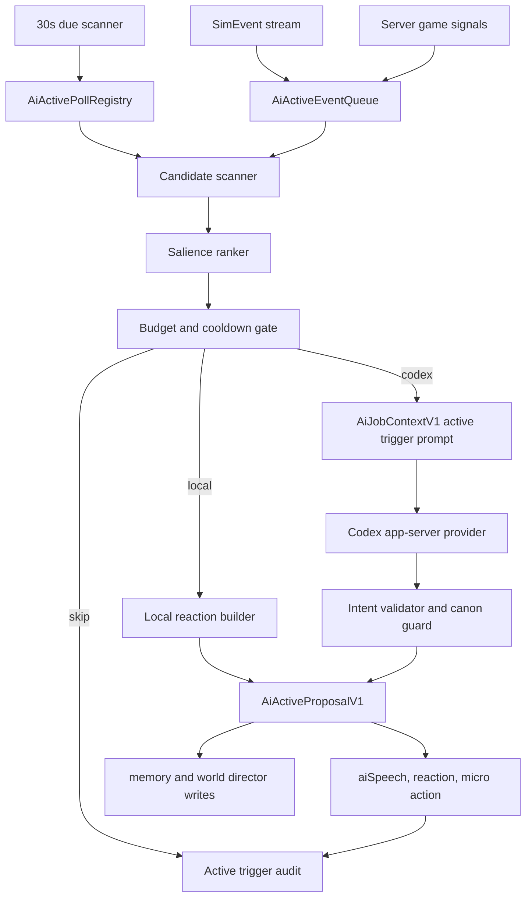

# AI 主动触发与轮询导演机制设计

本文是 World of ClaudeCraft 的 AI 生命层主动触发机制归档。它补齐现有 `docs/design/ai-interactable-agents.zh_CN.md` 中偏“玩家点击后响应”的部分，重点设计两条新入口：

- 游戏内事件主动触发：战斗、任务、场景、天气、时间、掉落、玩家行为、随行对象、区域状态变化都会进入 AI 候选队列。
- 定时轮询主动触发：服务端维护一张可配置轮询表，每个轮询项目可以指定周期、条件、候选对象、预算和可用动作。默认先用较短周期，基础轮询为 5 分钟。

最后核对日期：2026-06-22。

结论先行：这套机制要让世界不等玩家点击才开口。NPC、宠物、普通怪、奇点个体、区域导演和语义物件都可以因为“看见了什么、想起了什么、到了什么时间、天气变成什么样、玩家停留太久或刚丢下某个东西”而主动产生一段想法、一句短话、一次靠近、一次躲避、一次观察、一次巡查或一条区域传闻。目标手感接近开放世界里的 ambient life：玩家只是经过，世界也在自己发生事。

## 已确认的产品决策

本节记录 2026-06-22 已确认的方向，后续实现以这里为默认立场。

| 主题 | 锁定决策 |
|---|---|
| 开关 | 主动机制必须有独立开关，事件触发和轮询触发分开控制。 |
| 在线人数 | 轮询运行必须依赖在线人数。没有玩家在线时不运行；在线人数越多，调度频率、候选数量和 Codex 并发要按预算动态缩放。 |
| 第一版强度 | 第一版就做真实能力，不只做 dry run 或纯预览。 |
| 触发密度 | 第一版先密一点，不对玩家主动事件做硬上限；如果出现打扰或刷屏，再从后台规则、冷却和噪音预算收束。 |
| Codex 使用 | 初期尽量激进使用 Codex。限制依据是 Codex 的 5 小时窗口和一周窗口预算，而不是一开始就保守省调用。 |
| 动态文本 | 主动 AI 第一版就大量使用动态中文和英文回复，按玩家 locale 输出，并经过 schema、validator、口语化清洗和审计。 |
| 普通怪行为 | 普通怪主动行为可以影响开怪、逃跑和呼叫同伴，但必须走服务器权威动作桥和可测试规则。 |
| 关键 NPC | 关键 NPC 允许短距离生活动作，只要有自动回位、交互距离保护和任务安全守门。 |
| 玩家设置 | 推荐加入客户端设置，让玩家降低主动 AI 频率或关闭主动 AI 气泡。 |
| 长记忆 | 尽可能长期保存 AI 记忆。需要存储尺寸边界和比例预算，超过预算时删除旧的或低价值记录；初始预算应偏大。 |
| 后台 | 第一版就做可编辑后台，不只做只读诊断。 |
| 误会 | 允许轻微误会，例如 NPC 根据传闻错认玩家，但不能改变任务事实、奖励、声望或战斗结算。 |
| 失败体验 | 主动触发失败时按推荐静默处理：记录审计和后台错误，不主动弹给玩家；玩家手动点击 AI 时才显示失败。 |

## 归档位置与关系

| 文档 | 关系 |
|---|---|
| `docs/design/ai-interactable-agents.zh_CN.md` | AI 生命层主方案。定义 NPC、怪物、物件、场景语义、奇点个体、Codex provider、主线护栏和螺旋计划。本文是它的主动触发专题补充。 |
| `docs/design/ai-audit-center.zh_CN.md` | AI 审计与后台可观测归档。本文新增的主动触发需要进入同一审计中心。 |
| `docs/design/current-game-design.zh_CN.md` | 当前游戏事实总览。主动触发的场景、区域、职业、宠物、任务和副本都以该文档和源码为事实来源。 |
| `server/ai/life_layer.ts` | 当前 AI 生命层入口。已有 `handleSimEvents`、NPC 交互、物件检视、场景检视、丢弃物品、宠物命令和 provider cache。主动机制应作为新服务接入这里，而不是进入 `src/sim`。 |
| `server/ai/world_director.ts` | 当前区域余波和 proposal store。主动轮询要扩展 proposal 的来源、状态、执行计划和审计生命周期。 |
| `server/ai/scene_frame.ts` | 当前场景感知快照。主动机制的候选排序必须读这里的时间、天气、光照、场景物件、同伴和危险压力。 |

## 需求分析

### 玩家体验目标

玩家应该在 5 到 15 分钟的普通游玩里自然遇到以下变化：

- 到了饭点，城镇 NPC、守卫、商人、同伴或野兽会显得饿、烦躁、想找火堆、想找食物，或者评论玩家背包里的食物味道。
- 玩家站在铁匠铺、湖边、墓地、桥头、沼泽雾中或高塔旁，周围对象会主动产生短想法，而不是必须点“检视场景”。
- 玩家带着宠物或 NPC 进入危险区域时，宠物或随行者会主动犹豫、靠近主人、后退、低声说话、盯住某个物件。
- 玩家丢下食物、武器、骨片、药水、任务物或奇点遗物后，附近对象不一定立即全部冒泡，而是少数最相关对象在接下来的轮询或事件窗口里持续反应。
- 普通怪也会偶尔做出有个性的主动动作：远远盯着、绕开、嗅闻、守住某个物件、模仿同类、害怕星空、在雨里找遮蔽物。
- 每个 named NPC 都不只是站在功能点上。商人会盘货，守卫会换岗，牧师会祈祷，渔夫会看水，铁匠会收炉，夜里有人打盹或变得沉默。
- 类人怪和人形怪也有自己的生活。强盗分赃，邪教徒低声仪式，狗头人争蜡烛，食人魔站着睡，巨魔烤肉，鱼人围着浅水叫成一片。
- 非人怪不需要说人话，但要让玩家看出习性。野兽闻味和守食，蜘蛛修网和感震，亡灵沉寂和旧誓，元素共鸣，龙类护宝，恶魔挑拨恐惧。
- 玩家路过 NPC 堆时，可能听到一段连续对话：几句短话、几个停顿、一次看向或短移动，而不是所有对象同一瞬间冒泡。
- 世界导演能把玩家最近事件转成区域级小变化：营地更警觉、NPC 更愿意谈某个话题、桥头守卫扫视、野兽远离教堂、鱼人靠近水边丢下的鱼。
- 主动行为不抢玩家主线节奏。它像世界的呼吸，不像弹窗任务，也不像到处刷屏的聊天机器人。

### 当前缺口

现有 AI 生命层已经做到：

- 玩家打开 NPC gossip 或追问 topic 时，走 AI provider 或本地反应。
- 玩家检视物件、检视场景、丢弃物品、命令宠物时，可以产生语义反应。
- `handleSimEvents` 已监听 `questDone`、`damage`、`death` 等真实模拟事件，写入传闻、世界痕迹、首领记忆和世界导演状态。
- 世界导演有 `state`、`proposal`、TTL、审计 journal 和后台展示。
- 场景语义已有建筑、天气、昼夜、危险压力、语义物件和同伴。

仍缺：

- 没有统一的主动事件队列。事件触发散落在各入口，没有“这个事件是否值得让某对象主动做事”的集中判断。
- 没有轮询表。无法配置“饭点”“夜晚星空”“下雨找屋檐”“附近物件想法”“营地紧张巡查”等规则的周期和预算。
- 没有主动候选选择器。玩家周围可能有很多对象，系统需要只挑最有戏的 1 到 2 个，而不是全部冒泡。
- 没有主动行为的预算层。高密度区域如果每 5 分钟所有 NPC 都说话，会变成噪音。
- 没有主动行为的可执行动作桥。当前多数 proposal 是 preview，只进入诊断和表现。主动机制需要把低风险行为转成可见动作，同时保持服务器权威。
- 没有面向主动触发的后台观测。运营需要知道哪些 rule due、哪些 skipped、为什么某 NPC 主动说话、为什么被压制。
- 没有统一生活状态机。NPC、类人怪和非人怪还缺岗位、吃饭、休息、睡意、巡逻、躲雨、守巢、觅食、共鸣等长期节律。
- 没有连续行为调度。NPC 间聊天、营地换岗、怪物争抢、群体警戒和传闻传播还只能表现成孤立单句。

### 核心需求

| 编号 | 需求 | 说明 |
|---|---|---|
| R1 | 事件触发 | 游戏内事件进入 AI 主动触发队列，包括任务、战斗、死亡、掉落、天气、时间、场景进入、玩家停留、随行对象、区域导演状态变化。 |
| R2 | 定时轮询 | 服务端有一张轮询项目表，默认基础周期 5 分钟，每个项目可配置独立周期、条件、范围、预算和动作类型。 |
| R3 | 周边对象高密度扫描 | 在玩家周围按场景、对象、记忆、个性、距离和冷却选出最值得主动反应的对象，避免所有对象同时冒泡。 |
| R4 | 生活节律 | 时间和天气能触发生活化反应，例如饭点、夜晚疲劳、晴夜星空、下雨躲避、雪地抱怨、雾中害怕。 |
| R5 | 主动行动 | 允许 AI 产生低风险主动动作：说话、看向、靠近、避开、检视、短暂停顿、寻求遮蔽、巡查、传播传闻。 |
| R6 | 世界导演接管 | 事件和轮询共同喂给世界导演，形成短期区域状态和低风险 proposal。 |
| R7 | 奇点个体增强 | 普通怪中的奇点个体可以被轮询唤醒，产生自发记忆、计划和小目标。 |
| R8 | 成本和噪音控制 | 有全局、场景、实体、rule、provider 的预算和冷却。玩家主动事件不做第一版硬上限，但 Codex 调用必须受 5 小时和一周滚动窗口保护。 |
| R9 | 主线安全 | AI 不能决定任务完成、奖励、掉落、经济、战斗结算和副本权限。关键 NPC 不能因为主动行为离开任务可交互范围。 |
| R10 | 可观测和可测 | 每次主动触发要有审计记录、触发原因、候选分数、跳过原因、provider timing、输出动作和最终展示事件。 |
| R11 | 全生物生活层 | 每个有智力或可被玩家感知为有生命的对象，都要有日常节律、需求、习惯动作和可中断的短行为。NPC 需要人设和作息，类人怪需要营地生活，非人怪需要符合家族习性的生态表现。 |
| R12 | 连续行为 | 系统要支持一次 AI 思考生成多步对话或多步动作，并按节奏播放。连续行为包括 NPC 间闲聊、换岗、吃饭、巡查、祈祷、狩猎、躲雨、警戒扩散、传闻传播和怪物群体反应。 |

## 设计原则

1. 主动不是刷屏。一个场景主动发生一件小事，往往比十个 NPC 一起冒泡更有生命感。
2. 第一版 AI 优先，本地保底。只要 Codex 预算允许，主动事件和轮询都应尽量交给 Codex 做即兴表达；本地规则负责保底、预算耗尽、失败静默和关键安全动作。
3. 事件比轮询优先。玩家刚完成任务、刚丢下物品、刚带宠物进墓地，这些应比普通 5 分钟环境轮询更容易触发。
4. 轮询要有抖动。所有玩家和所有 rule 不能在同一秒同时触发。抖动使用服务端非模拟层随机或稳定 hash，不进入 `src/sim`。
5. 主动动作必须可撤销。靠近、后退、注视、短暂停留、临时巡查都要有 TTL 和回归策略。
6. 主动输出必须有边界。模型只能从允许 intent 中选，所有输出经过 validator 和 canon guard。
7. 世界可以记住，但不永久膨胀。主动触发写入的记忆默认短 TTL，只有优秀动态结果才进入作者沉淀。
8. 生命感来自节律，不只来自台词。站着打盹、吃饭中、修理中、巡逻中、盯着雨水、躲在火边、整理蛛网、闻到玩家丢下的肉，都要能成为可见状态或行为。
9. 连续行为要有呼吸感。一次 AI 调用可以生成后续 20 到 90 秒的多步节奏，但每一步都可被战斗、任务交互、玩家离开、路径失败或安全守门取消。

## 主动触发分类

### 事件触发

事件触发来自真实游戏行为，优先级高，适合让世界立刻或延迟几秒主动反应。

| 事件 | 来源 | 主动反应方向 | 示例 |
|---|---|---|---|
| `questDone` | `SimEvent` | 同场景和同区域传闻、NPC 松口气、守卫改口、世界导演 relief | 玩家完成 Eastbrook 亡灵链后，Brother Aldric 之外的 NPC 也低声提到墓地安静了些。 |
| `death` | `SimEvent` | 首领记忆、奇点死亡痕迹、同类恐惧、区域警觉 | 一只奇点狼被杀后，附近野兽短暂避开该位置。 |
| `damage` 阈值 | `SimEvent` | 首领阶段喊话、精英怪紧张、同伴提醒 | 首领血量低于 20% 时，周围同类停顿或咆哮。 |
| 玩家进入场景 | server interest 或位置采样 | 场景初见、天气评论、危险警告 | 玩家第一次走近 Fallen Chapel，随行宠物后退。 |
| 玩家停留过久 | 主动轮询服务 | NPC 看玩家、怪物观察、场景沉默 | 玩家在铁匠铺挂机，铁匠主动问是不是等炉火。 |
| 玩家丢弃物品 | 已有 discard 路径 | 食物吸引、贵重物引发贪婪、诅咒物引发恐惧 | 食物先吸引野兽，5 分钟内成为 NPC 传闻。 |
| 天气块变化 | `time_weather_model` | 下雨躲避、雾中害怕、雪地疲惫、晴夜抬头 | Mirror Lake 晴夜，渔夫看水面星光。 |
| 时间阶段变化 | `time_weather_model` | 黎明清醒、白天精神、黄昏收工、夜晚疲劳 | 黄昏守卫说换班快到了。 |
| 宠物或随行 NPC 进入特殊区域 | `SceneFrameV1.companions` | 非亡灵害怕、恶魔被警惕、野兽闻到尸气 | 带恶魔进城镇，守卫盯住它。 |
| 世界导演 state 创建或刷新 | `AiWorldDirectorStore` | 区域话题偏移、营地警觉、物件痕迹回声 | Eastbrook 出现贵重物传闻后，市场 NPC 更警觉。 |
| 玩家刚从副本出来 | server session and scene | 伤痕、战利品、队伍状态、区域旁观 | 城镇 NPC 说玩家身上有墓穴冷气。 |

### 定时轮询

轮询用于没有明确事件但世界应该自己呼吸的场景。服务端不应每 tick 计算，而是用独立间隔检查 due rule。

基础策略：

- 事件触发和轮询触发分别由 `AI_ACTIVE_EVENTS_ENABLED`、`AI_ACTIVE_POLLS_ENABLED` 或后台 realm 配置控制。
- 没有在线玩家时，轮询不运行，只保留必要的内存清理和 provider warmup。
- 调度器每 30 秒检查一次 due rule。
- 轮询项目默认周期 300 秒，也就是 5 分钟。
- 每个 rule 自己有 `periodSeconds`、`jitterSeconds`、`perPlayerCooldownSeconds`、`perEntityCooldownSeconds`。
- 每次 due 后不一定产出事件。轮询可能因为没有合适候选、预算不足、玩家忙碌、后台关闭或安全守门而跳过。
- 第一版不对玩家主动事件做硬上限，但每次轮询仍按屏幕可读性选择少数对象，避免同一瞬间全部冒泡。
- 在线人数会影响扫描密度、Codex 并发和每轮候选数量。人少时更激进，人多时优先保持总预算不超。

## 轮询表设计

### 数据来源

建议采用“两层表”：

1. 代码种子表：`server/ai/active_poll_rules.ts`，用于版本化默认规则、测试和无 DB 环境。
2. 持久化覆盖表：`ai_active_poll_rules`，用于运营调整周期、启停、权重和实验 realm 配置。

代码种子负责默认体验，DB 覆盖负责线上调参。没有 DB 或表未初始化时，服务端只读代码种子表。

### 规则结构

```ts
export interface AiActivePollRuleV1 {
  ruleId: string;
  title: string;
  enabled: boolean;
  category:
    | 'dailyNeed'
    | 'sceneAmbient'
    | 'weather'
    | 'time'
    | 'companion'
    | 'creature'
    | 'worldDirector'
    | 'townLife'
    | 'encounterEcho'
    | 'livingRoutine'
    | 'groupConversation'
    | 'activeSequence';
  periodSeconds: number;
  jitterSeconds: number;
  priority: number;
  scope: 'playerVicinity' | 'scene' | 'zone' | 'realm';
  onlineGate: {
    minOnlinePlayers: number;
    maxOnlinePlayers?: number;
    emptyWorldBehavior: 'skip';
  };
  onlineScaling: {
    lowPopulationMultiplier: number;
    highPopulationMultiplier: number;
    highPopulationThreshold: number;
  };
  candidateSelector: AiActiveCandidateSelector;
  condition: AiActiveRuleCondition;
  actionBudget: AiActiveActionBudget;
  providerPolicy: 'localOnly' | 'codexAllowed' | 'codexPreferred';
  outputMode: 'lineIdOnly' | 'dynamicTextFirst' | 'mixedLivingWorld';
  allowedIntents: string[];
  allowedLineIds: string[];
  cooldown: {
    perPlayerSeconds: number;
    perEntitySeconds: number;
    perSceneSeconds: number;
    perRuleSeconds: number;
  };
  auditTags: string[];
}
```

### 全局开关和在线人数策略

全局配置既可以来自环境变量，也可以由后台写入 realm 覆盖表。环境变量是启动默认值，后台配置是运行时覆盖。

| 配置 | 默认 | 说明 |
|---|---|---|
| `AI_ACTIVE_EVENTS_ENABLED` | `1` | 是否启用游戏内事件主动触发。 |
| `AI_ACTIVE_POLLS_ENABLED` | `1` | 是否启用定时轮询主动触发。 |
| `AI_ACTIVE_DYNAMIC_TEXT_ENABLED` | `1` | 是否允许主动 AI 使用动态文本。第一版默认开启。 |
| `AI_ACTIVE_REAL_ACTIONS_ENABLED` | `1` | 是否允许真实微动作、开怪、逃跑、呼叫同伴等服务器权威动作桥。第一版默认开启。 |
| `AI_ACTIVE_PLAYER_VISIBLE_ERRORS` | `0` | 主动 AI 失败是否提示玩家。默认静默，只写审计和后台。 |
| `AI_ACTIVE_POLL_BASE_SECONDS` | `300` | 默认轮询周期。单个 rule 可以覆盖。 |

在线人数分层：

| 在线人数 | 轮询策略 | Codex 策略 | 说明 |
|---:|---|---|---|
| 0 | 不运行轮询 | 不发主动 job | 空世界不自说自话，只做清理和 warmup。 |
| 1-5 | 激进 | codexPreferred rule 尽量调用 | 适合制造强沉浸，单人或小队能频繁遇到主动世界。 |
| 6-20 | 标准激进 | 按 5 小时窗口预算分配 | 保持高频，但开始压低低优先级重复事件。 |
| 21-50 | 拥挤 | Codex 只给高分候选和奇点 | 避免多人城镇中同时大量冒泡。 |
| 50 以上 | 保护 | 大部分轮询降级为 local 或跳过 | 保护 Codex 周期预算和服务器可读性。 |

缩放规则：

- `effectivePeriod = periodSeconds * onlineMultiplier`，在线人数少时 multiplier 可以低于 1，在线人数高时高于 1。
- `candidateLimit` 在线人数少时可以提高，在线人数高时降低。
- `codexAdmissionScore` 在线人数越高越严格。
- 事件触发不因在线人数完全关闭，但会在 Codex 预算紧张时降级成本地表现或静默。

### 持久化表草案

```sql
CREATE TABLE IF NOT EXISTS ai_active_runtime_config (
  realm TEXT PRIMARY KEY,
  events_enabled BOOLEAN NOT NULL DEFAULT TRUE,
  polls_enabled BOOLEAN NOT NULL DEFAULT TRUE,
  dynamic_text_enabled BOOLEAN NOT NULL DEFAULT TRUE,
  real_actions_enabled BOOLEAN NOT NULL DEFAULT TRUE,
  player_visible_errors BOOLEAN NOT NULL DEFAULT FALSE,
  updated_at TIMESTAMPTZ NOT NULL DEFAULT now()
);

CREATE TABLE IF NOT EXISTS ai_active_poll_rules (
  realm TEXT NOT NULL,
  rule_id TEXT NOT NULL,
  enabled BOOLEAN NOT NULL DEFAULT TRUE,
  period_seconds INTEGER NOT NULL DEFAULT 300,
  jitter_seconds INTEGER NOT NULL DEFAULT 60,
  priority INTEGER NOT NULL DEFAULT 50,
  provider_policy TEXT NOT NULL DEFAULT 'codexPreferred',
  config_json JSONB NOT NULL DEFAULT '{}'::jsonb,
  updated_at TIMESTAMPTZ NOT NULL DEFAULT now(),
  PRIMARY KEY (realm, rule_id)
);

CREATE TABLE IF NOT EXISTS ai_active_poll_cursors (
  realm TEXT NOT NULL,
  rule_id TEXT NOT NULL,
  scope_key TEXT NOT NULL,
  next_due_at TIMESTAMPTZ NOT NULL,
  last_checked_at TIMESTAMPTZ,
  last_fired_at TIMESTAMPTZ,
  last_skip_reason TEXT,
  PRIMARY KEY (realm, rule_id, scope_key)
);

CREATE INDEX IF NOT EXISTS ai_active_poll_cursors_due
  ON ai_active_poll_cursors (realm, next_due_at);
```

说明：

- `config_json` 只放运营覆盖，不放完整 prompt。
- 完整默认配置仍在代码中，保证 review、测试和版本回滚可控。
- `scope_key` 可为 `player:{pid}`、`scene:{sceneId}:player:{pid}`、`zone:{zoneId}` 或 `realm`。
- cursor 表只用于调度，不作为玩法事实来源。

## 初始轮询项目表

| ruleId | 周期 | 范围 | provider | 触发条件 | 候选 | 体验效果 |
|---|---:|---|---|---|---|---|
| `daily_meal_hunger` | 300 秒 | playerVicinity | codexAllowed | 游戏时间接近 7、12、18、22 点，且附近有城镇 NPC、野兽、宠物或食物语义 | 饥饿、商人、守卫、宠物、野兽 | NPC 提到该吃点东西，野兽嗅闻食物，宠物靠近主人。 |
| `nearby_object_musing` | 300 秒 | playerVicinity | codexPreferred | 玩家附近有高语义物件，且玩家 30 秒内没有主动检视 | NPC、宠物、奇点怪 | 少数对象主动看向炉火、墓碑、桥、湖面或掉落物。 |
| `weather_shelter` | 300 秒 | playerVicinity | codexAllowed | 雨、雪、强风，附近有 shelter、house、hut、tower、fire | NPC、宠物、低智怪 | 找屋檐、缩短闲聊、抱怨冷雨。 |
| `clear_night_stars` | 600 秒 | scene | codexPreferred | 夜晚、晴天、`starrySky` 或 `moonlitWater` | 渔夫、学者、守卫、观星奇点怪 | 抬头、停顿、说一句不那么程序化的感叹。 |
| `fog_fear_scan` | 300 秒 | playerVicinity | codexAllowed | Mirefen 雾、低可见度、非安全区 | 守卫、宠物、野兽、人形怪 | 靠近、压低声音、扫视芦苇。 |
| `undead_pressure_companion` | 120 秒 | playerVicinity | codexAllowed | `undeadPressure >= 0.25` 且有非亡灵同伴 | 宠物、随行 NPC、牧师、亡灵 | 非亡灵害怕或祈祷，亡灵更平静或靠近。 |
| `town_guard_patrol_glance` | 300 秒 | scene | codexAllowed | safeTown、gate、bridge、watchPost | 守卫、高地 NPC | 看向道路、桥口或玩家随行物。 |
| `market_value_watch` | 300 秒 | playerVicinity | codexPreferred | 附近有 valuable、coin、gear、marketEdge | 商人、强盗、人形怪 | 对贵重物和玩家交易习惯产生短评。 |
| `creature_curiosity_scan` | 300 秒 | playerVicinity | codexAllowed | 玩家附近有野兽、鱼人、蜘蛛、狗头人等普通怪且不在战斗 | 普通怪和奇点候选 | 嗅闻、后退、观察、守巢。 |
| `singularity_restlessness` | 180 秒 | playerVicinity | codexPreferred | 周围有奇点个体，且其记忆或 plan 未过期 | 奇点怪 | 主动延续上次记忆，形成一次小目标。 |
| `boss_memory_echo` | 600 秒 | scene | codexAllowed | 同场景或同区域有首领胜负记忆 | NPC、队友、场景自身 | 提到刚发生过的击败或团灭余波。 |
| `world_director_echo` | 300 秒 | zone | codexAllowed | world director state 活跃 | NPC、场景检视、营地对象 | 区域话题轻微偏移，不等玩家追问。 |
| `idle_player_observed` | 300 秒 | playerVicinity | codexPreferred | 玩家在同一场景停留超过 90 秒，且没有战斗、交易或任务对话 | 附近 NPC 或奇点怪 | 主动问候、观察装备、评论玩家站姿或等待。 |
| `npc_living_routine_tick` | 300 秒 | playerVicinity | codexAllowed | 附近有 named NPC 或 generic NPC，且当前时段适合作息变化 | NPC | 工作、吃饭、站着打盹、短巡查、整理摊位、祈祷、看天或回到岗位。 |
| `humanoid_camp_life` | 300 秒 | scene | codexPreferred | 类人怪营地、邪教营地、强盗营地、狗头人矿点或食人魔营地非战斗状态 | 类人怪、狗头人、巨魔、食人魔、邪教徒 | 换岗、争吵、分食、赌东西、检查武器、准备伏击或呼叫同伴。 |
| `creature_family_habit_tick` | 300 秒 | playerVicinity | codexAllowed | 附近有非人怪物且不在战斗、死亡、leash 或关键任务目标锁定中 | 各 MobFamily | 觅食、梳理、守巢、织网、潜伏、共鸣、护宝、避火、躲雨。 |
| `npc_group_conversation` | 420 秒 | scene | codexPreferred | 玩家附近 30 码内有 2 到 4 个可说话 NPC，且噪音预算允许 | NPC 组 | 一次 Codex 生成 2 到 6 句连续对话，按节奏冒泡并可被玩家打断追问。 |
| `active_sequence_continuation` | 30 秒 | realm | localOnly | 已有未完成 `AiActiveSequenceV1` 且下一步 due | 序列参与者 | 播放下一步对话、动作、表情或记忆写入，必要时取消或回收。 |

## 主动调度架构



### 新服务边界

建议新增 `server/ai/active_triggers.ts`，由 `GameServer` 持有：

- 不进入 `src/sim`。
- 不被客户端直接调用。
- 读取 `Sim` 快照、`SceneFrameV1`、AI memory、world director、profiles、family semantics。
- 通过 `GameServer.routeEvents` 或现有 deliver 机制发送表现事件。
- 如果要执行真实移动或模式动作，必须走服务器授权的动作桥，不直接从 UI 或模型改状态。

建议类结构：

```ts
export class AiActiveTriggerService {
  noteSimEvents(input: { sim: Sim; events: SimEvent[] }): void;
  noteServerSignal(signal: AiActiveServerSignal): void;
  tick(input: { sim: Sim; sessions: Iterable<ClientSessionLike>; nowMs: number }): Promise<SimEvent[]>;
  diagnostics(): AiActiveTriggerDiagnostics;
  stop(): void;
}
```

`GameServer.start()` 里不应把主动轮询塞进 20 Hz inner loop。可以沿用独立 `setInterval`，例如 30 秒触发一次 due scanner，并把产出的事件通过 `routeEvents` 广播。

## 事件队列设计

### 事件格式

```ts
export interface AiActiveEventV1 {
  eventId: string;
  kind:
    | 'quest_completed'
    | 'combat_resolved'
    | 'entity_died'
    | 'item_discarded'
    | 'scene_entered'
    | 'time_phase_changed'
    | 'weather_changed'
    | 'companion_pressure'
    | 'world_director_changed'
    | 'player_idle'
    | 'routine_due'
    | 'sequence_step_due'
    | 'conversation_seeded';
  sourcePlayerEntityId: number | null;
  subjectEntityId?: number;
  subjectTemplateId?: string;
  sceneId?: string;
  zoneId?: string;
  itemId?: string;
  questId?: string;
  salience: number;
  createdAtSeconds: number;
  expiresAtSeconds: number;
  evidence: string[];
}
```

### 事件优先级

| 优先级 | 事件 | 说明 |
|---|---|---|
| 100 | 玩家或宠物死亡、首领击败、任务完成 | 直接影响区域记忆，应优先入 world director。 |
| 80 | 丢弃高语义物品、奇点个体出现、随行对象进入恐惧区域 | 容易形成“世界看到我”的瞬间。 |
| 60 | 玩家进入新场景、天气突变、夜晚晴天 | 适合低频氛围主动反应。 |
| 40 | 玩家停留、饭点、守卫巡查、普通环境反应 | 作为世界呼吸，必须让位于高优先级事件。 |

## 候选选择与打分

### 候选对象

候选只从玩家兴趣范围内选择，避免远处对象无端说话。

- NPC：任务 NPC、商人、守卫、职业感强的 named NPC、高地位 NPC、受伤 NPC。
- 宠物和召唤物：玩家自己的宠物、恶魔、护送式 NPC。
- 普通怪：不在战斗、不死亡、不正被 leash、在场景语义范围内。
- 奇点个体：优先级更高，尤其是有记忆或 plan 的个体。
- 语义物件：场景 anchor 和地面任务物件本身不一定“说话”，但可作为其他对象注意目标。

### 分数模型

```ts
score =
  eventSalience * 0.28
  + sceneRelevance * 0.18
  + profileAffinity * 0.16
  + memoryHeat * 0.14
  + novelty * 0.10
  + proximity * 0.08
  + singularityBonus * 0.06
  - cooldownPenalty
  - noisePenalty
```

字段说明：

- `eventSalience`：事件本身强度，任务完成和死亡高，普通饭点低。
- `sceneRelevance`：对象 family/profile 是否适合当前场景，例如野兽对食物、牧师对墓地、守卫对桥和门。
- `profileAffinity`：NPC profile 的 knowledge、fear、sceneAffinities、speechFingerprint 是否匹配。
- `memoryHeat`：对象或区域是否已有同玩家记忆、rumor、world director state。
- `novelty`：玩家最近是否没见过类似反应。
- `proximity`：距离玩家和目标物是否合适。
- `singularityBonus`：奇点个体和罕见个体适度加权。
- `cooldownPenalty`：同实体、同 rule、同场景冷却。
- `noisePenalty`：附近刚发生过 AI speech 或当前玩家正在任务对话、战斗、交易、拾取。

### 选择上限

- 第一版不设置“每玩家主动主事件”硬上限。
- 同一轮扫描仍要按可读性分批展示，避免一个瞬间十几个对象同时冒泡。
- 同一实体和同一 rule 仍有冷却，防止同一 NPC 或怪物反复刷存在感。
- 同一场景允许更密集，但需要后台可调的 scene cooldown 和 screen noise guard。
- 事件触发优先于轮询触发。Codex 预算紧张时，事件触发先拿预算。

## 主动输出设计

### 输出对象

建议新增 `AiActiveProposalV1`，与 `AiWorldDirectorProposal` 互补。前者是某次主动触发的执行候选，后者是区域状态的长期提案。

```ts
export interface AiActiveProposalV1 {
  proposalId: string;
  ruleId: string;
  triggerKind: 'event' | 'poll';
  sourcePlayerEntityId: number;
  speakerEntityId: number;
  targetEntityId?: number;
  targetObjectId?: number;
  targetItemId?: string;
  sceneId: string;
  zoneId: string;
  priority: number;
  risk: 'presentation' | 'reversibleMovement' | 'socialOverlay' | 'combatAdjacent';
  intents: AiActiveIntent[];
  speech?: AiActiveSpeech;
  memoryWrites: AiMemoryAuditRecord[];
  ttlSeconds: number;
  evidence: string[];
  skipIfPlayerBusy: boolean;
}
```

### 允许动作层级

| 层级 | 动作 | 是否可默认开启 | 说明 |
|---|---|---|---|
| A0 | 说话、头顶反应徽标、注意力连线、短暂停顿 | 是 | 已接近现有 `aiSpeech.reaction` 能力。 |
| A1 | 看向目标、身体语言偏移、短暂靠近或后退 | 是 | 仍可保持纯表现或短 TTL 覆盖。 |
| A2 | 服务端权威微移动：走向屋檐、靠近掉落物、回到出生点附近 | 是 | 第一版真实执行。必须有路径、leash、任务 NPC 距离和回归守门。 |
| A3 | 社交 overlay：写 rumor、world trace、world director state | 是 | 只影响之后台词和表现，不改任务事实。 |
| A4 | 营地状态：警觉、巡逻偏移、短期聚集 | 是 | 第一版真实执行，但仍有 TTL、区域边界和回归策略。 |
| A5 | 临时微遭遇：追踪玩家、偷看、求饶、带路 | 是 | 第一版允许低风险版本，后台可关闭。 |
| A6 | 战斗邻近动作：普通怪主动开怪、逃跑、呼叫同伴 | 是 | 第一版允许，但只能通过服务器权威动作桥进入现有仇恨、leash、社交连带或逃跑规则。 |

### 真实动作桥

主动 AI 第一版就要“真的做”，因此需要一个明确动作桥，把 proposal 转成服务器可验证动作，而不是只给 HUD 动画。

```ts
export type AiActiveWorldAction =
  | { type: 'moveTo'; entityId: number; x: number; z: number; radius: number; returnHomeAfterSeconds: number }
  | { type: 'lookAt'; entityId: number; targetEntityId?: number; targetObjectId?: number; seconds: number }
  | { type: 'fleeFrom'; entityId: number; targetEntityId: number; seconds: number }
  | { type: 'startCombat'; entityId: number; targetEntityId: number; reason: string }
  | { type: 'callForHelp'; entityId: number; radius: number; reason: string }
  | { type: 'raiseCampAlert'; sceneId: string; zoneId: string; seconds: number };
```

守门规则：

- 动作只能由服务端执行，客户端只接收结果。
- 动作不能绕过现有距离、阵营、死亡、战斗、leash 和 social aggro 判断。
- `startCombat` 只能让已经敌对且合理距离内的怪物进入现有仇恨路径，不能让中立或城镇 NPC 变敌对。
- `callForHelp` 只能调用现有社交连带或营地警觉，不生成新怪、不改变掉落、不扩大副本权限。
- `fleeFrom` 和 `moveTo` 必须带 TTL，结束后回到 spawn 或 patrol anchor。
- 关键 NPC 的 `moveTo` 半径第一版建议 3 到 6 码，且不能离开交互范围。

### 主动话语风格

主动话语要更像自然冒出的短念头，而不是回答问题：

- 不解释系统。
- 不说“我可以帮你”“总结一下”“不过”等助手式开头。
- 一次一句，最多 20 到 36 个中文字或对应英文短句。
- 能不说话就用动作表达，例如转头、后退、靠近火堆。
- 同一场景不要连续输出同类句式。
- 动态文本第一版默认用于主动 AI。输出语言按玩家 locale 选择，中文玩家优先简中，英文玩家优先英文；后续把高质量结果沉淀为 lineId。

## 全生物生活层

主动 AI 不能只是“玩家问一句，NPC 回一句”。需要新增 Living Routine Layer，把每个有智力的生物、每个能让玩家感到有生命的怪物、每个可被语义感知的宠物和随从，都放进一个轻量生活状态机里。它不是复杂模拟人生，而是用少量可见状态、短动作、场景语义和 Codex 即兴表达，制造“他们本来就在生活”的感觉。

### 智力与生命感分层

| 层级 | 覆盖对象 | 设计目标 | 主动表现 |
|---|---|---|---|
| L0 本能生命 | 野兔、鹿、普通野兽、蜘蛛等低智生物 | 让它们不像静态刷怪点 | 嗅闻、躲避、觅食、梳理、守巢、昼伏夜出、被天气和气味影响。 |
| L1 群体生物 | 狼群、鱼人、狗头人、巨魔、食人魔、蜘蛛巢群 | 有领地、群体节奏和同伴反应 | 轮流巡逻、群体警觉、争抢食物、跟随首领、照看巢穴、呼叫同伴。 |
| L2 类人智能 | 强盗、邪教徒、狗头人、巨魔、食人魔、幻影战士等 | 像有营地和社会关系 | 吃饭、休息、争吵、赌东西、维修武器、祈祷、守夜、埋伏、逃跑。 |
| L3 城镇 NPC | 商人、守卫、工匠、牧师、渔夫、学者、草药师等 | 每个人有岗位、人设、生活节奏 | 工作、短巡查、看店、吃饭、打盹、闲聊、看天气、对玩家行为产生记忆。 |
| L4 关键个体 | named NPC、稀有怪、首领、奇点个体、宠物和召唤物 | 有个人记忆和独特偏执 | 延续上次事件，形成短计划，主动开口或做动作，但关键玩法仍由服务器和任务系统决定。 |

### 生活状态结构

建议新增 `AiLivingRoutineStateV1`，由主动调度服务持有或持久化，不进入 `src/sim` deterministic tick。

```ts
export interface AiLivingRoutineStateV1 {
  entityId: number;
  templateId: string;
  kind: 'npc' | 'mob' | 'pet' | 'summon';
  routineProfileId: string;
  intelligenceLayer: 'instinct' | 'group' | 'humanoid' | 'civilian' | 'singularity';
  currentActivity:
    | 'idle'
    | 'working'
    | 'patrolling'
    | 'eating'
    | 'resting'
    | 'sleeping'
    | 'watching'
    | 'hiding'
    | 'foraging'
    | 'guarding'
    | 'ritual'
    | 'social'
    | 'curious'
    | 'afraid'
    | 'returningHome';
  visibleStatusLineId?: string;
  homeAnchor: AiRoutineAnchor;
  targetAnchor?: AiRoutineAnchor;
  startedAtMs: number;
  expiresAtMs: number;
  nextRoutineDueAtMs: number;
  interruptible: boolean;
  cancelReasons: string[];
}
```

状态说明：

- `visibleStatusLineId` 必须是本地化 key，不允许在实现里硬编码“吃饭中”“睡着了”“巡查中”等玩家可见文案。简中必须在 `zh_CN` 覆盖，其他语言按项目 i18n 规则补齐。
- 站着睡觉的 `zzz` 可以作为视觉 token，但仍需要一个本地化 accessible name 和状态 lineId，例如 `hudChrome.aiStatus.sleepingLight`。
- `homeAnchor` 是出生点、摊位、岗位、巢、营火、洞口、桥头或巡逻路线。所有生活动作都从 anchor 出发，并能回收。
- `interruptible` 默认为 true。战斗、任务对话、玩家交易、路径失败、关键 NPC 离交互点过远、玩家离开兴趣范围，都能取消状态。

### 生活锚点

场景语义需要补一层 routine affordance，让 AI 知道“这个地方适合做什么”。这些 affordance 来自建筑、道具、地形、天气和已有 scene tags。

| 锚点 | 语义 | 适合对象 | 行为 |
|---|---|---|---|
| `workbench` | 工作台、药罐、铁砧、书桌、补给箱 | 工匠、草药师、军需官、学者 | 工作、修理、配药、记录、整理货物。 |
| `foodSpot` | 火堆、摊位、酒馆边、鱼篓、肉架 | NPC、类人怪、野兽、宠物 | 吃饭、分食、嗅闻、争抢、短暂靠近。 |
| `sleepSpot` | 床铺、墙边、帐篷、洞角、树荫、墓边 | NPC、类人怪、野兽、亡灵 dormant | 站着打盹、坐靠、蜷缩、短暂沉寂。 |
| `patrolPoint` | 门、桥、路口、岗哨、营地边缘 | 守卫、斥候、强盗、邪教徒 | 换岗、扫视、短巡查、发现可疑物。 |
| `shelter` | 屋檐、帐篷、树冠、塔门、洞口 | 大多数活物 | 下雨躲避、缩短闲聊、靠近火。 |
| `nestOrLair` | 巢、蛛网、洞穴、鱼人浅滩、龙类高台 | 非人怪 | 守巢、修补、护宝、警戒。 |
| `ritualFocus` | 墓碑、祭坛、符文、亡灵土、邪教火盆 | 牧师、邪教徒、亡灵、恶魔、龙类 | 祈祷、仪式、低语、被吸引或厌恶。 |
| `waterEdge` | 湖边、码头、沼泽浅水、月光水面 | 渔夫、鱼人、野兽、潮汐相关 NPC | 捕鱼、观察水纹、群体鸣叫、夜间凝视。 |
| `hoardSpot` | 箱子、矿车、亮晶晶物、武器架 | 狗头人、强盗、食人魔、龙类 | 收集、看守、争抢、误会玩家意图。 |

### 状态气泡与表现

第一版状态气泡应短、轻、可忽略。它们不是聊天回答，而是生活提示。

| 活动 | 可见状态 key | 简中语义 | 可选动作 |
|---|---|---|---|
| `sleeping` | `hudChrome.aiStatus.sleepingLight` | 打盹中 | 站着低头、短暂停顿、视觉 token `zzz`。 |
| `eating` | `hudChrome.aiStatus.eating` | 吃点东西 | 靠近食物锚点、短暂停顿、看向背包或火堆。 |
| `working` | `hudChrome.aiStatus.working` | 忙着手头活 | 面向工作台、修理、配药、整理货箱。 |
| `patrolling` | `hudChrome.aiStatus.patrolling` | 巡查中 | 沿 2 到 4 个短点位走动，再回位。 |
| `praying` | `hudChrome.aiStatus.praying` | 低声祈祷 | 面向墓碑、祭坛或教堂锚点。 |
| `watchingRoad` | `hudChrome.aiStatus.watchingRoad` | 盯着路口 | 看向道路、桥、玩家随从或掉落物。 |
| `hiding` | `hudChrome.aiStatus.hiding` | 躲着什么 | 后退到同伴或遮蔽附近。 |
| `guardingNest` | `hudChrome.aiStatus.guardingNest` | 守着巢 | 蜘蛛、野兽或鱼人靠近巢点。 |
| `webTending` | `hudChrome.aiStatus.webTending` | 整理蛛网 | 蜘蛛靠近蛛网、停顿、对震动反应。 |
| `dormant` | `hudChrome.aiStatus.dormant` | 沉寂着 | 亡灵不睡觉，而是静止、低语或被墓土吸引。 |
| `resonating` | `hudChrome.aiStatus.resonating` | 正在共鸣 | 元素对天气、石头、水、火或符文作出脉冲。 |

实现要求：

- 所有 key 必须进 `src/ui/i18n.ts` 或后续 catalog，并按当前项目规则补全简中和所有 locale。
- 后台显示这些状态时也必须走 admin i18n。
- 动态文本可以用 Codex 生成，但最终展示仍要带 `locale`、`kind`、`lineId` 或 validated dynamic text，不能用英文 fallback 伪装完成。

## NPC 人设与生活节奏覆盖

每个 named NPC 都需要一个 routine profile。现有 `server/ai/profiles.ts` 已经有 persona、sceneAffinity、itemInterest 和 timeWeatherSensitivity，生活层要复用这些字段，并补充日程、生活动作和连续行为模板。

| NPC | 人设核心 | 日常节奏 | 主动生活表现 | 连续行为模板 |
|---|---|---|---|---|
| Brother Aldric | 忧虑的牧师，把天气、墓地和玩家选择看作征兆 | 清晨祈祷，白天接待玩家，黄昏整理墓地传闻，夜里更安静 | 面向教堂或墓地低声祈祷，晴夜看星，带恶魔或亡灵压力高时明显戒备 | 与守卫讨论墓地异动，与玩家随从保持距离，和 Scout Maren 核对亡灵踪迹。 |
| The Merchant | 把传闻、风险和钱看成同一种天气 | 白天看摊，饭点关心补给，雨天抱怨货布，夜里盘点 | 看向贵重物、掉落物或玩家装备，整理货箱，对市场异常起疑 | 和守卫聊可疑买家，和 Trader Wilkes 争论价格，围绕玩家丢下的物品产生传闻。 |
| Marshal Redbrook | 把每个传闻都变成巡逻问题的镇长官 | 早晚换岗，白天听报告，夜里更警觉 | 短巡查门口、桥头或道路，看向武器、随从和墓地方向 | 和 Brother Aldric 争论亡灵风险，与 Scout Maren 下达巡路提醒。 |
| Trader Wilkes | 从靴子、饥饿和口袋判断旅人需求 | 饭点最活跃，下午补货，雨天关心干粮 | 整理面包、看向鱼或肉，提醒旅途补给 | 与 The Merchant 讨价还价，与 Provisioner Hale 交换路况。 |
| Apothecary Lin | 精准的药剂师，听得出伤口和植物的不对劲 | 清晨采药，白天配药，夜里记录症状 | 面向药罐、蛛丝、草药或受伤玩家停顿 | 与 Herbalist Yara 交换毒性观察，与 Ranger Elwyn 讨论林地病兆。 |
| Fisherman Brandt | 老渔夫，听得懂鱼人含糊叫声里的警告 | 黎明和黄昏靠近水边，夜里看月光水面 | 看水纹、鱼篓、鱼人方向或玩家丢下的鱼 | 与 Tidewatcher Ondrel 隔水讨论月光异动，向守卫报告鱼人群聚。 |
| Foreman Odell | 脾气硬的矿工头，敏感于坏石头和蜡烛 | 白天盯矿工，饭点数人头，夜里担心塌方 | 检查工具、矿车、蜡烛和洞口，听到狗头人时烦躁 | 和 Smith Haldren 讨论工具损耗，和狗头人营地形成警戒链。 |
| Ranger Elwyn | 说话轻，因为林子会回答太响的人 | 清晨巡林，白天看脚印，夜里听兽群 | 看向草痕、宠物、野兽和星空，提醒玩家安静 | 与 Scout Maren 交换踪迹，与 Apothecary Lin 讨论蛛毒。 |
| Warden Fenwick | 信任门、干火药和懂得沼泽何时撒谎的人 | 白天守桥，雾天高警觉，雨夜查火药 | 走向桥点、看芦苇、压低声音、对非亡灵随从害怕 | 与 Provisioner Hale 谈补给受潮，与守卫组做换岗对话。 |
| Provisioner Hale | 通过泥、沉默和价格判断路有多坏 | 早晨清点，饭点分配干粮，雨天护货 | 整理干货、检查湿靴、看向玩家背包 | 与 Warden Fenwick 讨论封桥，与 Trader Wilkes 交换缺货传闻。 |
| Herbalist Yara | 尊重毒、蛛丝和潮湿植物的诚实 | 雨天更活跃，白天采样，夜里整理标本 | 检视草药、蛛网、毒瓶和沼泽水 | 与 Apothecary Lin 进行两地药性连续对话，与蜘蛛巢产生观察链。 |
| Captain Thessaly | 用城墙、山风和留下的人判断勇气 | 黎明点名，白天巡视墙，夜里听山动 | 短巡查城墙、看向食人魔营地或亡灵田 | 与 Quartermaster Bree 讨论补给，与 Scout Maren 讨论山路风险。 |
| Quartermaster Bree | 把战争听成毯子、钝刀和破靴 | 饭点和夜前最忙，白天发补给 | 盘点箱子、看玩家装备磨损、抱怨缺货 | 与 Captain Thessaly 讨论守军状态，与 Armorer Hode 争论修理优先级。 |
| Armorer Hode | 用刃口、平衡和钢出鞘后的沉默判断麻烦 | 白天打铁，雨雪天检查锈蚀，夜里收炉 | 面向铁砧、武器架、玩家武器或火光 | 与 Smith Haldren 对话，评价一件玩家刚丢下的武器。 |
| Smith Haldren | 实用铁匠，从凹痕、火星和遗留物读人 | 白天工作，黄昏收工具，雨天更暴躁 | 修理中、看炉火、短暂停手观察玩家装备 | 与 Foreman Odell 讨论矿石，与 Armorer Hode 做连续打铁节奏。 |
| Scout Maren | 用踪迹、时机、目击者和退路衡量传闻 | 黎明出发，白天回报，夜里核对路线 | 看路、看脚印、看玩家随从，短距离走到岗哨 | 与 Marshal Redbrook 或 Captain Thessaly 汇报，与 Ranger Elwyn 交换痕迹。 |
| Loremaster Caddis | 把小痕迹变成谨慎理论，不假装确定 | 白天读记录，晴夜观星，风暴时观察元素 | 面向书桌、遗迹、符文、星空或元素迹象 | 与 Tidewatcher Ondrel 讨论月光证据，与元素场景形成观察链。 |
| Tidewatcher Ondrel | 把月光、水和溺亡声音当作证据的孤独守望者 | 夜里最清醒，白天疲惫，雨雾中更专注 | 看月光水面、码头、鱼人或溺亡痕迹 | 与 Fisherman Brandt 连续谈水面变化，与 Drowned Temple 线索形成余波。 |
| Generic NPC | 接地气的本地人，注意眼前天气、道路和附近物 | 按场景职业模板走简化作息 | 吃饭、打盹、看路、躲雨、整理摊位、闲聊 | 与附近同职业或同场景 NPC 生成短闲聊。 |

named NPC 执行规则：

- 每个 NPC 都必须有岗位 anchor、休息 anchor、社交 anchor 和安全回位半径。
- 任务 NPC、商人、训练或剧情相关 NPC 的动作半径默认 3 到 6 码，互动距离始终可达。
- 同一 named NPC 一次只处于一个显性 routine，连续对话可以附着在该 routine 上。
- 如果玩家打开对话、交易或任务窗口，NPC 立即暂停生活动作，恢复为可交互状态。

## 怪物家族生活习性覆盖

当前 `MobFamily` 覆盖 `beast`、`humanoid`、`murloc`、`spider`、`kobold`、`undead`、`troll`、`ogre`、`elemental`、`dragonkin`、`demon`。生活层必须对所有家族都有规则，不能只给亡灵和少数示例。

| 家族 | 生命感核心 | 平时行为 | 对时间天气的感知 | 对玩家物件的兴趣 | 连续行为 |
|---|---|---|---|---|---|
| Beast | 气味、领地、饥饿、族群安全 | 嗅地、绕圈、舔毛、守食、昼夜找窝、幼弱个体靠近群体 | 白天觅食，夜里更警觉，雨天闻味变弱，亡灵气息和恶魔气息会退避 | 肉、鱼、血味吸引；火、圣物、诅咒物、恶魔味道回避 | 觅食链、狼群警觉链、受惊逃散链、靠近食物再被火吓退。 |
| Humanoid | 社会判断、利益、恐惧、地位、阵营 | 吃饭、休息、赌东西、看守、争吵、检查武器、埋伏 | 白天更敢活动，深夜困倦但守夜者更紧张，雨雾会降低信心 | 钱、武器、药水、工具、传闻吸引；诅咒物和强者威胁导致退让 | 营地闲聊、换岗、分赃、伏击准备、同伴呼救、误会玩家意图。 |
| Murloc | 浅水安全、鱼味、族群警报、湿泥 | 聚群、突然跑向水边、鱼篓守护、集体短叫 | 雨天更活跃，晴夜对月光水面敏感，干燥高地焦躁 | 鱼、湿物、闪亮物、贝壳吸引；火和干燥物回避 | 水边警报链、鱼群争抢、月光合唱、一个叫声带动多只转头。 |
| Spider | 震动、蛛网、阴影、耐心、育巢 | 静止、细小侧移、修网、守卵、拖向阴影 | 强风和火让蛛网不稳，夜晚和雾中更大胆 | 血、尸体、昆虫、被困猎物吸引；火、灰、重震动回避 | 修网链、震动探查链、守巢威胁链、猎物接近时多步潜伏。 |
| Kobold | 黑暗、蜡烛、小贪婪、采矿、胆怯 | 抱蜡烛、抢小亮物、躲同伴后面、敲石头 | 夜里安心，露天和暴雨恐慌，火光和蜡烛稳定情绪 | 硬币、金属、工具、宝石、蜡烛吸引；水、塌方、圣物回避 | 争蜡烛、矿洞换班、发现亮物后叫同伴、被玩家靠近后退缩。 |
| Undead | 冷记忆、怨恨、束缚、对生命迟钝 | 不睡觉，沉寂、低语、凝视活物、靠近墓土 | 夜晚和墓地更活跃，白天不疲惫但更迟钝，圣光和净火压制 | 骨、墓、诅咒、阴影、遗物吸引；圣物、净火回避 | 墓地回声、旧誓言低语、活物靠近后缓慢围拢、首领记忆余波。 |
| Troll | 饥饿、再生骄傲、部族、残酷玩笑 | 烤肉、敲鼓、威胁、笑、守战利品 | 雨林和沼泽更舒服，强火或首领死亡让其不安 | 肉、骨、战利品、武器吸引；毒肉、强圣物回避 | 烤肉分食、鼓点警戒、嘲笑弱者、闻到食物后集体靠近。 |
| Ogre | 体型优势、慢半拍自信、饥饿、领地压力 | 站着睡、堵路、炫耀、欺负弱者、砸石头 | 白天犯困少，夜里站着打盹，窄路和强魔法让其烦躁 | 大块食物、重武器、战利品吸引；龙类气息和强魔法让其迟疑 | 打盹被吵醒、欺负同伴、争夺食物、误把玩家行为当挑衅。 |
| Elemental | 元素共鸣、压力、平衡、非人情绪 | 脉冲、转向、沉默、围绕元素锚点游移 | 风暴、火、水、石、月光强化；束缚符文和抽取遗物压制 | 魔法、石、水、火、风暴、遗物吸引；束缚和虚空物回避 | 天气共鸣链、风暴前沉默、多个元素同步转向、被符文牵引。 |
| Dragonkin | 古老记忆、威严、血脉、领地、评判 | 高处俯视、慢转身、护宝、记住不敬 | 晴夜和高处更像审判时刻，亵渎遗迹会激怒 | 宝物、魔法、古物、龙骨吸引；假献礼、束缚、玷污回避 | 护宝巡视、古老警告、被玩家丢下遗物吸引、记住冒犯并延后反应。 |
| Demon | 饥饿、嘲弄、契约、痛苦审美、反圣 | 诱惑、靠近恐惧、挑拨同伴、嘲笑神圣边界 | 夜晚、火、恐惧和诅咒强化；圣所和束缚圈压制 | 诅咒、影、火、灵魂、恐惧、遗物吸引；圣物和封印回避 | 低声诱导、嘲弄恐惧、和亡灵互相无视或竞争、被牧师和守卫警惕。 |

模板级补充：

- 稀有怪和首领默认获得 `singularity` 权重，即使不是正式奇点，也要比普通模板更容易有独特日常偏执。
- 战斗中不执行生活动作，但可以把“刚才的生活状态”转成战斗开场表现，例如守食的野兽更容易主动开怪，胆怯狗头人更容易呼叫同伴。
- 宠物和召唤物使用同家族习性，但被玩家命令和宠物模式覆盖。主动生活只能表现情绪和轻微位置调整，不能擅自改变宠物战术模式。
- 副本内小怪可以有生活表现，但优先级低于副本节奏。首领房间的连续行为只在未开战、未锁定机制时触发。

## 连续对话与连续行为链

单句气泡会显得机械。需要新增 `AiActiveSequenceV1`，允许一次 Codex 思考生成一段 20 到 90 秒的节奏，然后由本地 scheduler 播放。这样 NPC 堆里可以出现 NPC 之间的连续聊天，怪物营地可以出现换岗、吃饭、争吵、祈祷、警戒扩散等多步行为。

### 序列结构

```ts
export interface AiActiveSequenceV1 {
  sequenceId: string;
  kind:
    | 'npcConversation'
    | 'campConversation'
    | 'watchShift'
    | 'meal'
    | 'workLoop'
    | 'prayer'
    | 'shelter'
    | 'hunt'
    | 'forage'
    | 'nestCare'
    | 'objectInspection'
    | 'rumorRelay'
    | 'alertChain'
    | 'mourning'
    | 'celebration'
    | 'territoryDispute';
  participants: AiActiveSequenceParticipant[];
  anchor: AiRoutineAnchor;
  sourceRuleId: string;
  sourcePlayerEntityId: number | null;
  locale: string;
  startedAtMs: number;
  expiresAtMs: number;
  nextStepIndex: number;
  steps: AiActiveSequenceStepV1[];
  cancelIf: AiActiveSequenceCancelRule[];
  memoryWrites: AiMemoryAuditRecord[];
  auditTags: string[];
}

export interface AiActiveSequenceStepV1 {
  delaySeconds: number;
  actorEntityId: number;
  intent:
    | 'say'
    | 'thinkBubble'
    | 'lookAt'
    | 'moveTo'
    | 'pause'
    | 'emote'
    | 'callForHelp'
    | 'startCombat'
    | 'fleeFrom'
    | 'writeMemory';
  lineId?: string;
  dynamicText?: AiValidatedDynamicText;
  visibleStatusLineId?: string;
  emotion?: 'calm' | 'worried' | 'angry' | 'hungry' | 'tired' | 'afraid' | 'curious' | 'amused' | 'reverent';
  targetEntityId?: number;
  targetObjectId?: number;
  targetAnchorId?: string;
  worldAction?: AiActiveWorldAction;
}
```

播放规则：

- Codex 只负责生成计划。每一步是否执行，由本地 validator、movement guard、combat guard、quest guard 和 noise guard 决定。
- 第一步可以显示“思考中”表现，但该表现也必须是本地化 key 或视觉 token，不允许硬编码玩家可见文字。
- 一次序列默认 2 到 6 步，特殊仪式或警报链最多 10 步。
- 步间间隔建议 3 到 12 秒，战斗邻近动作可更短，城镇闲聊可更慢。
- 玩家离开 45 码、进入战斗、打开任务或交易、参与者死亡、路径失败、关键 NPC 离岗位过远时，序列取消并写审计。
- 玩家靠近并点击任一参与 NPC，可以把当前序列转为一次追问上下文，让 NPC 知道玩家刚刚听到了什么。

### NPC 间连续聊天

NPC 连续聊天不应像客服对话，而要像玩家路过时听到别人正在说事。

生成输入：

- 场景语义：天气、时间、建筑、道路、危险压力、物件。
- 参与者 profile：persona、speechFingerprint、knowledgeScope、tabooTopics、memory。
- 近期事件：玩家完成的任务、丢下的物品、世界导演状态、首领记忆。
- 噪音预算：最近是否有其他气泡、玩家是否在忙。
- 允许输出：2 到 6 个 beat，每个 beat 一个 speaker、短句、动作和情绪。

示例节奏：

| 场景 | 参与者 | Beat |
|---|---|---|
| Eastbrook 市场 | The Merchant、Marshal Redbrook | 商人看向玩家丢下的武器，长官提醒别乱传，商人低声说已经有人注意到了。 |
| Fallen Chapel 附近 | Brother Aldric、Scout Maren | 牧师提到墓土不安，斥候说脚印绕过了门，牧师看向玩家随从后沉默。 |
| Fenbridge 雾天 | Warden Fenwick、Provisioner Hale | 守桥人说雾在撒谎，补给商抱怨干粮受潮，守桥人短巡到桥头。 |
| Highwatch 墙边 | Captain Thessaly、Quartermaster Bree、Armorer Hode | 队长听山风，军需官说毯子不够，甲匠回一句刃口也不够。 |
| Mirror Lake 晴夜 | Fisherman Brandt、Tidewatcher Ondrel | 老渔夫听见鱼人叫声，潮汐守望者看月光水面，二人都不确定那是不是警告。 |

语言风格：

- 中文短句像人嘴里冒出来，不要“首先、其次、不过、总结一下、我建议你”。
- 一句只表达一个动作或一个情绪，少解释。
- 允许轻微误会和猜测，但要带证据感，例如“我只看见泥，不敢说死”。
- 聊天可以不把玩家当中心。玩家只是听见一个世界片段。

### 连续行为模板

| 模板 | 触发条件 | 步骤 | 结果 |
|---|---|---|---|
| `watchShift` | 守卫、强盗、邪教营地、桥、门、岗哨 | A 看路，B 靠近，A 说一句交班，B 接管短巡逻，A 回到休息点 | 场景像有人轮班，警觉状态可短期写入 world director。 |
| `mealSequence` | 饭点、营火、食物锚点、低战斗压力 | 参与者靠近食物，显示吃饭状态，短句或动作，结束回位 | 城镇和营地都有吃饭感，不消耗玩家物品。 |
| `standingSleep` | 夜晚、疲劳高、非关键工作中 | 参与者低头，显示睡意状态，短暂停顿，被声音或玩家靠近打断 | 简化睡眠，不需要复杂床铺系统。 |
| `prayerRitual` | 教堂、墓地、邪教营地、月光水面、亡灵压力 | 面向 ritualFocus，低声短句，旁人反应，写轻量记忆 | 神圣、邪教和亡灵场景都有仪式感。 |
| `campAlertChain` | 玩家靠近营地、同伴死亡、怪物看到异常物 | 一个怪看向目标，叫同伴，另一个短移位，营地警觉 TTL 提高 | 可引发开怪、呼叫同伴或逃跑，但走服务器动作桥。 |
| `rumorRelay` | 任务完成、首领死亡、贵重物丢下、世界导演 state | A 低声说，B 记住并在另一个场景低频复述 | 传闻能移动，但不改任务事实。 |
| `huntOrForage` | 野兽、鱼人、蜘蛛、食物或猎物语义 | 嗅闻或静止，靠近目标，观察，吃或放弃，回巢 | 非人怪不只是站着等打。 |
| `shelterSequence` | 下雨、雪、强风、附近 shelter | 角色看天，靠近屋檐或树冠，显示躲雨状态，雨停后回位 | 天气变成可见生活压力。 |
| `objectInspection` | 玩家丢下高语义物品或场景出现异常物 | 看向、靠近、短句、可能后退、写 trace | 丢物能引发后续兴趣，而不是即时全屏冒泡。 |
| `mourningOrCelebration` | 首领击败、同类死亡、任务完成 | 低头、沉默、欢呼、祈祷或聚集 | 世界对玩家事件有余波，但不发奖励。 |
| `territoryDispute` | 两个同类或敌对 family 靠近同一食物、火堆、巢、宝物 | 互看、威胁、一个靠近、一个退让或开怪 | 怪物之间也能产生小戏剧。 |

### 连续行为安全规则

- 序列永远不是任务脚本。它可以增加气氛，不能替代或修改 quest step。
- 序列动作必须可取消、可回收、可审计。
- 同屏最多一个主序列，附属反应最多两个实体。
- 序列占用实体后，同实体不再被其他主动 rule 选中，直到序列结束或取消。
- 任何 `startCombat`、`callForHelp`、`fleeFrom` 都必须进入 `AiActiveWorldAction` 动作桥，并通过现有仇恨、leash、阵营和社交连带规则。
- 序列里的动态文本如果质量高，可以沉淀为本地化 lineId；沉淀前也必须按 locale 展示，且简中玩家得到简中内容。

## 场景化规则样例

### 饭点和饥饿

条件：

- 游戏时间接近 7、12、18、22 点。
- 玩家附近有 `food`、`meat`、`fish`、`freshBread`、`marketEdge`、`inn`、`fireplace` 或城镇 NPC。
- 玩家不在战斗、不在交易、不在任务对话确认。

反应：

- 商人：主动谈补给、价格、路上的饥饿。
- 守卫：提到换班和热汤。
- 野兽：嗅闻食物，靠近或绕圈。
- 宠物：靠近主人或盯着背包。
- 贫穷 NPC：看向食物但不直接抢玩家物品。

禁止：

- 不自动消耗玩家食物。
- 不自动赠送或出售物品。
- 不让饥饿影响战斗属性。

### 玩家周围高密度对象想法

条件：

- 玩家周围 30 码内有 3 个以上语义对象或 4 个以上可感知实体。
- 玩家 30 秒内未触发手动 AI 对话。
- 场景有强标签，如 `forge`、`graveSoil`、`moonlitWater`、`marshFog`、`watchPost`。

反应：

- 只选一个对象主动反应。
- 如果对象是 NPC，优先与自身 profile 匹配的语义物件。
- 如果对象是怪物，优先 family instinct，例如野兽闻味、蜘蛛避火、狗头人看蜡烛、亡灵靠近墓地。
- 如果存在奇点个体，有 20% 到 35% 的候选加权，但仍受冷却控制。

### 非亡灵进入亡灵压力区

条件：

- `scene.danger.undeadPressure >= 0.25` 或场景含 `deathPressure`、`undeadMemory`、`cryptGate`。
- 附近有非亡灵宠物、随行 NPC、人形 NPC 或野兽。

反应：

- 野兽后退或低吼。
- 人形 NPC 压低声音、祈祷、看向出口。
- 牧师类 NPC 留在原地但更严肃。
- 亡灵类对象不害怕，可能靠近、凝视活物或对诅咒物产生兴趣。

禁止：

- 不把宠物模式改成 passive 或 flee，除非玩家明确命令。
- 不把随行 NPC 移出任务可达范围。

### 晴夜星空

条件：

- `time.isNight` 且 `light.tags` 含 `starrySky`。
- 场景含 `openWater`、`highView`、`tower`、`dock`、`quietRipples` 或普通开阔区域。

反应：

- 渔夫、学者、守卫、观星奇点怪更容易触发。
- 反应应安静、短，偏审美或记忆。
- 如果玩家正赶路或战斗，不触发。

### 下雨或雪

条件：

- `weather.kind` 为 `rain` 或 `snow`。
- 附近有 shelter affordance 或建筑标签。

反应：

- NPC 靠近屋檐、缩短闲话。
- 宠物抖水或靠近主人。
- 火源、屋檐、塔楼、民居成为注意目标。

禁止：

- 不让 NPC 堵住门、商人窗口或副本入口。
- 不改变移动速度、命中或资源回复。

## Codex provider 使用策略

### 何时调用 Codex

第一版原则是“预算允许就尽量调用”。Codex 主动调用优先用于：

- 奇点个体有记忆或 plan，要延续一次独特行为。
- NPC profile 和当前场景高度匹配，但 lineId 池没有合适表达。
- 多个信号组合罕见，例如夜晚晴天、刚完成首领、带恶魔进入墓地、丢下贵重诅咒物。
- 世界导演已有高 heat，且玩家近期没有听过同类话题。
- 饭点、天气、巡查、亡灵压力等高频规则在低在线和预算充足时也可以走 Codex，让普通生活事件更像活人即兴。

不调用或降级 Codex 的情况：

- 5 小时窗口或一周窗口预算接近上限。
- 在线人数较高且候选分数不足。
- 玩家忙碌、后台关闭、关键安全守门失败。
- provider 连续失败进入 circuit breaker。
- 同一个对象或同一个 rule 刚刚触发过，继续调用会显得机械重复。

### Codex 预算窗口

以 Codex 的 5 小时窗口和一周窗口作为硬保护。实现时不要把具体额度写死在逻辑里，使用环境变量和后台配置承载。

| 配置 | 说明 |
|---|---|
| `AI_CODEX_ROLLING_5H_LIMIT_UNITS` | 5 小时窗口的主动 AI 预算单位。单位可以按 provider call、turn 秒数或消耗估计统一折算。 |
| `AI_CODEX_ROLLING_WEEK_LIMIT_UNITS` | 7 天窗口的主动 AI 预算单位。 |
| `AI_CODEX_ACTIVE_RESERVE_RATIO` | 给玩家手动点击 AI 留出的保底比例，避免主动轮询耗尽全部额度。 |
| `AI_CODEX_ACTIVE_AGGRESSIVE_RATIO` | 主动 AI 可使用的预算比例。第一版建议偏高。 |
| `AI_CODEX_BUDGET_SOFT_RATIO` | 达到软阈值后只接收高分候选。 |
| `AI_CODEX_BUDGET_HARD_RATIO` | 达到硬阈值后主动 Codex 全部降级或静默。 |

预算消耗记录：

- 每次主动 provider attempt 记录 `startedAt`、`finishedAt`、`provider`、`ruleId`、`triggerKind`、`estimatedUnits`、`promptChars`、`rawOutputChars`。
- 5 小时和一周窗口按滚动时间查询，不靠进程内计数。
- 后台显示窗口剩余、预测耗尽时间、最近触发最多的 rule 和降级次数。

### 主动 job trigger 扩展

当前 `AiJobContextV1.trigger` 需要新增：

```ts
type AiJobTrigger =
  | 'npc_gossip_opened'
  | 'npc_question'
  | 'object_inspected'
  | 'singularity_candidate'
  | 'pet_command'
  | 'active_event'
  | 'active_poll'
  | 'ambient_thought'
  | 'daily_need';
```

主动 prompt 必须携带：

- `ruleId`
- `triggerKind`
- `eventEvidence`
- `candidateScore`
- `silenceReason` 或 `noiseBudget`
- `scene`
- `profile`
- `familySemantics`
- `memorySignals`
- `directorProposals`
- `livingRoutineState`
- `activeSequences`
- `allowedIntents`
- `allowedLineIds`

输出仍走结构化 JSON 和 validator，不允许模型直接返回自由文本给玩家。

## 预算与噪音控制

### 默认预算

| 维度 | 默认 |
|---|---:|
| 每玩家主动主事件 | 第一版不设硬上限 |
| 每玩家 Codex 主动事件 | 不设固定硬上限，受 5 小时和一周窗口预算约束 |
| 每实体主动事件 | 默认 2 到 5 分钟冷却，后台可调 |
| 每场景主动事件 | 默认密集，后台可按场景冷却和在线人数缩放 |
| 每轮询 tick 全服 Codex 主动 job | 按在线人数、窗口预算和 rule priority 动态 admission |
| 单次主动事件显示对象 | 主 speaker 1 个，附属反应默认最多 2 个，后台可调 |
| 同类 lineId 重复 | 10 分钟内同玩家不重复 |

第一版的“密一点”不是完全无门槛，而是不对玩家事件数做硬封顶。真正的保护来自：

- Codex 5 小时窗口和一周窗口。
- 同实体、同 rule、同 lineId 的重复冷却。
- 屏幕噪音守门，防止同屏全部冒泡。
- 玩家忙碌守门，避免任务确认、交易、战斗读条时打断。
- 后台即时调低周期、禁用 rule 或关闭轮询。

### 跳过原因

每次 due 后都要记录跳过原因，避免后台只看到“没发生”。

- `player_busy_combat`
- `player_busy_dialog`
- `player_recent_ai_speech`
- `no_candidate`
- `candidate_score_too_low`
- `entity_cooldown`
- `scene_cooldown`
- `rule_cooldown`
- `provider_budget_exhausted`
- `canon_guard_blocked`
- `key_entity_guarded`
- `movement_guard_blocked`

## 长记忆与存储预算

产品方向是尽可能长记忆：NPC、怪物、奇点个体、区域导演、物件痕迹和误会都应尽量保存，让世界真的记住玩家。限制不是“保守少存”，而是“给足预算，超过后按价值淘汰”。

### 初始预算建议

| 预算项 | 初始建议 | 说明 |
|---|---:|---|
| 单 realm AI memory soft cap | 4 GB | 达到后开始压缩和删除低价值旧记录。 |
| 单 realm AI memory hard cap | 6 GB | 达到后必须删除，不能继续无限增长。 |
| 单玩家活跃长期记忆 | 50,000 条以内 | 超过后按 salience 和 recency 淘汰。 |
| 单实体长期记忆 | 5,000 条以内 | 防止热门 NPC 或奇点怪无限膨胀。 |
| 单场景长期记忆 | 20,000 条以内 | 防止主城或热门副本入口堆积。 |
| 单条 raw dynamicText | 180 字以内 | 长文本只保存摘要，不保存完整闲聊。 |
| provider prompt/raw output | 审计短期保留，长期只保留摘要和 hash | 避免审计表比记忆表增长更快。 |

### 淘汰顺序

1. 过期且低 salience 的普通环境轮询记录。
2. 重复 lineId、重复 rule、重复天气饭点记录。
3. 没有后续互动引用的低价值 NPC 闲聊。
4. 旧的 provider raw output，只保留摘要、长度、hash 和 decision metadata。
5. 普通怪非奇点记录。
6. 长期没有再被玩家触发的区域传闻。
7. 最后才淘汰奇点个体、首领记忆、玩家绰号、关键误会和跨区域传闻。

### 记忆压缩

- 相同玩家、同一 NPC、同一主题的多条记忆应定期压缩为 summary record。
- 奇点个体死亡或离开后，可以把实体级记忆压缩成 world trace 或 rumor。
- 误会类记忆要保存 `isMisunderstanding: true` 和证据来源，方便后续被纠正。
- 记忆删除要写 compact audit：删除数量、类别、原因、预算水位。

## 主线与任务风险规避

主动机制更容易影响主线体感，因此必须比点击式 AI 更严格。

### 硬规则

- 不改 quest log、completed quest set、XP、level、inventory、currency、loot、market、trade、arena rating、副本权限。
- 不自动接任务、交任务、拾取任务物、开启副本门。
- 允许关键 NPC、商人和任务 NPC 做短距离生活动作，但必须自动回位，并在动作全程保持交互可达。
- 不让敌对怪被主动机制带进安全城镇。
- 不在首领战关键机制时等待 Codex。战斗邻近主动动作只能异步提出，并由服务器在安全 tick 执行或拒绝。
- AI 关闭后，原任务、战斗、拾取、商人、副本和宠物命令路径必须完全可用。

### 关键实体保护

关键实体包括：

- 有 `questIds` 的 NPC。
- 有 `vendorItems` 的 NPC。
- 副本入口和离开物件。
- 正在参与玩家任务目标的怪物或物件。
- 当前目标、当前战斗、已被 tap、尸体可拾取对象。
- 关键剧情 NPC：Brother Aldric、Marshal Redbrook、Scout Maren、Warden Fenwick、Tidewatcher Ondrel 等。

关键实体可以主动说话、看向、停顿和短距离生活移动。默认活动半径 3 到 6 码，任何移动都必须保存 home anchor、回归 TTL 和交互距离守门。

## 管理后台和审计

### 新增指标

`AiLifeLayer` 或新 `AiActiveTriggerService` 应增加：

- activePollDue
- activePollSkipped
- activePollFired
- activeEventQueued
- activeEventExpired
- activeCandidatesScanned
- activeCandidatesSelected
- activeProviderCalls
- activeLocalReactions
- activeMovementProposals
- activeMovementExecuted
- activeMovementBlocked
- activeNoiseSuppressions
- activeCodexBudget5hUsed
- activeCodexBudgetWeekUsed
- activeCodexBudgetDowngrades
- activeMemoryBytesEstimated
- activeMemoryPruneDeleted
- activeRoutineTicks
- activeRoutineStateChanges
- activeRoutineCancelled
- activeSequencesStarted
- activeSequencesAdvanced
- activeSequencesCompleted
- activeSequencesCancelled
- activeNpcConversationsStarted
- activeFamilyHabitTriggers
- activeLastSkipReason
- activeLastRuleId

### 后台面板

Usage 页建议新增一个 tab 或 section：

- 主动 AI 规则状态：ruleId、enabled、period、next due、last fired、last skip。
- 运行时开关：事件主动触发、轮询主动触发、动态文本、真实动作、玩家可见错误。
- 可编辑规则：启停 rule、修改周期、jitter、priority、providerPolicy、在线人数 gate、动态文本开关、真实动作开关。
- 最近主动触发记录：trigger、rule、speaker、target、scene、score、provider、lineId、intent、skip reason。
- 预算状态：5 小时 Codex 窗口、一周 Codex 窗口、预计耗尽时间、provider 降级次数、实体 cooldown、场景 cooldown、rule cooldown。
- 安全拦截：canon guard、movement guard、key entity guard。
- 长记忆存储：估算字节数、soft/hard cap、水位、最近压缩和淘汰。
- 生活层状态：当前正在工作、吃饭、打盹、巡逻、躲雨、守巢、共鸣的实体数量，按场景和家族过滤。
- 连续序列：进行中的 `AiActiveSequenceV1`，下一步时间、参与者、取消条件、最近一步输出、是否来自 Codex。
- 规则编辑：可编辑 NPC routine 权重、家族习性权重、NPC 连续聊天频率、同屏主序列上限和序列最大步数。

所有后台字符串继续走 admin i18n，简中要补全。

## 测试设计

### 单元测试

- `tests/ai_active_poll_rules.test.ts`
  - 默认 rule 表完整性。
  - period、jitter、cooldown 合法。
  - allowedLineIds 存在于 HUD chrome catalog。
  - providerPolicy 和 outputMode 组合合法。

- `tests/ai_active_scheduler.test.ts`
  - due scanner 按周期触发。
  - jitter 不导致同一时间全量触发。
  - cursor 过期和 skip reason 正确记录。
  - 0 在线时不运行轮询。
  - 不同在线人数会改变 effective period、candidate limit 和 Codex admission。
  - 同一实体、同一 rule 和同一 lineId cooldown 生效。

- `tests/ai_active_candidates.test.ts`
  - 饭点、星空、雨、亡灵压力、贵重物、奇点 plan 的候选排序。
  - 高密度对象只选最高分 1 到 2 个。
  - 玩家忙碌时抑制。

- `tests/ai_active_validator.test.ts`
  - 主动输出只能使用 allowed intents。
  - 关键实体短距离移动可通过，离开交互范围会被拒绝。
  - 任务、掉落、经济和战斗修改被拒绝。
  - 普通怪开怪、逃跑、呼叫同伴只能走允许的服务器权威动作。

- `tests/ai_active_admin.test.ts`
  - admin 可启停事件触发和轮询触发。
  - admin 可修改 rule 周期、priority、providerPolicy 和在线人数 gate。
  - 非 admin 或无 token 不能修改主动 AI 配置。

- `tests/ai_active_memory_budget.test.ts`
  - memory soft cap 触发压缩和低价值淘汰。
  - memory hard cap 触发强制删除。
  - 奇点、首领、玩家绰号、误会记录优先保留。

- `tests/ai_living_routines.test.ts`
  - 每个 named NPC profile 都有 routine profile、home anchor、work anchor、rest anchor 和 safety radius。
  - generic NPC 按场景职业模板生成 routine，不出现空作息。
  - 晚上、饭点、雨天、晴夜和雾天会改变 activity 权重。
  - 关键 NPC 的生活移动不会离开交互距离，并且能自动回位。
  - `visibleStatusLineId` 必须存在于 i18n catalog，不能直接返回硬编码文案。

- `tests/ai_family_living_catalog.test.ts`
  - 所有 `MOB_FAMILIES` 都有生活习性、场景放大器、回避物、可见状态和连续行为模板。
  - 所有当前 mob template 都能映射到 family routine。
  - 稀有怪、首领和奇点个体获得更高主动权重，但不绕过战斗和任务守门。
  - 宠物和召唤物能使用家族习性，同时被宠物模式和玩家命令覆盖。

- `tests/ai_active_sequences.test.ts`
  - `AiActiveSequenceV1` 按 step delay 播放，不会一次性全部冒泡。
  - 玩家离开、参与者死亡、战斗开始、任务窗口打开、路径失败会取消序列。
  - 同屏主序列上限生效，附属反应不超过配置。
  - 序列占用实体后，该实体不会被其他主动 rule 重复选中。
  - `startCombat`、`callForHelp`、`fleeFrom` 只能通过动作桥执行。

- `tests/ai_npc_conversation_sequences.test.ts`
  - 一次 Codex 输出可生成 2 到 6 个 NPC 间对话 beat，并按节奏播放。
  - 每个 beat 有 speaker、delay、lineId 或 validated dynamic text、emotion、gesture 或 action。
  - 玩家点击参与 NPC 后，当前序列能作为追问上下文。
  - 聊天不泄露隐藏任务事实，不承诺奖励，不改变 quest state。
  - 中文 locale 下动态文本为简中，英文 locale 下为英文。

### 集成测试

- `tests/server_ai_active_triggers.test.ts`
  - 真实 `GameServer` 中每 5 分钟轮询触发一次饭点或场景主动反应。
  - 丢弃物品后，事件触发先写 trace，后续轮询能读 trace 并只让一个对象反应。
  - 带宠物进入 Fallen Chapel，宠物或 NPC 产生恐惧表现，但宠物模式和任务状态不变。
  - 晴夜 Mirror Lake 触发星空反应，连续 10 分钟不重复刷屏。
  - 奇点个体在第二次相遇时主动延续 plan，但不改变 XP、loot、quest。
  - 普通怪可以因主动 AI 开怪、逃跑或呼叫同伴，但只通过现有仇恨、逃跑和社交连带路径改变状态。
  - 关键 NPC 可以短距离移动并自动回位，任务交互距离保持可用。
  - NPC 堆里能触发一次连续聊天，气泡按 step delay 出现，而不是同一帧全部出现。
  - 狗头人、鱼人、蜘蛛、野兽、食人魔、元素、龙类和恶魔至少各有一个家族习性主动表现样例。
  - 饭点和夜晚能看到 `eating`、`sleeping`、`patrolling`、`working` 等生活状态，但状态文案全部来自 i18n。

### 主线 parity

必须延续现有 AI 主线安全测试：

- AI 关闭和开启分别跑同一段任务链。
- 比较 quest log、completed quests、inventory、currency、XP、level、pet mode、market 状态。
- 主动触发开启后，允许多出 `aiSpeech` 和审计记录，不允许多出玩法事实变化。

### 长跑测试

- 模拟 1 小时服务器时间。
- 多玩家分布在 Eastbrook、Mirefen、Thornpeak。
- 默认 5 分钟轮询开启。
- 验证内存、director state、active event queue、cursor、audit journal 不无限增长。
- 验证 provider budget 受 5 小时窗口和一周窗口保护。
- 验证后台调小周期、关闭轮询或关闭真实动作后，运行中服务能按新配置生效。
- 验证 1 小时内序列数量、routine state、状态气泡和动态文本不会无限增长或重复刷屏。
- 验证连续对话和连续行为在玩家不关注时可以静默结束，不留下不可回收的移动覆盖。

## 螺旋式实现计划

每一轮都是可玩可验证版本，不做“最小 MVP”，而是每轮都有完整体验闭环。

### 螺旋 1：激进可玩主动 AI 基线

交付：

- 新增 `AiActiveTriggerService`。
- 新增代码种子规则表、due scanner、主动事件队列和在线人数 gate。
- 接入 `GameServer` 独立 30 秒轮询，不进入 20 Hz 热路径。
- 事件触发和轮询触发分开开关，0 在线时轮询不运行。
- 第一版就真实发出主动 `aiSpeech`、动态文本、注意力、短暂停顿和可回位微动作。
- 后台第一版可编辑：启停事件、启停轮询、启停动态文本、启停真实动作、调整 rule 周期和 providerPolicy。
- 失败静默：主动 provider error 和 validator rejection 只写审计和后台，不弹给玩家。

验证：

- 单测覆盖 due scanner、cooldown、skip reason。
- 集成测试确认 0 在线时不跑轮询，1 到 5 人在线时轮询更激进。
- Eastbrook 10 分钟体验能看到饭点、物件、天气或守卫主动反应。
- 后台修改 rule 周期后运行中生效。
- AI 关闭后，任务、战斗、拾取、商人、副本和宠物路径仍可用。

### 螺旋 2：事件触发和世界反应扩展

交付：

- `questDone`、`death`、`damage`、`item_discarded`、`world_director_changed` 进入主动事件队列。
- 事件队列按优先级和 TTL 处理。
- 事件触发优先拿 Codex 预算，轮询让位。
- 丢弃物品、任务完成、首领记忆、奇点死亡、随行对象恐惧都可以产生主动动态文本。
- 世界导演 state 创建或刷新时可以主动推一次区域余波。

验证：

- 完成任务后，同场景 NPC 可主动轻声反馈。
- 丢弃食物后，附近一只最相关对象反应，而不是全部反应。
- 死亡和首领事件仍不改变掉落、XP、任务。
- provider 失败时玩家不看到主动错误气泡，后台和审计能看到原因。

### 螺旋 3：Codex 预算窗口和在线人数调度

交付：

- 建立 Codex 5 小时窗口和一周窗口预算 ledger。
- 后台展示主动 AI 预算使用、剩余额度、预测耗尽时间和降级次数。
- 在线人数 1-5、6-20、21-50、50 以上采用不同 effective period、candidate limit 和 Codex admission。
- 手动 AI 交互保留一部分预算，主动 AI 用剩余预算激进运行。

验证：

- 人少时主动 Codex 高频触发。
- 预算达到软阈值后只保留高分候选。
- 预算达到硬阈值后主动 Codex 降级或静默。
- 周窗口和 5 小时窗口查询不依赖进程内计数。

### 螺旋 4：真实动作桥和普通怪主动行为

交付：

- 实现 `AiActiveWorldAction` 动作桥。
- 支持 NPC 短距离生活移动、自动回位、找 shelter、靠近掉落物。
- 支持普通怪主动开怪、逃跑、呼叫同伴，进入现有仇恨、leash、逃跑和社交连带路径。
- 关键 NPC 可移动 3 到 6 码，但交互距离必须一直可用。

验证：

- 下雨时 NPC 真的靠近屋檐，再自动回位。
- 野兽可以靠近食物但不拾取玩家物品。
- 普通怪可因 AI 开怪或逃跑，但不会破坏掉落、XP、任务和 leash。
- 任务 NPC 不离开可交互范围。

### 螺旋 5：全 NPC 生活节奏

交付：

- 新增 `AiLivingRoutineStateV1` 和 routine registry。
- 为所有 named NPC 补 routine profile：岗位、吃饭、休息、巡查、天气反应、夜晚疲劳、社交锚点和回位规则。
- 为 generic NPC 按场景职业生成 routine：本地人、商贩、守卫、工匠、药剂师、渔夫、学者、军需官。
- 接入状态气泡：工作、吃饭、打盹、巡查、祈祷、看路、躲雨等全部走本地化 key。
- 后台展示当前生活状态，支持调整 routine 权重和开关。

验证：

- Eastbrook、Fenbridge、Highwatch 各 10 分钟能看到不同 NPC 作息。
- 任务 NPC 生活动作不破坏任务交互距离。
- 晚上和饭点能明显改变状态分布。
- 简中环境下所有状态气泡都有简中本地化。

### 螺旋 6：怪物家族生态生活

交付：

- 为 `beast`、`humanoid`、`murloc`、`spider`、`kobold`、`undead`、`troll`、`ogre`、`elemental`、`dragonkin`、`demon` 建立 family routine catalog。
- 所有 mob template 能映射到家族习性和场景 affordance。
- 非人怪支持觅食、守巢、织网、沉寂、共鸣、护宝、避火、躲雨、警戒、分食、争抢等行为。
- 类人怪和人形怪支持营地生活：吃饭、休息、赌东西、争吵、换岗、修武器、祈祷、准备伏击。
- 稀有怪、首领和奇点个体拥有更高独特行为权重。

验证：

- 11 个 MobFamily 都至少有一个可触发生活样例。
- 普通怪行为能影响开怪、逃跑、呼叫同伴，但必须通过服务器动作桥。
- 宠物和召唤物表现家族习性，同时不覆盖玩家宠物模式。
- 副本内生活表现不打断首领机制和小怪拉怪节奏。

### 螺旋 7：连续序列调度器

交付：

- 新增 `AiActiveSequenceV1`、step scheduler、sequence audit 和取消守门。
- 支持 NPC 连续聊天、营地闲聊、换岗、吃饭、站着打盹、祈祷、躲雨、狩猎、物件检视、传闻传播、警戒扩散、哀悼和庆祝。
- 一次 Codex 调用可以生成 2 到 6 个 beat，本地按 step delay 播放，不再同一帧全部冒泡。
- 玩家点击序列参与者时，可把刚听到的对话转成追问上下文。
- 后台可查看、取消和过滤进行中的序列。

验证：

- NPC 堆里能出现一段 20 到 60 秒的自然连续聊天。
- 狗头人争蜡烛、鱼人警报、守卫换岗、野兽觅食、蜘蛛守巢至少各有一个序列样例。
- 战斗、玩家离开、路径失败、任务窗口打开能取消序列并回收动作。
- 序列不修改任务、奖励、掉落、经济和副本权限。

当前实现补充：

- 主动序列已经从纯 NPC 闲聊扩展到同族怪物生态序列。附近没有足够 NPC 对话对象时，调度器会挑选同一 MobFamily 的 2 到 3 个高分候选，按 beat 产生思考、回应、互相注意目标和 family scene 本地化表达。
- 怪物生态序列复用服务器权威动作桥。鱼人、狗头人、人形、巨魔、食人魔等类群可以从序列中触发开怪或呼救，野兽等胆怯反应可以触发逃跑。动作仍受距离、战斗、等级、精英/稀有/首领保护和任务安全边界限制。
- 序列 beat 会携带 `sequence:*`、`family:*`、`planKind` 和 `targetEntityId`，HUD 和审计能看出它不是孤立气泡，而是一段正在发生的群体行为。

### 螺旋 8：动态文本大规模口语体验

交付：

- 主动 AI 默认 `dynamicTextFirst`。
- 中文玩家优先简中动态输出，英文玩家优先英文动态输出。
- 复用 speech fingerprint、family semantics、scene frame、memory signals、living routine state、active sequence context 和 world director proposal。
- 增加主动动态文本口语化清洗、助手腔抑制、重复句式抑制和短句节奏约束。

验证：

- 饭点、星空、墓地、沼泽雾、铁匠铺、市场、营地、蛛网、鱼人浅滩和元素风暴都能出现不僵硬的动态短句。
- 简中环境不回退英文，英文环境不混入中文。
- 动态文本不泄露隐藏任务事实，不承诺奖励。

### 螺旋 9：世界导演主动执行

交付：

- `AiWorldDirectorProposal` 从 preview 扩展为可进入 active queue 的低风险 proposal。
- `nudgeNpcRumor`、`raiseCampCaution`、`echoTrace`、`echoEncounterMemory`、`echoQuestRelief` 可被轮询主动播放。
- 区域状态不等玩家点 NPC，也能在合适时机从附近对象身上浮现。
- 轻微误会可以作为 social overlay 写入，例如 NPC 根据传闻错认玩家，但必须可被后续事实纠正。
- 世界导演可以启动低风险连续序列，例如传闻传播、营地警戒、首领击败后的哀悼或庆祝。

验证：

- Eastbrook 的贵重物传闻会让市场 NPC 主动警觉一次。
- 首领击败后，回城附近 NPC 可以主动谈一次余波。
- director state 过期后不再主动冒出。
- 误会只影响台词和传闻，不影响任务、声望、奖励和交易价格。

### 螺旋 10：奇点个体主动生活

交付：

- 奇点个体拥有主动轮询权重、短期目标和计划延续。
- 支持 `followScent`、`collectObject`、`guardPlace`、`avoidPlayer`、`watchSky`、`omenWatch`、`seekFood`、`protectNest`、`misreadPlayer` 的主动触发。
- Codex 优先参与奇点个体表达、生活偏执和计划延续。
- 奇点普通怪可以主动开怪、逃跑、呼叫同伴、绕开玩家或启动短连续序列。

验证：

- 同一个奇点怪第二次遇到玩家时会主动表现记忆。
- 胆怯奇点在亡灵压力或高敌意场景中主动避开。
- 观星奇点在晴夜会主动停顿或看天。
- 所有表现不改变掉落、XP 和任务。

### 螺旋 11：长记忆和全量运营收束

交付：

- 扩展 AI memory persistence，支持主动事件、routine state 摘要、序列摘要、误会、长记忆摘要和压缩记录。
- 加入 memory soft cap、hard cap、按价值淘汰、raw output 摘要和 hash。
- 后台展示存储水位、压缩次数、淘汰数量、保留类别、生活状态数量和序列数量。
- 为 Eastbrook、Mirefen、Thornpeak、Glimmermere 的主要场景补主动 rule 覆盖。
- 为所有 named NPC、所有 MobFamily、关键物品、天气时间组合补 lineId 池。
- 把优秀 Codex 动态文本沉淀为本地化 lineId，简中同步补齐。
- 完成成本仪表、噪音仪表、安全拦截仪表。

验证：

- 记忆预算超 soft cap 后优先压缩和删除低价值记录。
- 记忆预算超 hard cap 后强制删除旧记录。
- 奇点、首领、玩家绰号、误会记录、优秀序列摘要优先保留。
- 服务重启后长期记忆能回读并参与主动候选排序。
- 15 分钟 Eastbrook 体验、15 分钟 Mirefen 体验、15 分钟 Thornpeak 体验都有主动生活感。
- `AI_LIVING_WORLD_EXPERIMENT=0` 时基础主线仍完整可玩。
- release tier 前所有新增玩家可见文本都有本地化路径和简中覆盖。

## 验收标准

第一批完整目标达成时，应该满足：

- 玩家不点击 AI 按钮，也能在 5 到 15 分钟内遇到合理的主动生活事件。
- 默认 5 分钟轮询存在，并且事件触发和轮询触发可以分别开关。
- 没有在线玩家时，轮询不运行；不同在线人数下调用频率、候选数量和 Codex admission 会动态缩放。
- 周围对象不会全部同时冒泡，系统只挑最合适对象。
- 饭点、夜晚、晴夜、下雨、亡灵压力、附近物件、丢弃物、奇点个体、世界导演余波都有对应规则。
- 每个 named NPC 都有可见人设节奏，能工作、吃饭、休息、短巡查、对天气和场景作出不同反应。
- 所有 MobFamily 都有生活习性覆盖，非人怪也能表现觅食、守巢、织网、沉寂、共鸣、护宝、避火、躲雨或群体警戒。
- NPC 堆里能出现按节奏播放的连续对话，玩家路过时像听见别人正在生活，而不是所有气泡同一帧弹出。
- 系统支持连续行为链：换岗、吃饭、祈祷、营地警戒、传闻传播、狩猎、躲雨、物件检视、哀悼和庆祝。
- 主动行为有审计、跳过原因、候选分数、Codex 预算窗口和后台可见指标。
- 第一版就支持后台可编辑规则、动态文本和真实动作桥。
- 普通怪可以通过服务器权威路径主动开怪、逃跑和呼叫同伴。
- 关键 NPC 可以短距离生活移动，并自动回位且保持任务交互可达。
- 主动 AI 可以大量使用动态中文和英文回复，并按玩家 locale 输出。
- AI 记忆尽量长期保存，超过存储预算后按价值删除旧记录。
- AI 开关关闭后，任务、战斗、拾取、商人、副本、宠物、市场和社交核心路径不受影响。
- Codex provider 初期被激进使用，但不能超过 5 小时窗口和一周窗口预算；预算耗尽后降级或静默。

## 开发注意事项

- 不要把主动轮询写进 `src/sim` tick。
- 不要让 Codex 调用阻塞战斗、快照和保存。
- 不要让主动机制通过客户端决定任何权威状态。
- 不要把普通怪主动开怪、逃跑和呼叫同伴做成模型直接改状态。必须落到服务器动作桥和现有规则。
- 不要让关键 NPC 的生活动作破坏任务交互距离。每个关键 NPC 动作都要有 home anchor 和回位 TTL。
- 不要新增玩家可见硬编码文案。默认路径走 `hudChrome.aiSpeech.*` 或现有 server/sim matcher，后台走 admin i18n。
- 不要把主动 provider error 推给玩家。主动失败默认静默，写审计、后台和预算指标。
- 不要无界保存 raw prompt 和 raw output。长期记忆保存摘要、hash、salience 和可检索证据。
- 不要为了“有反应”让所有对象一起冒泡。第一版可以密，但要保持同屏可读。
- 不要把生活状态当作任务脚本。routine 和 sequence 只能制造氛围、微动作和可见状态，不能完成或推进任务。
- 不要让序列一次性播放所有 beat。必须按 step delay 播放，并能被战斗、任务交互、玩家离开和路径失败取消。
- 不要硬编码“吃饭中”“睡着了”“巡查中”等状态文案。所有玩家可见状态都必须走本地化 key，简中必须同步补齐。

最终体验目标是：玩家从 Eastbrook 走到 Fallen Chapel、从 Fenbridge 穿过雾、从 Mirror Lake 夜里经过时，会感觉自己不是在点按钮触发 AI，而是在一个正在观察、想象、害怕、饿着、记仇、好奇和自我延续的世界里移动。
