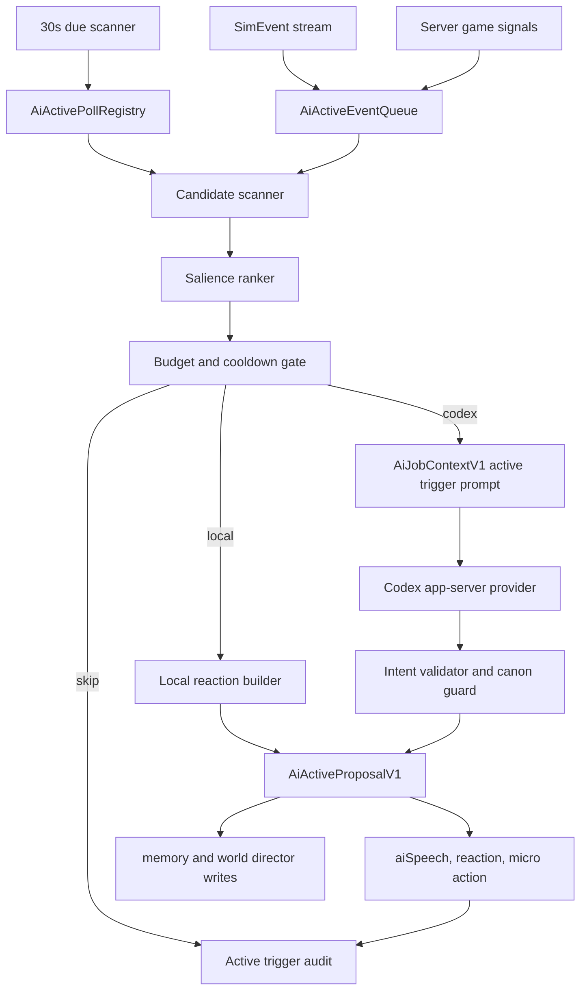

# AI 主动触发与轮询导演机制设计

本文是 World of ClaudeCraft 的 AI 生命层主动触发机制归档。它补齐现有 `docs/design/ai-interactable-agents.zh_CN.md` 中偏“玩家点击后响应”的部分，重点设计两条新入口：

- 游戏内事件主动触发：战斗、任务、场景、天气、时间、掉落、玩家行为、随行对象、区域状态变化都会进入 AI 候选队列。
- 定时轮询主动触发：服务端维护一张可配置轮询表，每个轮询项目可以指定周期、条件、候选对象、预算和可用动作。默认先用较短周期，基础轮询为 5 分钟。

最后核对日期：2026-06-22。

结论先行：这套机制要让世界不等玩家点击才开口。NPC、宠物、普通怪、奇点个体、区域导演和语义物件都可以因为“看见了什么、想起了什么、到了什么时间、天气变成什么样、玩家停留太久或刚丢下某个东西”而主动产生一段想法、一句短话、一次靠近、一次躲避、一次观察、一次巡查或一条区域传闻。目标手感接近开放世界里的 ambient life：玩家只是经过，世界也在自己发生事。

## 归档位置与关系

| 文档 | 关系 |
|---|---|
| `docs/design/ai-interactable-agents.zh_CN.md` | AI 生命层主方案。定义 NPC、怪物、物件、场景语义、奇点个体、Codex provider、主线护栏和螺旋计划。本文是它的主动触发专题补充。 |
| `docs/design/ai-audit-center.zh_CN.md` | AI 审计与后台可观测归档。本文新增的主动触发需要进入同一审计中心。 |
| `docs/design/current-game-design.zh_CN.md` | 当前游戏事实总览。主动触发的场景、区域、职业、宠物、任务和副本都以该文档和源码为事实来源。 |
| `server/ai/life_layer.ts` | 当前 AI 生命层入口。已有 `handleSimEvents`、NPC 交互、物件检视、场景检视、丢弃物品、宠物命令和 provider cache。主动机制应作为新服务接入这里，而不是进入 `src/sim`。 |
| `server/ai/world_director.ts` | 当前区域余波和 proposal store。主动轮询要扩展 proposal 的来源、状态、执行计划和审计生命周期。 |
| `server/ai/scene_frame.ts` | 当前场景感知快照。主动机制的候选排序必须读这里的时间、天气、光照、场景物件、同伴和危险压力。 |

## 需求分析

### 玩家体验目标

玩家应该在 5 到 15 分钟的普通游玩里自然遇到以下变化：

- 到了饭点，城镇 NPC、守卫、商人、同伴或野兽会显得饿、烦躁、想找火堆、想找食物，或者评论玩家背包里的食物味道。
- 玩家站在铁匠铺、湖边、墓地、桥头、沼泽雾中或高塔旁，周围对象会主动产生短想法，而不是必须点“检视场景”。
- 玩家带着宠物或 NPC 进入危险区域时，宠物或随行者会主动犹豫、靠近主人、后退、低声说话、盯住某个物件。
- 玩家丢下食物、武器、骨片、药水、任务物或奇点遗物后，附近对象不一定立即全部冒泡，而是少数最相关对象在接下来的轮询或事件窗口里持续反应。
- 普通怪也会偶尔做出有个性的主动动作：远远盯着、绕开、嗅闻、守住某个物件、模仿同类、害怕星空、在雨里找遮蔽物。
- 世界导演能把玩家最近事件转成区域级小变化：营地更警觉、NPC 更愿意谈某个话题、桥头守卫扫视、野兽远离教堂、鱼人靠近水边丢下的鱼。
- 主动行为不抢玩家主线节奏。它像世界的呼吸，不像弹窗任务，也不像到处刷屏的聊天机器人。

### 当前缺口

现有 AI 生命层已经做到：

- 玩家打开 NPC gossip 或追问 topic 时，走 AI provider 或本地反应。
- 玩家检视物件、检视场景、丢弃物品、命令宠物时，可以产生语义反应。
- `handleSimEvents` 已监听 `questDone`、`damage`、`death` 等真实模拟事件，写入传闻、世界痕迹、首领记忆和世界导演状态。
- 世界导演有 `state`、`proposal`、TTL、审计 journal 和后台展示。
- 场景语义已有建筑、天气、昼夜、危险压力、语义物件和同伴。

仍缺：

- 没有统一的主动事件队列。事件触发散落在各入口，没有“这个事件是否值得让某对象主动做事”的集中判断。
- 没有轮询表。无法配置“饭点”“夜晚星空”“下雨找屋檐”“附近物件想法”“营地紧张巡查”等规则的周期和预算。
- 没有主动候选选择器。玩家周围可能有很多对象，系统需要只挑最有戏的 1 到 2 个，而不是全部冒泡。
- 没有主动行为的预算层。高密度区域如果每 5 分钟所有 NPC 都说话，会变成噪音。
- 没有主动行为的可执行动作桥。当前多数 proposal 是 preview，只进入诊断和表现。主动机制需要把低风险行为转成可见动作，同时保持服务器权威。
- 没有面向主动触发的后台观测。运营需要知道哪些 rule due、哪些 skipped、为什么某 NPC 主动说话、为什么被压制。

### 核心需求

| 编号 | 需求 | 说明 |
|---|---|---|
| R1 | 事件触发 | 游戏内事件进入 AI 主动触发队列，包括任务、战斗、死亡、掉落、天气、时间、场景进入、玩家停留、随行对象、区域导演状态变化。 |
| R2 | 定时轮询 | 服务端有一张轮询项目表，默认基础周期 5 分钟，每个项目可配置独立周期、条件、范围、预算和动作类型。 |
| R3 | 周边对象高密度扫描 | 在玩家周围按场景、对象、记忆、个性、距离和冷却选出最值得主动反应的对象，避免所有对象同时冒泡。 |
| R4 | 生活节律 | 时间和天气能触发生活化反应，例如饭点、夜晚疲劳、晴夜星空、下雨躲避、雪地抱怨、雾中害怕。 |
| R5 | 主动行动 | 允许 AI 产生低风险主动动作：说话、看向、靠近、避开、检视、短暂停顿、寻求遮蔽、巡查、传播传闻。 |
| R6 | 世界导演接管 | 事件和轮询共同喂给世界导演，形成短期区域状态和低风险 proposal。 |
| R7 | 奇点个体增强 | 普通怪中的奇点个体可以被轮询唤醒，产生自发记忆、计划和小目标。 |
| R8 | 成本和噪音控制 | 有全局、玩家、场景、实体、rule、provider 的预算和冷却。Codex 调用不能随在线人数线性爆炸。 |
| R9 | 主线安全 | AI 不能决定任务完成、奖励、掉落、经济、战斗结算和副本权限。关键 NPC 不能因为主动行为离开任务可交互范围。 |
| R10 | 可观测和可测 | 每次主动触发要有审计记录、触发原因、候选分数、跳过原因、provider timing、输出动作和最终展示事件。 |

## 设计原则

1. 主动不是刷屏。一个场景主动发生一件小事，往往比十个 NPC 一起冒泡更有生命感。
2. 先本地规则，后 Codex 深推理。饭点、天气、恐惧、靠近火源这类高频反应应由规则和 lineId 支撑；Codex 用在奇点、角色即兴、复杂记忆和不常见组合。
3. 事件比轮询优先。玩家刚完成任务、刚丢下物品、刚带宠物进墓地，这些应比普通 5 分钟环境轮询更容易触发。
4. 轮询要有抖动。所有玩家和所有 rule 不能在同一秒同时触发。抖动使用服务端非模拟层随机或稳定 hash，不进入 `src/sim`。
5. 主动动作必须可撤销。靠近、后退、注视、短暂停留、临时巡查都要有 TTL 和回归策略。
6. 主动输出必须有边界。模型只能从允许 intent 中选，所有输出经过 validator 和 canon guard。
7. 世界可以记住，但不永久膨胀。主动触发写入的记忆默认短 TTL，只有优秀动态结果才进入作者沉淀。

## 主动触发分类

### 事件触发

事件触发来自真实游戏行为，优先级高，适合让世界立刻或延迟几秒主动反应。

| 事件 | 来源 | 主动反应方向 | 示例 |
|---|---|---|---|
| `questDone` | `SimEvent` | 同场景和同区域传闻、NPC 松口气、守卫改口、世界导演 relief | 玩家完成 Eastbrook 亡灵链后，Brother Aldric 之外的 NPC 也低声提到墓地安静了些。 |
| `death` | `SimEvent` | 首领记忆、奇点死亡痕迹、同类恐惧、区域警觉 | 一只奇点狼被杀后，附近野兽短暂避开该位置。 |
| `damage` 阈值 | `SimEvent` | 首领阶段喊话、精英怪紧张、同伴提醒 | 首领血量低于 20% 时，周围同类停顿或咆哮。 |
| 玩家进入场景 | server interest 或位置采样 | 场景初见、天气评论、危险警告 | 玩家第一次走近 Fallen Chapel，随行宠物后退。 |
| 玩家停留过久 | 主动轮询服务 | NPC 看玩家、怪物观察、场景沉默 | 玩家在铁匠铺挂机，铁匠主动问是不是等炉火。 |
| 玩家丢弃物品 | 已有 discard 路径 | 食物吸引、贵重物引发贪婪、诅咒物引发恐惧 | 食物先吸引野兽，5 分钟内成为 NPC 传闻。 |
| 天气块变化 | `time_weather_model` | 下雨躲避、雾中害怕、雪地疲惫、晴夜抬头 | Mirror Lake 晴夜，渔夫看水面星光。 |
| 时间阶段变化 | `time_weather_model` | 黎明清醒、白天精神、黄昏收工、夜晚疲劳 | 黄昏守卫说换班快到了。 |
| 宠物或随行 NPC 进入特殊区域 | `SceneFrameV1.companions` | 非亡灵害怕、恶魔被警惕、野兽闻到尸气 | 带恶魔进城镇，守卫盯住它。 |
| 世界导演 state 创建或刷新 | `AiWorldDirectorStore` | 区域话题偏移、营地警觉、物件痕迹回声 | Eastbrook 出现贵重物传闻后，市场 NPC 更警觉。 |
| 玩家刚从副本出来 | server session and scene | 伤痕、战利品、队伍状态、区域旁观 | 城镇 NPC 说玩家身上有墓穴冷气。 |

### 定时轮询

轮询用于没有明确事件但世界应该自己呼吸的场景。服务端不应每 tick 计算，而是用独立间隔检查 due rule。

基础策略：

- 调度器每 30 秒检查一次 due rule。
- 轮询项目默认周期 300 秒，也就是 5 分钟。
- 每个 rule 自己有 `periodSeconds`、`jitterSeconds`、`perPlayerCooldownSeconds`、`perEntityCooldownSeconds`。
- 每次 due 后不一定产出事件。大多数轮询会因为没有合适候选、预算不足或冷却未到而跳过。
- 单个玩家周围一次主动轮询最多产出 1 个主事件和 1 个附属反应。

## 轮询表设计

### 数据来源

建议采用“两层表”：

1. 代码种子表：`server/ai/active_poll_rules.ts`，用于版本化默认规则、测试和无 DB 环境。
2. 持久化覆盖表：`ai_active_poll_rules`，用于运营调整周期、启停、权重和实验 realm 配置。

代码种子负责默认体验，DB 覆盖负责线上调参。没有 DB 或表未初始化时，服务端只读代码种子表。

### 规则结构

```ts
export interface AiActivePollRuleV1 {
  ruleId: string;
  title: string;
  enabled: boolean;
  category: 'dailyNeed' | 'sceneAmbient' | 'weather' | 'time' | 'companion' | 'creature' | 'worldDirector' | 'townLife' | 'encounterEcho';
  periodSeconds: number;
  jitterSeconds: number;
  priority: number;
  scope: 'playerVicinity' | 'scene' | 'zone' | 'realm';
  candidateSelector: AiActiveCandidateSelector;
  condition: AiActiveRuleCondition;
  actionBudget: AiActiveActionBudget;
  providerPolicy: 'localOnly' | 'codexAllowed' | 'codexPreferred';
  outputMode: 'lineIdOnly' | 'mixedLivingWorld';
  allowedIntents: string[];
  allowedLineIds: string[];
  cooldown: {
    perPlayerSeconds: number;
    perEntitySeconds: number;
    perSceneSeconds: number;
    perRuleSeconds: number;
  };
  auditTags: string[];
}
```

### 持久化表草案

```sql
CREATE TABLE IF NOT EXISTS ai_active_poll_rules (
  realm TEXT NOT NULL,
  rule_id TEXT NOT NULL,
  enabled BOOLEAN NOT NULL DEFAULT TRUE,
  period_seconds INTEGER NOT NULL DEFAULT 300,
  jitter_seconds INTEGER NOT NULL DEFAULT 60,
  priority INTEGER NOT NULL DEFAULT 50,
  provider_policy TEXT NOT NULL DEFAULT 'localOnly',
  config_json JSONB NOT NULL DEFAULT '{}'::jsonb,
  updated_at TIMESTAMPTZ NOT NULL DEFAULT now(),
  PRIMARY KEY (realm, rule_id)
);

CREATE TABLE IF NOT EXISTS ai_active_poll_cursors (
  realm TEXT NOT NULL,
  rule_id TEXT NOT NULL,
  scope_key TEXT NOT NULL,
  next_due_at TIMESTAMPTZ NOT NULL,
  last_checked_at TIMESTAMPTZ,
  last_fired_at TIMESTAMPTZ,
  last_skip_reason TEXT,
  PRIMARY KEY (realm, rule_id, scope_key)
);

CREATE INDEX IF NOT EXISTS ai_active_poll_cursors_due
  ON ai_active_poll_cursors (realm, next_due_at);
```

说明：

- `config_json` 只放运营覆盖，不放完整 prompt。
- 完整默认配置仍在代码中，保证 review、测试和版本回滚可控。
- `scope_key` 可为 `player:{pid}`、`scene:{sceneId}:player:{pid}`、`zone:{zoneId}` 或 `realm`。
- cursor 表只用于调度，不作为玩法事实来源。

## 初始轮询项目表

| ruleId | 周期 | 范围 | provider | 触发条件 | 候选 | 体验效果 |
|---|---:|---|---|---|---|---|
| `daily_meal_hunger` | 300 秒 | playerVicinity | localOnly | 游戏时间接近 7、12、18、22 点，且附近有城镇 NPC、野兽、宠物或食物语义 | 饥饿、商人、守卫、宠物、野兽 | NPC 提到该吃点东西，野兽嗅闻食物，宠物靠近主人。 |
| `nearby_object_musing` | 300 秒 | playerVicinity | codexAllowed | 玩家附近有高语义物件，且玩家 30 秒内没有主动检视 | NPC、宠物、奇点怪 | 少数对象主动看向炉火、墓碑、桥、湖面或掉落物。 |
| `weather_shelter` | 300 秒 | playerVicinity | localOnly | 雨、雪、强风，附近有 shelter、house、hut、tower、fire | NPC、宠物、低智怪 | 找屋檐、缩短闲聊、抱怨冷雨。 |
| `clear_night_stars` | 600 秒 | scene | codexAllowed | 夜晚、晴天、`starrySky` 或 `moonlitWater` | 渔夫、学者、守卫、观星奇点怪 | 抬头、停顿、说一句不那么程序化的感叹。 |
| `fog_fear_scan` | 300 秒 | playerVicinity | localOnly | Mirefen 雾、低可见度、非安全区 | 守卫、宠物、野兽、人形怪 | 靠近、压低声音、扫视芦苇。 |
| `undead_pressure_companion` | 120 秒 | playerVicinity | localOnly | `undeadPressure >= 0.25` 且有非亡灵同伴 | 宠物、随行 NPC、牧师、亡灵 | 非亡灵害怕或祈祷，亡灵更平静或靠近。 |
| `town_guard_patrol_glance` | 300 秒 | scene | localOnly | safeTown、gate、bridge、watchPost | 守卫、高地 NPC | 看向道路、桥口或玩家随行物。 |
| `market_value_watch` | 300 秒 | playerVicinity | codexAllowed | 附近有 valuable、coin、gear、marketEdge | 商人、强盗、人形怪 | 对贵重物和玩家交易习惯产生短评。 |
| `creature_curiosity_scan` | 300 秒 | playerVicinity | localOnly | 玩家附近有野兽、鱼人、蜘蛛、狗头人等普通怪且不在战斗 | 普通怪和奇点候选 | 嗅闻、后退、观察、守巢。 |
| `singularity_restlessness` | 180 秒 | playerVicinity | codexPreferred | 周围有奇点个体，且其记忆或 plan 未过期 | 奇点怪 | 主动延续上次记忆，形成一次小目标。 |
| `boss_memory_echo` | 600 秒 | scene | localOnly | 同场景或同区域有首领胜负记忆 | NPC、队友、场景自身 | 提到刚发生过的击败或团灭余波。 |
| `world_director_echo` | 300 秒 | zone | localOnly | world director state 活跃 | NPC、场景检视、营地对象 | 区域话题轻微偏移，不等玩家追问。 |
| `idle_player_observed` | 300 秒 | playerVicinity | codexAllowed | 玩家在同一场景停留超过 90 秒，且没有战斗、交易或任务对话 | 附近 NPC 或奇点怪 | 主动问候、观察装备、评论玩家站姿或等待。 |

## 主动调度架构



### 新服务边界

建议新增 `server/ai/active_triggers.ts`，由 `GameServer` 持有：

- 不进入 `src/sim`。
- 不被客户端直接调用。
- 读取 `Sim` 快照、`SceneFrameV1`、AI memory、world director、profiles、family semantics。
- 通过 `GameServer.routeEvents` 或现有 deliver 机制发送表现事件。
- 如果要执行真实移动或模式动作，必须走服务器授权的动作桥，不直接从 UI 或模型改状态。

建议类结构：

```ts
export class AiActiveTriggerService {
  noteSimEvents(input: { sim: Sim; events: SimEvent[] }): void;
  noteServerSignal(signal: AiActiveServerSignal): void;
  tick(input: { sim: Sim; sessions: Iterable<ClientSessionLike>; nowMs: number }): Promise<SimEvent[]>;
  diagnostics(): AiActiveTriggerDiagnostics;
  stop(): void;
}
```

`GameServer.start()` 里不应把主动轮询塞进 20 Hz inner loop。可以沿用独立 `setInterval`，例如 30 秒触发一次 due scanner，并把产出的事件通过 `routeEvents` 广播。

## 事件队列设计

### 事件格式

```ts
export interface AiActiveEventV1 {
  eventId: string;
  kind:
    | 'quest_completed'
    | 'combat_resolved'
    | 'entity_died'
    | 'item_discarded'
    | 'scene_entered'
    | 'time_phase_changed'
    | 'weather_changed'
    | 'companion_pressure'
    | 'world_director_changed'
    | 'player_idle';
  sourcePlayerEntityId: number | null;
  subjectEntityId?: number;
  subjectTemplateId?: string;
  sceneId?: string;
  zoneId?: string;
  itemId?: string;
  questId?: string;
  salience: number;
  createdAtSeconds: number;
  expiresAtSeconds: number;
  evidence: string[];
}
```

### 事件优先级

| 优先级 | 事件 | 说明 |
|---|---|---|
| 100 | 玩家或宠物死亡、首领击败、任务完成 | 直接影响区域记忆，应优先入 world director。 |
| 80 | 丢弃高语义物品、奇点个体出现、随行对象进入恐惧区域 | 容易形成“世界看到我”的瞬间。 |
| 60 | 玩家进入新场景、天气突变、夜晚晴天 | 适合低频氛围主动反应。 |
| 40 | 玩家停留、饭点、守卫巡查、普通环境反应 | 作为世界呼吸，必须让位于高优先级事件。 |

## 候选选择与打分

### 候选对象

候选只从玩家兴趣范围内选择，避免远处对象无端说话。

- NPC：任务 NPC、商人、守卫、职业感强的 named NPC、高地位 NPC、受伤 NPC。
- 宠物和召唤物：玩家自己的宠物、恶魔、护送式 NPC。
- 普通怪：不在战斗、不死亡、不正被 leash、在场景语义范围内。
- 奇点个体：优先级更高，尤其是有记忆或 plan 的个体。
- 语义物件：场景 anchor 和地面任务物件本身不一定“说话”，但可作为其他对象注意目标。

### 分数模型

```ts
score =
  eventSalience * 0.28
  + sceneRelevance * 0.18
  + profileAffinity * 0.16
  + memoryHeat * 0.14
  + novelty * 0.10
  + proximity * 0.08
  + singularityBonus * 0.06
  - cooldownPenalty
  - noisePenalty
```

字段说明：

- `eventSalience`：事件本身强度，任务完成和死亡高，普通饭点低。
- `sceneRelevance`：对象 family/profile 是否适合当前场景，例如野兽对食物、牧师对墓地、守卫对桥和门。
- `profileAffinity`：NPC profile 的 knowledge、fear、sceneAffinities、speechFingerprint 是否匹配。
- `memoryHeat`：对象或区域是否已有同玩家记忆、rumor、world director state。
- `novelty`：玩家最近是否没见过类似反应。
- `proximity`：距离玩家和目标物是否合适。
- `singularityBonus`：奇点个体和罕见个体适度加权。
- `cooldownPenalty`：同实体、同 rule、同场景冷却。
- `noisePenalty`：附近刚发生过 AI speech 或当前玩家正在任务对话、战斗、交易、拾取。

### 选择上限

- 每个玩家每轮最多 1 个主动主事件。
- 同一场景 5 分钟内最多 3 个主动事件。
- 同一实体 10 分钟内最多 1 次 Codex 主动事件，local lineId 可短一些。
- 同一 rule 每玩家 5 分钟内最多触发 1 次。
- 事件触发可以抢占轮询触发，但不能突破玩家噪音上限。

## 主动输出设计

### 输出对象

建议新增 `AiActiveProposalV1`，与 `AiWorldDirectorProposal` 互补。前者是某次主动触发的执行候选，后者是区域状态的长期提案。

```ts
export interface AiActiveProposalV1 {
  proposalId: string;
  ruleId: string;
  triggerKind: 'event' | 'poll';
  sourcePlayerEntityId: number;
  speakerEntityId: number;
  targetEntityId?: number;
  targetObjectId?: number;
  targetItemId?: string;
  sceneId: string;
  zoneId: string;
  priority: number;
  risk: 'presentation' | 'reversibleMovement' | 'socialOverlay';
  intents: AiActiveIntent[];
  speech?: AiActiveSpeech;
  memoryWrites: AiMemoryAuditRecord[];
  ttlSeconds: number;
  evidence: string[];
  skipIfPlayerBusy: boolean;
}
```

### 允许动作层级

| 层级 | 动作 | 是否可默认开启 | 说明 |
|---|---|---|---|
| A0 | 说话、头顶反应徽标、注意力连线、短暂停顿 | 是 | 已接近现有 `aiSpeech.reaction` 能力。 |
| A1 | 看向目标、身体语言偏移、短暂靠近或后退 | 是 | 仍可保持纯表现或短 TTL 覆盖。 |
| A2 | 服务端权威微移动：走向屋檐、靠近掉落物、回到出生点附近 | 实验 realm | 必须有路径、leash、任务 NPC 距离和回归守门。 |
| A3 | 社交 overlay：写 rumor、world trace、world director state | 是 | 只影响之后台词和表现，不改任务事实。 |
| A4 | 营地状态：警觉、巡逻偏移、短期聚集 | 实验 realm | 不改变仇恨公式和怪物生成，只改变低风险 idle 行为。 |
| A5 | 临时微遭遇：追踪玩家、偷看、求饶、带路 | 需要单独开关 | 这是最有趣也最危险的层，必须逐个玩法验证。 |

### 主动话语风格

主动话语要更像自然冒出的短念头，而不是回答问题：

- 不解释系统。
- 不说“我可以帮你”“总结一下”“不过”等助手式开头。
- 一次一句，最多 20 到 36 个中文字或对应英文短句。
- 能不说话就用动作表达，例如转头、后退、靠近火堆。
- 同一场景不要连续输出同类句式。
- 动态文本只在实验路径使用，正式默认应沉淀为 lineId。

## 场景化规则样例

### 饭点和饥饿

条件：

- 游戏时间接近 7、12、18、22 点。
- 玩家附近有 `food`、`meat`、`fish`、`freshBread`、`marketEdge`、`inn`、`fireplace` 或城镇 NPC。
- 玩家不在战斗、不在交易、不在任务对话确认。

反应：

- 商人：主动谈补给、价格、路上的饥饿。
- 守卫：提到换班和热汤。
- 野兽：嗅闻食物，靠近或绕圈。
- 宠物：靠近主人或盯着背包。
- 贫穷 NPC：看向食物但不直接抢玩家物品。

禁止：

- 不自动消耗玩家食物。
- 不自动赠送或出售物品。
- 不让饥饿影响战斗属性。

### 玩家周围高密度对象想法

条件：

- 玩家周围 30 码内有 3 个以上语义对象或 4 个以上可感知实体。
- 玩家 30 秒内未触发手动 AI 对话。
- 场景有强标签，如 `forge`、`graveSoil`、`moonlitWater`、`marshFog`、`watchPost`。

反应：

- 只选一个对象主动反应。
- 如果对象是 NPC，优先与自身 profile 匹配的语义物件。
- 如果对象是怪物，优先 family instinct，例如野兽闻味、蜘蛛避火、狗头人看蜡烛、亡灵靠近墓地。
- 如果存在奇点个体，有 20% 到 35% 的候选加权，但仍受冷却控制。

### 非亡灵进入亡灵压力区

条件：

- `scene.danger.undeadPressure >= 0.25` 或场景含 `deathPressure`、`undeadMemory`、`cryptGate`。
- 附近有非亡灵宠物、随行 NPC、人形 NPC 或野兽。

反应：

- 野兽后退或低吼。
- 人形 NPC 压低声音、祈祷、看向出口。
- 牧师类 NPC 留在原地但更严肃。
- 亡灵类对象不害怕，可能靠近、凝视活物或对诅咒物产生兴趣。

禁止：

- 不把宠物模式改成 passive 或 flee，除非玩家明确命令。
- 不把随行 NPC 移出任务可达范围。

### 晴夜星空

条件：

- `time.isNight` 且 `light.tags` 含 `starrySky`。
- 场景含 `openWater`、`highView`、`tower`、`dock`、`quietRipples` 或普通开阔区域。

反应：

- 渔夫、学者、守卫、观星奇点怪更容易触发。
- 反应应安静、短，偏审美或记忆。
- 如果玩家正赶路或战斗，不触发。

### 下雨或雪

条件：

- `weather.kind` 为 `rain` 或 `snow`。
- 附近有 shelter affordance 或建筑标签。

反应：

- NPC 靠近屋檐、缩短闲话。
- 宠物抖水或靠近主人。
- 火源、屋檐、塔楼、民居成为注意目标。

禁止：

- 不让 NPC 堵住门、商人窗口或副本入口。
- 不改变移动速度、命中或资源回复。

## Codex provider 使用策略

### 何时调用 Codex

Codex 主动调用只用于“值得即兴”的情况：

- 奇点个体有记忆或 plan，要延续一次独特行为。
- NPC profile 和当前场景高度匹配，但 lineId 池没有合适表达。
- 多个信号组合罕见，例如夜晚晴天、刚完成首领、带恶魔进入墓地、丢下贵重诅咒物。
- 世界导演已有高 heat，且玩家近期没有听过同类话题。

不调用 Codex 的情况：

- 饭点普通饥饿提醒。
- 普通下雨躲避。
- 普通守卫巡查。
- 普通亡灵压力下的害怕。
- 任何玩家忙碌或预算不足的情况。

### 主动 job trigger 扩展

当前 `AiJobContextV1.trigger` 需要新增：

```ts
type AiJobTrigger =
  | 'npc_gossip_opened'
  | 'npc_question'
  | 'object_inspected'
  | 'singularity_candidate'
  | 'pet_command'
  | 'active_event'
  | 'active_poll'
  | 'ambient_thought'
  | 'daily_need';
```

主动 prompt 必须携带：

- `ruleId`
- `triggerKind`
- `eventEvidence`
- `candidateScore`
- `silenceReason` 或 `noiseBudget`
- `scene`
- `profile`
- `familySemantics`
- `memorySignals`
- `directorProposals`
- `allowedIntents`
- `allowedLineIds`

输出仍走结构化 JSON 和 validator，不允许模型直接返回自由文本给玩家。

## 预算与噪音控制

### 默认预算

| 维度 | 默认 |
|---|---:|
| 每玩家主动主事件 | 90 秒最多 1 次 |
| 每玩家 Codex 主动事件 | 5 分钟最多 1 次 |
| 每实体主动事件 | 10 分钟最多 1 次 |
| 每场景主动事件 | 5 分钟最多 3 次 |
| 每轮询 tick 全服 Codex 主动 job | 低配 2 个，高配按环境变量配置 |
| 单次主动事件显示对象 | 主 speaker 1 个，附属反应最多 1 个 |
| 同类 lineId 重复 | 10 分钟内同玩家不重复 |

### 跳过原因

每次 due 后都要记录跳过原因，避免后台只看到“没发生”。

- `player_busy_combat`
- `player_busy_dialog`
- `player_recent_ai_speech`
- `no_candidate`
- `candidate_score_too_low`
- `entity_cooldown`
- `scene_cooldown`
- `rule_cooldown`
- `provider_budget_exhausted`
- `canon_guard_blocked`
- `key_entity_guarded`
- `movement_guard_blocked`

## 主线与任务风险规避

主动机制更容易影响主线体感，因此必须比点击式 AI 更严格。

### 硬规则

- 不改 quest log、completed quest set、XP、level、inventory、currency、loot、market、trade、arena rating、副本权限。
- 不自动接任务、交任务、拾取任务物、开启副本门。
- 不让关键 NPC、商人、任务物件、传送门因为主动行为离开交互范围。
- 不让敌对怪被主动机制带进安全城镇。
- 不在首领战关键机制时等待 Codex 或执行额外动作。
- AI 关闭后，原任务、战斗、拾取、商人、副本和宠物命令路径必须完全可用。

### 关键实体保护

关键实体包括：

- 有 `questIds` 的 NPC。
- 有 `vendorItems` 的 NPC。
- 副本入口和离开物件。
- 正在参与玩家任务目标的怪物或物件。
- 当前目标、当前战斗、已被 tap、尸体可拾取对象。
- 关键剧情 NPC：Brother Aldric、Marshal Redbrook、Scout Maren、Warden Fenwick、Tidewatcher Ondrel 等。

关键实体可以主动说话、看向、停顿，但默认不能离开原点 3 码以上。确实需要微移动时，必须有回归 TTL。

## 管理后台和审计

### 新增指标

`AiLifeLayer` 或新 `AiActiveTriggerService` 应增加：

- activePollDue
- activePollSkipped
- activePollFired
- activeEventQueued
- activeEventExpired
- activeCandidatesScanned
- activeCandidatesSelected
- activeProviderCalls
- activeLocalReactions
- activeMovementProposals
- activeMovementExecuted
- activeMovementBlocked
- activeNoiseSuppressions
- activeLastSkipReason
- activeLastRuleId

### 后台面板

Usage 页建议新增一个 tab 或 section：

- 主动 AI 规则状态：ruleId、enabled、period、next due、last fired、last skip。
- 最近主动触发记录：trigger、rule、speaker、target、scene、score、provider、lineId、intent、skip reason。
- 预算状态：全局 provider budget、玩家 cooldown、场景 cooldown、rule cooldown。
- 安全拦截：canon guard、movement guard、key entity guard。

所有后台字符串继续走 admin i18n，简中要补全。

## 测试设计

### 单元测试

- `tests/ai_active_poll_rules.test.ts`
  - 默认 rule 表完整性。
  - period、jitter、cooldown 合法。
  - allowedLineIds 存在于 HUD chrome catalog。
  - providerPolicy 和 outputMode 组合合法。

- `tests/ai_active_scheduler.test.ts`
  - due scanner 按周期触发。
  - jitter 不导致同一时间全量触发。
  - cursor 过期和 skip reason 正确记录。
  - 同一玩家和实体 cooldown 生效。

- `tests/ai_active_candidates.test.ts`
  - 饭点、星空、雨、亡灵压力、贵重物、奇点 plan 的候选排序。
  - 高密度对象只选最高分 1 到 2 个。
  - 玩家忙碌时抑制。

- `tests/ai_active_validator.test.ts`
  - 主动输出只能使用 allowed intents。
  - 关键实体移动被拒绝。
  - 任务、掉落、经济和战斗修改被拒绝。

### 集成测试

- `tests/server_ai_active_triggers.test.ts`
  - 真实 `GameServer` 中每 5 分钟轮询触发一次饭点或场景主动反应。
  - 丢弃物品后，事件触发先写 trace，后续轮询能读 trace 并只让一个对象反应。
  - 带宠物进入 Fallen Chapel，宠物或 NPC 产生恐惧表现，但宠物模式和任务状态不变。
  - 晴夜 Mirror Lake 触发星空反应，连续 10 分钟不重复刷屏。
  - 奇点个体在第二次相遇时主动延续 plan，但不改变 XP、loot、quest。

### 主线 parity

必须延续现有 AI 主线安全测试：

- AI 关闭和开启分别跑同一段任务链。
- 比较 quest log、completed quests、inventory、currency、XP、level、pet mode、market 状态。
- 主动触发开启后，允许多出 `aiSpeech` 和审计记录，不允许多出玩法事实变化。

### 长跑测试

- 模拟 1 小时服务器时间。
- 多玩家分布在 Eastbrook、Mirefen、Thornpeak。
- 默认 5 分钟轮询开启。
- 验证内存、director state、active event queue、cursor、audit journal 不无限增长。
- 验证 provider budget 没有随玩家数失控。

## 螺旋式实现计划

每一轮都是可玩可验证版本，不做“最小 MVP”，而是每轮都有完整体验闭环。

### 螺旋 1：主动调度骨架和只读审计

交付：

- 新增 `AiActiveTriggerService`。
- 新增代码种子规则表和 due scanner。
- 接入 `GameServer` 独立 30 秒轮询，不进入 20 Hz 热路径。
- 只做 dry run：扫描候选、打分、记录 skip/fired 预览，不向玩家发事件。
- 后台 diagnostics 能看到 rule、cursor、候选分数和跳过原因。

验证：

- 单测覆盖 due scanner、cooldown、skip reason。
- 集成测试确认服务运行 30 分钟不会影响任务、战斗和快照。
- 提交后可在后台看到主动机制已经在“思考”，但游戏内不出声。

### 螺旋 2：事件触发主动表现

交付：

- `questDone`、`death`、`damage`、`item_discarded`、`world_director_changed` 进入主动事件队列。
- 事件队列按优先级和 TTL 处理。
- 先只输出 A0/A1 表现：说话、注意力、停顿、身体语言。
- 继续使用 lineId 和本地规则，不新增 Codex 主动调用。

验证：

- 完成任务后，同场景 NPC 可主动轻声反馈。
- 丢弃食物后，附近一只最相关对象反应，而不是全部反应。
- 死亡和首领事件仍不改变掉落、XP、任务。

### 螺旋 3：5 分钟轮询表可玩版

交付：

- 启用初始轮询项目：饭点、附近物件想法、天气躲避、晴夜星空、亡灵压力、守卫巡查。
- 每个项目默认 300 秒或表内指定周期。
- 每个 rule 都有 cooldown、candidate selector、lineId 池和审计。
- 只允许 localOnly 和 lineIdOnly。

验证：

- 玩家在 Eastbrook 待 10 到 15 分钟能看到饭点、守卫巡查或铁匠铺环境反应。
- 玩家在 Mirror Lake 晴夜能看到低频星空反应。
- 玩家在 Fallen Chapel 带宠物时，宠物低频害怕但不改变宠物模式。
- 无刷屏，无多个 NPC 同时冒泡。

### 螺旋 4：Codex 主动即兴

交付：

- 新增主动 job trigger：`active_event`、`active_poll`、`ambient_thought`、`daily_need`。
- Codex 只在 `codexAllowed` 或 `codexPreferred` rule 下调用。
- 加入 provider budget、cache key、thinking 状态、prompt/output length 和 P50/P90/P95。
- 输出仍经过 validator、speech style cleanup、canon guard。

验证：

- 奇点个体、晴夜星空、复杂物件组合能产生非程序化短句。
- provider 超时只记录错误，不伪造本地 AI 回复。
- provider cache 命中不会让不同场景或不同个性串话。

### 螺旋 5：主动微动作桥

交付：

- 定义 `AiActiveIntent` 到受限动作的映射。
- A2 微移动先限实验 realm：靠近目标、后退、找 shelter、巡查 3 到 8 码。
- 对关键实体、战斗实体、任务目标、商人、副本门加 guard。
- 所有微动作有 TTL、返回点、路径检查和审计。

验证：

- 下雨时非关键 NPC 可以靠近屋檐，再回到原处。
- 野兽可以靠近食物但不拾取玩家物品。
- 任务 NPC 不离开可交互范围。
- 战斗和 leash 测试通过。

### 螺旋 6：世界导演主动执行

交付：

- `AiWorldDirectorProposal` 从 preview 扩展为可进入 active queue 的低风险 proposal。
- `nudgeNpcRumor`、`raiseCampCaution`、`echoTrace`、`echoEncounterMemory`、`echoQuestRelief` 可被轮询主动播放。
- 区域状态不等玩家点 NPC，也能在合适时机从附近对象身上浮现。

验证：

- Eastbrook 的贵重物传闻会让市场 NPC 主动警觉一次。
- 首领击败后，回城附近 NPC 可以主动谈一次余波。
- director state 过期后不再主动冒出。

### 螺旋 7：奇点个体主动生活

交付：

- 奇点个体拥有主动轮询权重、短期目标和计划延续。
- 支持 `followScent`、`collectObject`、`guardPlace`、`avoidPlayer`、`watchSky`、`omenWatch` 的主动触发。
- Codex 参与奇点个体的少量高价值表达。

验证：

- 同一个奇点怪第二次遇到玩家时会主动表现记忆。
- 胆怯奇点在亡灵压力或高敌意场景中主动避开。
- 观星奇点在晴夜会主动停顿或看天。
- 所有表现不改变掉落、XP 和任务。

### 螺旋 8：持久化覆盖和后台调参

交付：

- 加入 `ai_active_poll_rules` 和 `ai_active_poll_cursors`。
- Admin Usage 或新面板展示并允许启停 rule、调整周期、查看 cursor。
- 规则覆盖只影响当前 realm。
- 清理 AI memory 时可选择是否清理 active cursor 和主动审计。

验证：

- 修改某 rule 周期后无需改代码即可生效。
- 服务重启后 cursor 不导致立即全量触发。
- 无 token 或非 admin 不能改规则。

### 螺旋 9：全量内容化和运营收束

交付：

- 为 Eastbrook、Mirefen、Thornpeak、Glimmermere 的主要场景补主动 rule 覆盖。
- 为所有 named NPC、主要 MobFamily、关键物品、天气时间组合补 lineId 池。
- 把优秀 Codex 动态文本沉淀为本地化 lineId，简中同步补齐。
- 完成成本仪表、噪音仪表、安全拦截仪表。

验证：

- 15 分钟 Eastbrook 体验、15 分钟 Mirefen 体验、15 分钟 Thornpeak 体验都有主动生活感。
- `AI_LIVING_WORLD_EXPERIMENT=0` 时基础主线仍完整可玩。
- release tier 前所有新增玩家可见文本都有本地化路径和简中覆盖。

## 验收标准

第一批完整目标达成时，应该满足：

- 玩家不点击 AI 按钮，也能在 5 到 15 分钟内遇到合理的主动生活事件。
- 默认 5 分钟轮询存在，并且每个轮询项目可以配置独立周期。
- 周围对象不会全部同时冒泡，系统只挑最合适对象。
- 饭点、夜晚、晴夜、下雨、亡灵压力、附近物件、丢弃物、奇点个体、世界导演余波都有对应规则。
- 主动行为有审计、跳过原因、候选分数和后台可见指标。
- AI 开关关闭后，任务、战斗、拾取、商人、副本、宠物、市场和社交核心路径不受影响。
- Codex provider 不成为高频轮询的硬依赖，本地 lineId 和规则可以撑住基础世界呼吸。

## 开发注意事项

- 不要把主动轮询写进 `src/sim` tick。
- 不要让 Codex 调用阻塞战斗、快照和保存。
- 不要让主动机制通过客户端决定任何权威状态。
- 不要新增玩家可见硬编码文案。默认路径走 `hudChrome.aiSpeech.*` 或现有 server/sim matcher，后台走 admin i18n。
- 不要为了“有反应”牺牲沉默。真正像活物的世界，也会在合适时候保持安静。

最终体验目标是：玩家从 Eastbrook 走到 Fallen Chapel、从 Fenbridge 穿过雾、从 Mirror Lake 夜里经过时，会感觉自己不是在点按钮触发 AI，而是在一个正在观察、想象、害怕、饿着、记仇、好奇和自我延续的世界里移动。
